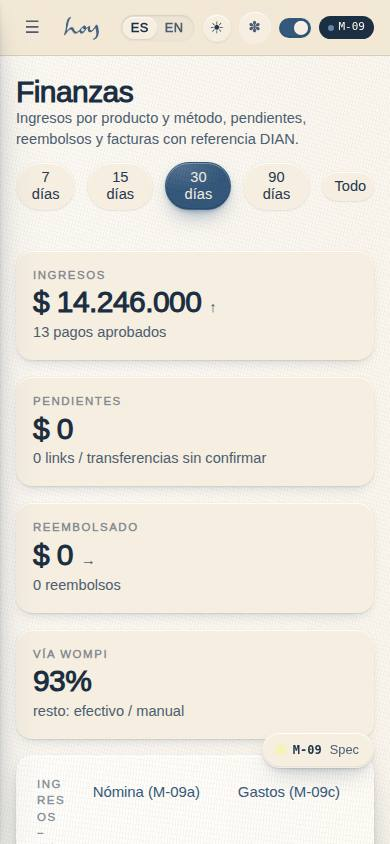
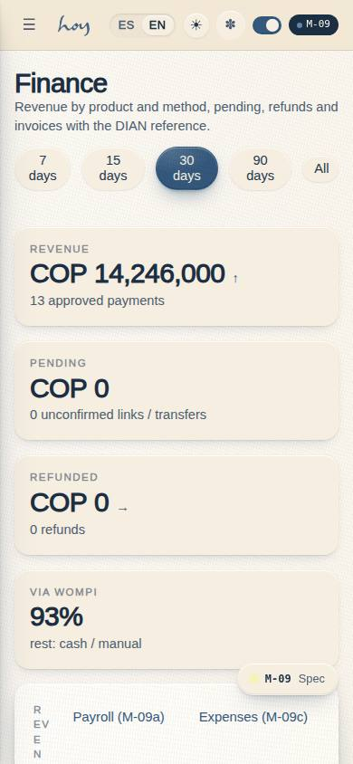

# M-09 — Finance

**Route** `/#/admin/finance` · **Roles** super_admin, admin, finance · **Surface** admin · **Spec** `spec.code === 'M-09'` (see `/#/dev/specs`)

## Purpose
Revenue by product and method, pending payments, refunds, invoices with the DIAN reference, the teacher-payroll roll-up and — since 0.6.1 — the period balance (Ingresos − Nómina − Gastos).

## Screenshots
| ES · mobile | EN · mobile |
| --- | --- |
|  |  |

| ES · desktop | EN · desktop |
| --- | --- |
|  |  |

## Sections (layout order — `useLayout(spec)`)
1. `KPIRow` — revenue, pending, refunded, Wompi share for the selected range
2. `BalanceCard` — Ingresos − Nómina − Gastos = Balance for the same range, with the margin and links to M-09a and M-09c (0.6.1)
3. `RevenueByProduct` — `BarList` over `payments.plan_id`
4. `RevenueByMethod` — `BarList` over `payments.method`
5. `PayoutsSummary` — the teacher-payroll roll-up, linking to M-09a
6. `PaymentsList` — every payment in range, with the refund action and the DIAN reference
7. `InvoicesTable` — invoices in range, filtered by the status of the payment behind them

## Data
| Table | Read / write | Notes |
| --- | --- | --- |
| `payments` | read / write | `status` flips to `refunded`; nothing else is edited here |
| `invoices` | read | one per approved payment; `dian_cufe` is null until e-invoicing is live |
| `plans` | read | product names for the breakdown |
| `payroll_runs`, `payroll_lines` | read | the three payout tiles (owed, approved-unpaid, paid this quarter) and the Nómina leg of the balance |
| `expenses` | read | the Gastos leg of the balance (rows dated in the range, paid or not) |
| `users`, `profiles` | read | who paid |
| `tenants` | read | IVA rate, DIAN resolution, Wompi environment from M-08 |
| `audit_log` | write | `payment.refund` |

## Logic and integrations
- Revenue = approved payments inside the range, grouped by plan and by method. Ranges are
  **7 / 15 / 30 / 90 days and all time**: 15 days is there because Colombian studios settle biweekly,
  and it drives both the KPI tiles and the invoice table.
- A refund flips `payments.status` to `refunded` and writes `audit_log payment.refund`. Returning the
  credit is a follow-up, not a side effect — the money and the entitlement are separate decisions.
- The invoice filter is the **payment's** status: invoices carry no status of their own.
- E-invoicing needs a DIAN resolution in M-08c; until then the CUFE column shows a badge rather than a
  fake number.
- The payout tiles read `payroll_runs`: the draft total, the sum of approved runs not yet paid, and
  runs paid in the last three months. Approving and paying happens in M-09a / M-09b.
- Integrations: Wompi (charges, and payouts through `wompiPayout()`), DIAN e-invoicing.

## States
- Loading · empty range · no draft run yet
- Without `payments.refund` the action is hidden and the reason is stated
- E-invoicing off: a notice instead of an empty CUFE column

## Real vs mock
- **Real.** The revenue, pending and refund numbers are sums over real `payments` rows, the invoice
  table is real `invoices`, the refund path writes and audits, and the payout tiles are real
  `payroll_runs` totals — the `value="—"` placeholder is gone.
- **Mock / pending.** No money moves: `wompiCheckout()` simulates the charge and `wompiPayout()` the
  dispersion, and no webhook confirms either. No CUFE is emitted, because the provider and the legal
  issuer are still owner decisions (ROADMAP §E).
- **Note.** A payout is deliberately **not** a `payments` row. `payments` is money in from members and
  feeds this page's revenue, C-11's history and the M-01 KPIs; money out lives on `payroll_runs` with
  an `audit_log` entry per action. Mixing them would make every revenue number in the product wrong.

## Changelog
- `docs/changelog/0016-expenses-ledger.md` — the Balance card (v0.6.1)
- `docs/changelog/0012-thin-screens-depth.md` — depth pass on the thin screens (v0.6.0)
- `docs/changelog/0005-final-integration.md` — screenshots and this page doc (v0.3.0)

---
**Resumen (ES).** Finanzas. Ingresos por producto y método, pagos pendientes, reembolsos, facturas con referencia DIAN y el marcador de payouts de Wompi.
