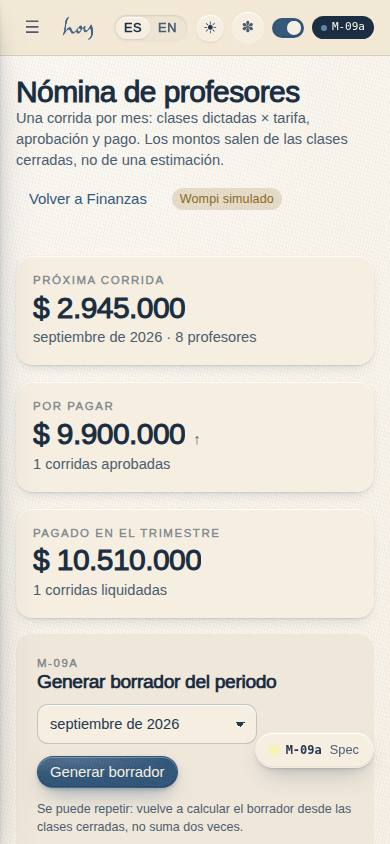
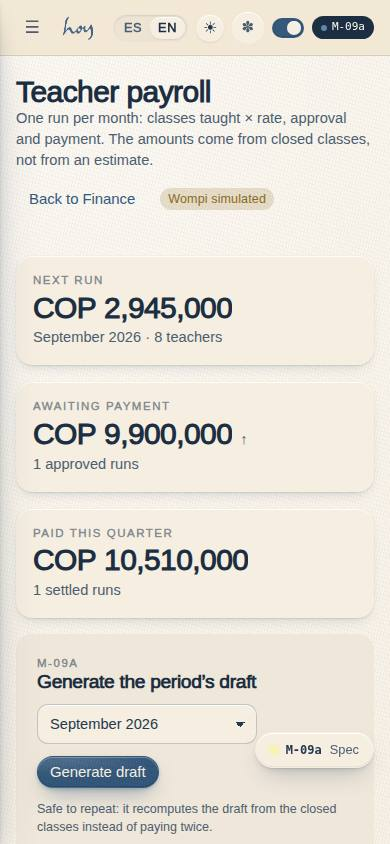
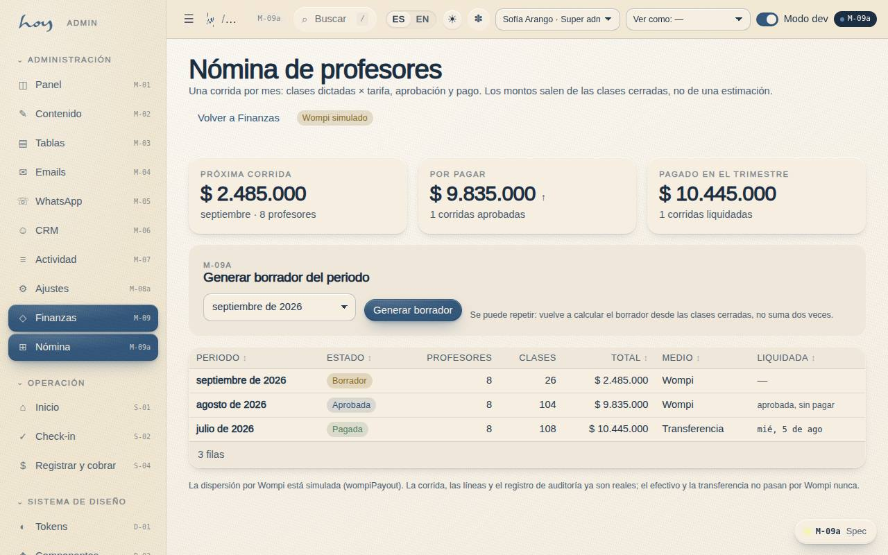
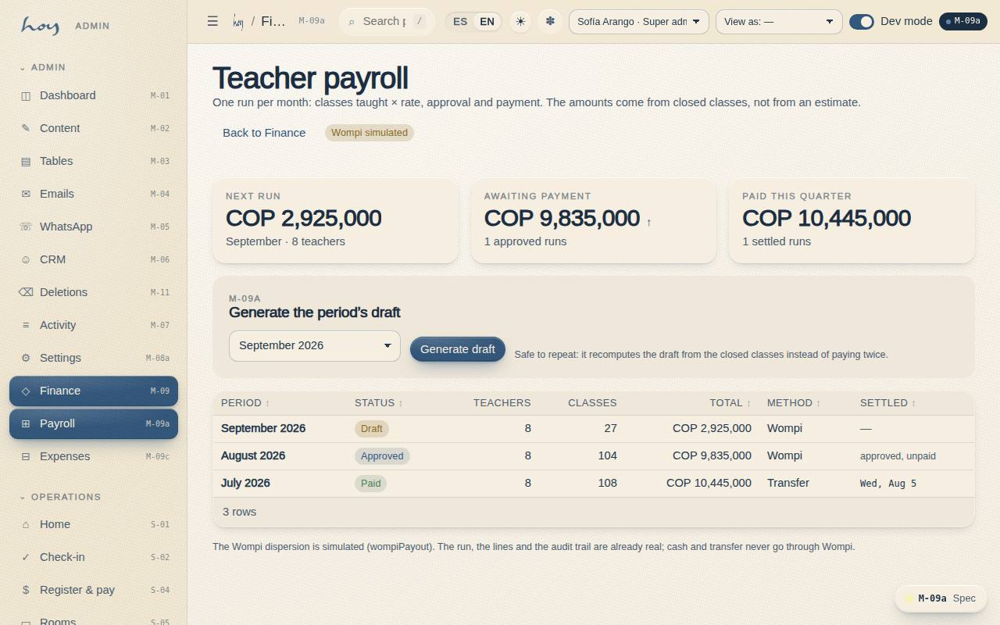

# M-09a — Finance · Payroll runs

**Route** `/#/admin/finance/payouts` · **Roles** super_admin, admin, finance · **Surface** admin · **Spec** `spec.code === 'M-09a'` (see `/#/dev/specs`)

## Purpose
The monthly teacher payroll runs: what is owed, what is approved and what is paid, plus the button that generates the period’s draft.

## Screenshots
| ES · mobile | EN · mobile |
| --- | --- |
|  |  |

| ES · desktop | EN · desktop |
| --- | --- |
|  |  |

## Sections (layout order — `useLayout(spec)`)
1. `KPIRow (próxima corrida, por aprobar, pagado en el trimestre)`
2. `GeneratePanel (periodo + generar borrador)`
3. `RunsTable (periodo, estado, profesores, clases, total, medio, liquidada)`
4. `SeamNote`

## Data
| Table | Read / write | Notes |
| --- | --- | --- |
| `payroll_runs` | read | |
| `payroll_lines` | read | |
| `class_sessions` | read | |
| `bookings` | read / write | |
| `teachers` | read | |
| `audit_log` | read / write | |

## Logic and integrations
- Generating a draft is idempotent: an existing draft for the same period has its lines deleted and recomputed, so pressing the button twice cannot double-pay. An approved or paid run is refused with a reason.
- payroll.write gates every action; payroll.read is enough to look.
- Teachers are paid per class taught: one completed class_sessions row = one payroll_lines row of kind class at teachers.rate_per_class. Bonuses and adjustments are lines finance adds by hand and are never derived.
- src/data/payrollCalc.ts is the single arithmetic: the seed (historical runs), M-09a (generate draft) and S-03 (the teacher statement) all use it, so the three screens can never disagree.
- A payout is NOT a payments row: payments is money in from members (it feeds M-09 revenue, C-11 history and M-01 KPIs). Money out lives on payroll_runs (status / paid_at / method / provider_ref) with an audit_log row per action.
- wompiPayout() in src/modules/admin/payouts.ts is the dispersion seam — simulated today, with the rejected path included; the badge says simulated on both pages.
- Integrations: Wompi

## States
- Loading
- No runs yet
- Draft exists for the period: regenerated
- Period already approved/paid: blocked
- Read-only (solo payroll.read)

## Real vs mock
- Real: the page renders from the data layer (`useData()` / `useTable`) over the tables above; every write goes through the `DataProvider` so the Supabase provider replaces the mock unchanged.
- Mock / pending: Wompi are simulated or deferred; data is the browser-local `MockProvider` seed.
- Note: Teachers are paid per class taught: one completed class_sessions row = one payroll_lines row of kind class at teachers.rate_per_class. Bonuses and adjustments are lines finance adds by hand and are never derived.
- Note: src/data/payrollCalc.ts is the single arithmetic: the seed (historical runs), M-09a (generate draft) and S-03 (the teacher statement) all use it, so the three screens can never disagree.
- Note: A payout is NOT a payments row: payments is money in from members (it feeds M-09 revenue, C-11 history and M-01 KPIs). Money out lives on payroll_runs (status / paid_at / method / provider_ref) with an audit_log row per action.
- Note: wompiPayout() in src/modules/admin/payouts.ts is the dispersion seam — simulated today, with the rejected path included; the badge says simulated on both pages.

## Changelog
- `docs/changelog/0005-final-integration.md` — screenshots and this page doc (v0.3.0)

---
**Resumen (ES).** Finanzas · Nóminas. Las liquidaciones mensuales de profesores: qué se debe, qué está aprobado y qué ya se pagó, y el botón que genera el borrador del periodo.
