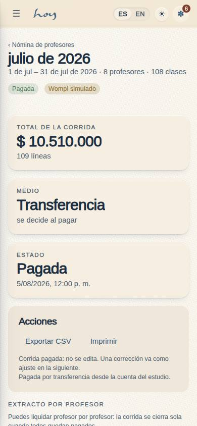
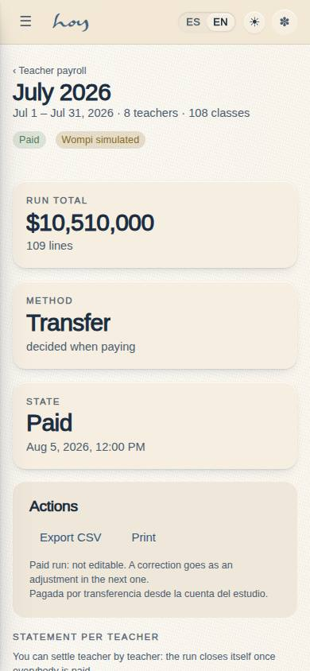
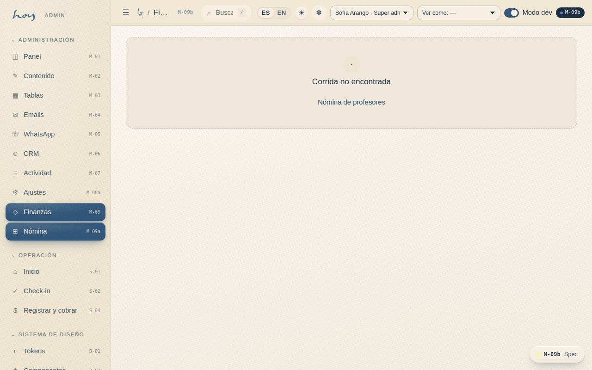
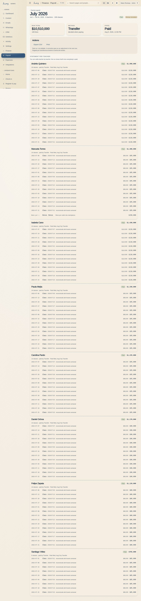

# M-09b — Finance · Payroll run

**Route** `/#/admin/finance/payouts/:id` · **Roles** super_admin, admin, finance · **Surface** admin · **Spec** `spec.code === 'M-09b'` (see `/#/dev/specs`)

## Purpose
One run: the per-teacher statement with their classes, bonuses and adjustments, and finance’s four actions — approve, send via Wompi, mark paid by transfer or cash, export CSV.

## Screenshots
| ES · mobile | EN · mobile |
| --- | --- |
|  |  |

| ES · desktop | EN · desktop |
| --- | --- |
|  |  |

## Sections (layout order — `useLayout(spec)`)
1. `RunHeader (periodo, estado, simulado)`
2. `KPIRow (total, medio, estado)`
3. `ActionBar (regenerar · aprobar · Wompi · transferencia · efectivo · CSV · imprimir)`
4. `Statement → TeacherCard (estado de pago, clases, líneas, subtotal, marcar como pagado)`

## Data
| Table | Read / write | Notes |
| --- | --- | --- |
| `payroll_runs` | read | |
| `payroll_lines` | read | |
| `class_sessions` | read | |
| `bookings` | read / write | |
| `teachers` | read | |
| `audit_log` | read / write | |

## Logic and integrations
- A run can be settled teacher by teacher: payroll_lines.paid_at + paid_method carry the stamp, so a bounced transfer for one teacher does not hold the other seven. The run closes itself as paid once every teacher is settled.
- Each teacher card shows the classes taught, the total attendance, the payment method and the settlement date — the payment detail finance is asked for on the phone.
- A run-level payment stamps every unpaid line with the same date and method, so the two paths can never disagree.
- Generating a draft is idempotent: an existing draft for the same period has its lines deleted and recomputed, so pressing the button twice cannot double-pay. An approved or paid run is refused with a reason.
- payroll.write gates every action; payroll.read is enough to look.
- Teachers are paid per class taught: one completed class_sessions row = one payroll_lines row of kind class at teachers.rate_per_class. Bonuses and adjustments are lines finance adds by hand and are never derived.
- src/data/payrollCalc.ts is the single arithmetic: the seed (historical runs), M-09a (generate draft) and S-03 (the teacher statement) all use it, so the three screens can never disagree.
- A payout is NOT a payments row: payments is money in from members (it feeds M-09 revenue, C-11 history and M-01 KPIs). Money out lives on payroll_runs (status / paid_at / method / provider_ref) with an audit_log row per action.
- wompiPayout() in src/modules/admin/payouts.ts is the dispersion seam — simulated today, with the rejected path included; the badge says simulated on both pages.
- Integrations: Wompi

## States
- Draft: regenerate + approve
- Approved: pay by Wompi / transfer / cash
- Approved: one teacher settled, the rest pending
- Paid: locked, read-only
- Wompi rejected: reason shown
- Run not found
- Negative adjustment line

## Real vs mock
- Real: the page renders from the data layer (`useData()` / `useTable`) over the tables above; every write goes through the `DataProvider` so the Supabase provider replaces the mock unchanged.
- Mock / pending: Wompi are simulated or deferred; data is the browser-local `MockProvider` seed.
- Note: Teachers are paid per class taught: one completed class_sessions row = one payroll_lines row of kind class at teachers.rate_per_class. Bonuses and adjustments are lines finance adds by hand and are never derived.
- Note: src/data/payrollCalc.ts is the single arithmetic: the seed (historical runs), M-09a (generate draft) and S-03 (the teacher statement) all use it, so the three screens can never disagree.
- Note: A payout is NOT a payments row: payments is money in from members (it feeds M-09 revenue, C-11 history and M-01 KPIs). Money out lives on payroll_runs (status / paid_at / method / provider_ref) with an audit_log row per action.
- Note: wompiPayout() in src/modules/admin/payouts.ts is the dispersion seam — simulated today, with the rejected path included; the badge says simulated on both pages.

## Changelog
- `docs/changelog/0005-final-integration.md` — screenshots and this page doc (v0.3.0)

---
**Resumen (ES).** Finanzas · Detalle de nómina. Una corrida: el extracto por profesor con sus clases, bonos y ajustes, y las cuatro acciones de finanzas — aprobar, enviar por Wompi, marcar pagada por transferencia o efectivo, exportar CSV.
