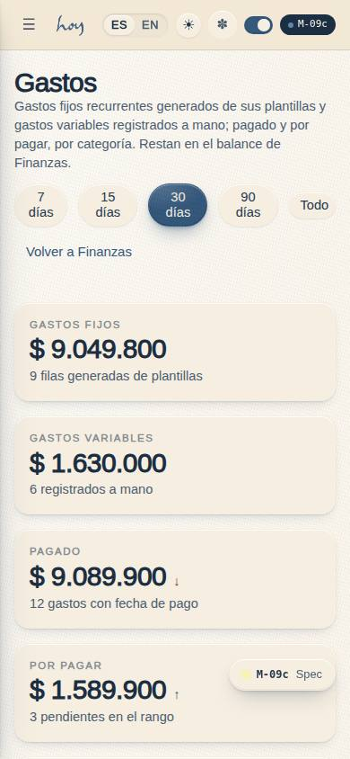
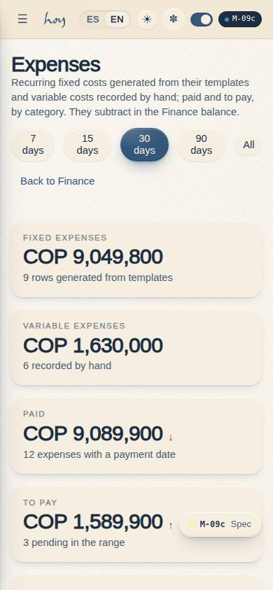
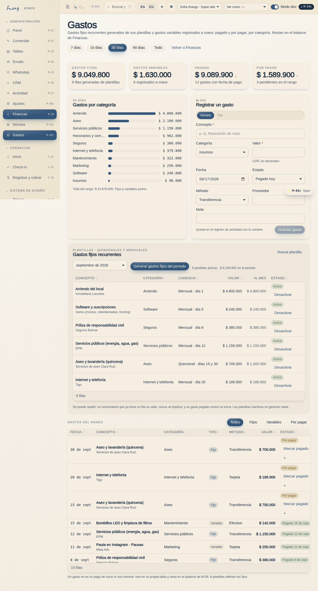
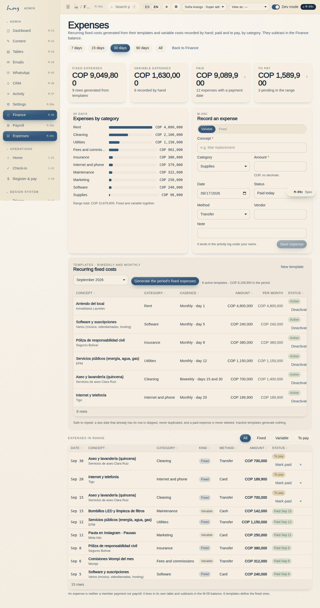

# M-09c — Finance · Expenses

**Route** `/#/admin/finance/expenses` · **Roles** super_admin, admin, finance · **Surface** admin · **Spec** `spec.code === 'M-09c'` (see `/#/dev/specs`)

## Purpose
The studio’s expenses ledger: recurring fixed costs (rent, utilities, cleaning by the quincena…) generated from templates with one idempotent button, variable costs recorded by hand, paid and to pay, by category — the third leg of the M-09 balance.

## Screenshots
| ES · mobile | EN · mobile |
| --- | --- |
|  |  |

| ES · desktop | EN · desktop |
| --- | --- |
|  |  |

## Sections (layout order — `useLayout(spec)`)
1. `RangeChips (7 / 15 / 30 / 90 días / Todo, los mismos de M-09)`
2. `KPIRow (fijos, variables, pagado, por pagar)`
3. `ByCategory (BarList)`
4. `AddExpenseForm (tipo, concepto, categoría, valor, fecha, pagado/por pagar, método, proveedor, nota)`
5. `TemplatesPanel (periodo + generar gastos fijos, tabla de plantillas con activar/desactivar, nueva plantilla)`
6. `ExpensesTable (fecha, concepto, categoría, tipo, método, valor, estado + marcar pagado)`

## Data
| Table | Read / write | Notes |
| --- | --- | --- |
| `expenses` | read | |
| `expense_templates` | read | |
| `audit_log` | read / write | |

## Logic and integrations
- A template falls due on anchor_day of every month; a biweekly template also falls due 15 days later (the Colombian quincena, clamped to the month’s last day). One due day inside the period = one expenses row of kind fixed pointing at the template.
- Range = rows whose incurred_on is inside the window, paid or not; “por pagar” is paid_on = null. Marking paid stamps today as paid_on and writes expense.pay to audit_log.
- Only an unpaid row can be deleted; a paid row is history and a correction is a new row with a note.
- An expense is neither a payments row (money in from members) nor a payroll row (teacher pay): it lives in expenses / expense_templates and subtracts in the M-09 balance. Mixing it into payments would corrupt every revenue number.
- src/data/expenseCalc.ts is the single arithmetic: dueDatesFor() and fixedExpensesFor() are what the seed and the generator both call, so the fixed rows on screen and the ones a button creates cannot disagree.
- Generating a period is idempotent: one row per template per due day; a due day that already has its row is skipped (paid or not), nothing is deleted, inactive templates generate nothing. Regenerating never duplicates, and a paid row is never touched.
- expenses.write gates every action (finance, admin, super_admin); expenses.read is enough to look. Every write appends an audit_log row through useAudit('admin').
- Integrations: none

## States
- Loading
- Empty range
- No templates yet
- Generate: n created / all skipped
- Unpaid row: marcar pagado
- Paid row: locked
- Read-only (solo expenses.read)
- Invalid form (empty concept, zero amount)

## Real vs mock
- Real: the page renders from the data layer (`useData()` / `useTable`) over the tables above; every write goes through the `DataProvider` so the Supabase provider replaces the mock unchanged.
- Mock / pending: no external integrations; data is the browser-local `MockProvider` seed.
- Note: An expense is neither a payments row (money in from members) nor a payroll row (teacher pay): it lives in expenses / expense_templates and subtracts in the M-09 balance. Mixing it into payments would corrupt every revenue number.
- Note: src/data/expenseCalc.ts is the single arithmetic: dueDatesFor() and fixedExpensesFor() are what the seed and the generator both call, so the fixed rows on screen and the ones a button creates cannot disagree.
- Note: Generating a period is idempotent: one row per template per due day; a due day that already has its row is skipped (paid or not), nothing is deleted, inactive templates generate nothing. Regenerating never duplicates, and a paid row is never touched.
- Note: expenses.write gates every action (finance, admin, super_admin); expenses.read is enough to look. Every write appends an audit_log row through useAudit('admin').

## Changelog
- `docs/changelog/0016-expenses-ledger.md` — the page, its tables, seed and screenshots (v0.6.1)

---
**Resumen (ES).** Finanzas · Gastos. El libro de gastos del estudio: fijos recurrentes (arriendo, servicios, aseo por quincena…) generados de plantillas con un botón idempotente, variables registrados a mano, pagado y por pagar, por categoría — la tercera pata del balance de M-09.
