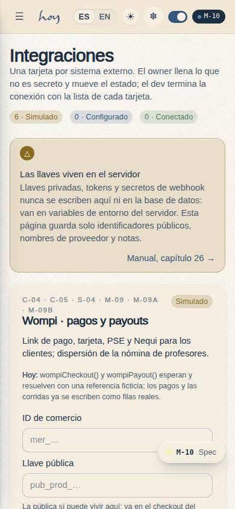
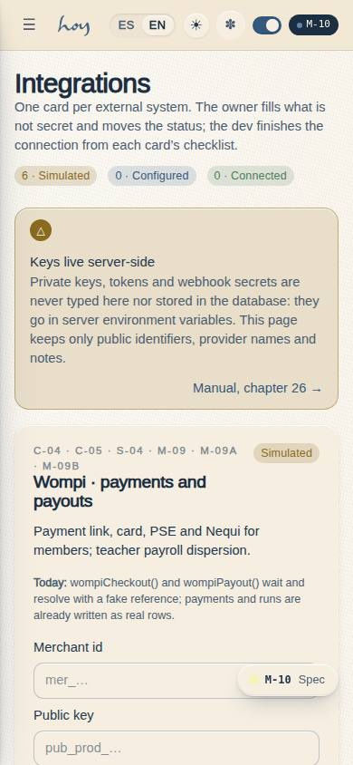
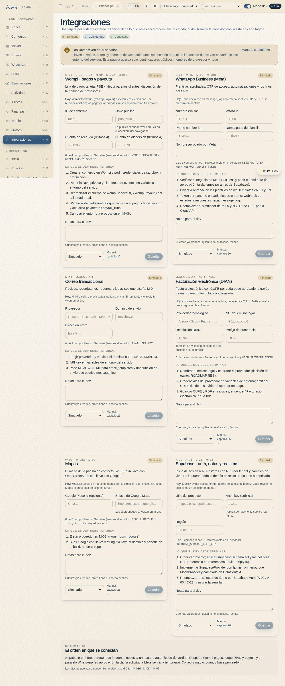
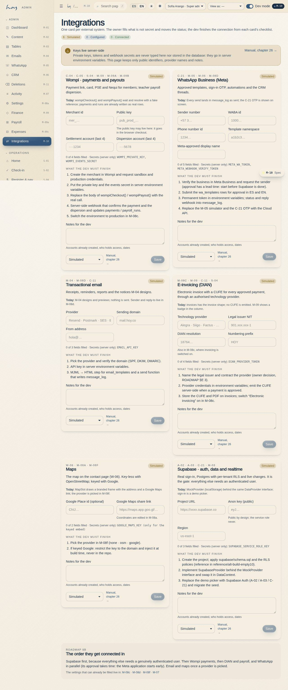

# M-10 — Integrations

**Route** `/#/admin/integrations` · **Roles** super_admin, admin · **Surface** admin · **Spec** `src/modules/admin/specs.ts` (`M10`)

## Purpose
One card per external system — Wompi, WhatsApp Business (Meta), email provider, DIAN e-invoicing, maps, Supabase — with the non-secret fields ready to fill (merchant id, public key, sender number, WABA id, template namespace, provider name, project URL…), a `simulated → configured → connected` status chip, the notice that keys live server-side (the environment variables are named, never stored), the checklist of what the dev must finish, notes and a link to manual chapter 26. The owner fills what can be filled today; the dev finalises the connections later.

## Screenshots
| ES · mobile | EN · mobile |
| --- | --- |
|  |  |

| ES · desktop | EN · desktop |
| --- | --- |
|  |  |

## Sections (layout order — `useLayout(spec)`)
1. `Intro` — title, one badge per status with its count, the "keys live server-side" `Notice`, link to `/manual/26-integraciones`
2. `Cards` — six `IntegrationCard`s (Card + Field + Input + Select + Badge + Button): what it does, what is simulated today, the fields, "n of m filled", the secrets named, the dev checklist, notes, status select, save
3. `Order` — the connection order from ROADMAP §B and links to the settings pages that already hold values (M-08c, M-08d, M-08f, M-07)

## Data
| Table | Read / write | Notes |
| --- | --- | --- |
| `integrations` | read / write | one row per key; `config` json holds NON-SECRET fields only; `status`; `notes`; `updated_by` |
| `audit_log` | write | `integration.update` with key, before, after |

## Logic and integrations
- Definitions (fields, checklist, secrets, screens) live in `src/modules/admin/integrationDefs.ts`, a pure module the seed imports, so the seeded rows and the page always agree; hooks in `integrations.ts`.
- Status is moved by hand — nothing here performs a connection; the seams (`wompiCheckout`, `wompiPayout`, `message_log`, `MockProvider`) keep behaving as before until the dev replaces them.
- `settings.write` gates every save. M-09a reads the Wompi row's status for its "simulado" badge (`useIntegrationStatus`).
- Integrations: Wompi, WhatsApp Business, Email, DIAN, Maps, Supabase — all simulated; this page is where that fact is recorded.

## Real vs mock
- Real: the rows, the saves and the audit entries.
- Mock / pending: every connection. The card says so in words ("Hoy: …").

## Changelog
- `docs/changelog/0018-decisions-as-settings.md` — first version (v0.7.0)

---
**Resumen (ES).** Integraciones: una tarjeta por sistema externo con los campos que no son secretos listos para llenar, un estado simulado · configurado · conectado, el aviso de que las llaves viven en el servidor y la lista para el dev. Manual, capítulo 26.
