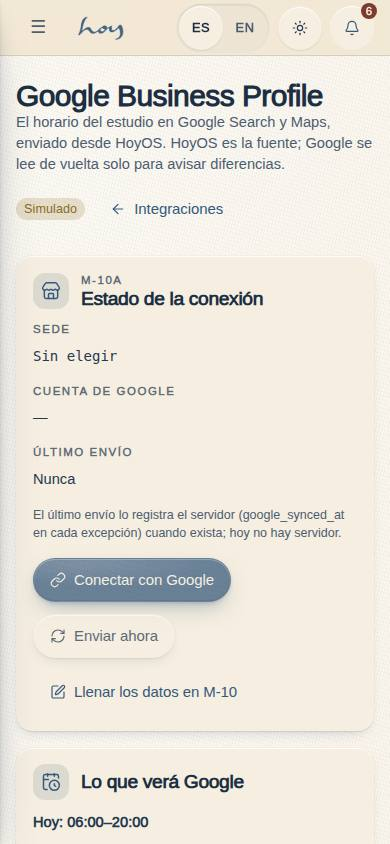
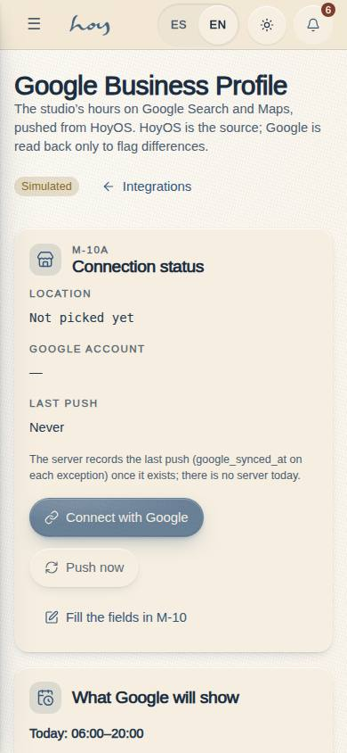
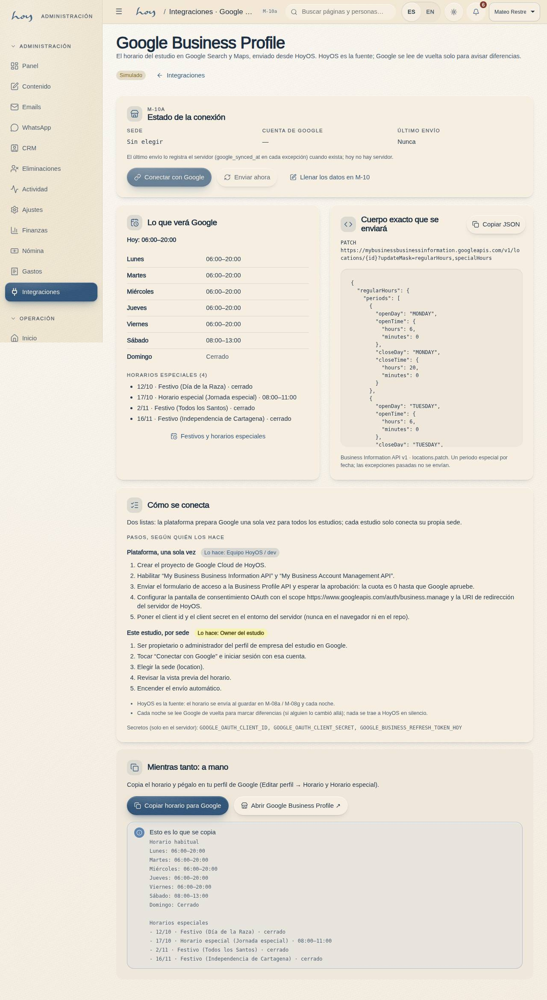
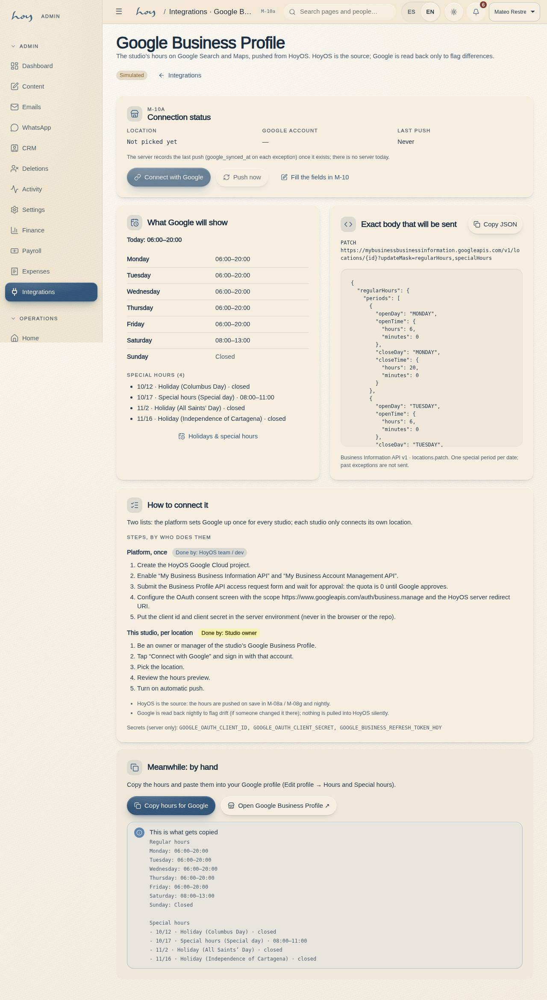

# M-10a — Integrations · Google Business Profile

**Route** `/#/admin/integrations/google-business` · **Roles** super_admin, admin · **Surface** admin · **Spec** `spec.code === 'M-10a'` (see `/#/dev/specs`)

## Purpose
The studio’s hours on Google Search and Maps. Shows the connection status, the exact body HoyOS will send to the Business Profile API (M-08a weekly hours + M-08g holidays and special hours), the steps split by who does them (platform once, studio per location) and, while there is no server, copying the hours to paste by hand.

## Screenshots
| ES · mobile | EN · mobile |
| --- | --- |
|  |  |

| ES · desktop | EN · desktop |
| --- | --- |
|  |  |

## Sections (layout order — `useLayout(spec)`)
1. `Status` — page head with status `Badge`; `Card`: location, Google account, last push; Connect with Google and Push now inside `Placeholder`; link to fill the fields on M-10
2. `Preview` — two cards: what Google will show (week table, today’s line, special hours) and the exact `locations.patch` body in a `<pre>` with Copy JSON and the endpoint line
3. `Setup` — `IntegrationSteps`: “Platform, once” (HoyOS team / dev) and “This studio, per location” (owner), the push / drift notes and the secret names
4. `Fallback` — Copy hours for Google (plain text) and Open Google Business Profile ↗, with the copied text shown

## Data
| Table | Read / write | Notes |
| --- | --- | --- |
| `integrations` | read | the `google_business` row: status and `config.locationName / accountEmail / placeId` (edited on M-10) |
| `tenants` | read | weekly hours (`settings.openingHours`) |
| `hours_overrides` | read | special hours from today; newest `google_synced_at` = last push (server-written, none yet) |
| `audit_log` | — | reserved for `integration.google.push` once the server exists |

## Logic and integrations
- HoyOS is the source of truth and pushes one way (D-0015): on save in M-08a / M-08g and nightly, the server calls locations.patch with updateMask=regularHours,specialHours and the body toGoogleBusinessHours() builds (src/tenant/hours.ts). Nightly it reads the location back and flags drift; nothing is pulled into HoyOS silently.
- Tokens never reach the browser: the OAuth client id / secret are platform env vars; each location’s refresh token is a server secret named per tenant (GOOGLE_BUSINESS_REFRESH_TOKEN_<TENANT>). The integrations row keeps only locationName, accountEmail and placeId.
- Status reads the google_business integrations row; “last push” is the newest hours_overrides.google_synced_at, which only the server writes (none yet).
- Special hours are one period per date (Google allows endDate at most one day after startDate), so multi-day overrides are expanded; past overrides are left out.
- Connect with Google and Push now are Placeholders until the server exists; Copy (JSON and text) and the Google link work today.
- Integrations: Google Business Profile (Business Information API v1, Account Management API), Google OAuth 2.0 (scope business.manage)

## States
- Loading
- Simulated (seed)
- Configured (location filled, server pending)
- Connected
- No special hours upcoming
- Copied

## Real vs mock
- Real: the preview body (`toGoogleBusinessHours()`, unit-tested in `scripts/test-hours.mjs`), both copy buttons and the external link.
- Mock / pending: OAuth connect, the push on save / nightly and the drift read-back — they need the HoyOS server (kanban: “Server for Google push + key verification”) and Google’s API access approval.
- Actions (WebMCP): `integrations.google.copyHours` works; `integrations.google.connect` and `integrations.google.push` answer “not wired yet”.

## Changelog
- `docs/changelog/0040-hours-google-keys.md` — first version (v0.16.0)

---
**Resumen (ES).** Integraciones · Google Business Profile. El horario del estudio en Google Search y Maps. Muestra el estado de la conexión, el cuerpo exacto que HoyOS enviará a la Business Profile API (horario semanal de M-08a + festivos y horarios especiales de M-08g), los pasos separados por quién los hace (plataforma una vez, estudio por sede) y, mientras no hay servidor, copiar el horario para pegarlo a mano.
