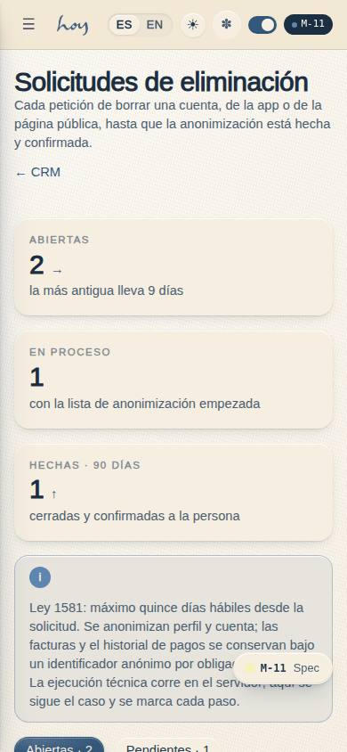
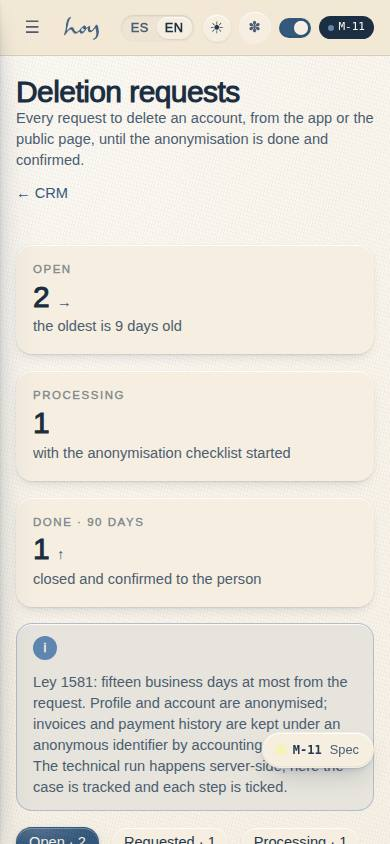
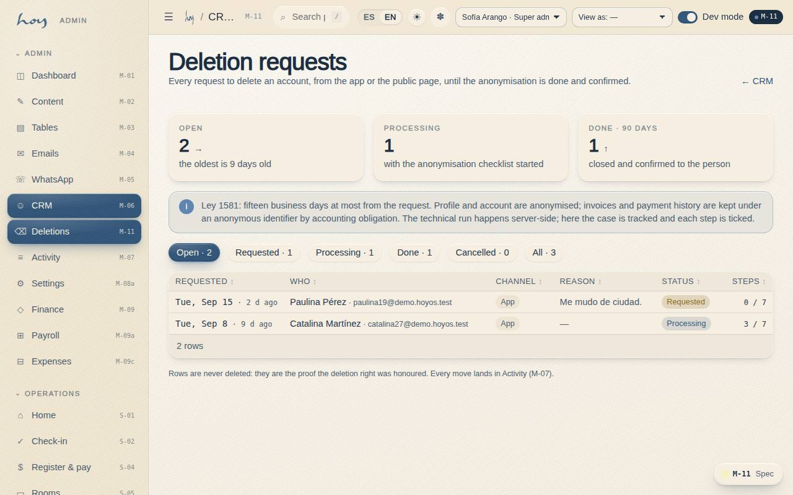

# M-11 — CRM · Deletion requests

**Route** `/#/admin/crm/deletions` · **Roles** super_admin, admin · **Surface** admin · **Spec** `src/modules/admin/specs.ts` `M11` (see `/#/dev/specs`)

## Purpose
The queue of account-deletion requests: who asked and through which channel, its status, the step-by-step anonymisation checklist, the internal note and the link to the member record. Admin moves it from requested to processing to done; cancelled closes it without deleting. Rows are never deleted: they are the proof the deletion right was honoured within Ley 1581's fifteen business days.

## Screenshots
| ES · mobile | EN · mobile |
| --- | --- |
|  |  |

| ES · desktop | EN · desktop |
| --- | --- |
|  |  |

## Sections
1. `KPIRow` — open requests (with the oldest's age), processing, done in the last 90 days.
2. `RuleNotice` — the fifteen-day rule and what is kept.
3. `StatusChips` — open / requested / processing / done / cancelled / all, with counts.
4. `RequestsTable` — requested date + age, who (member name, or email / masked phone for a public request), channel, reason, status, checklist n / 7.
5. `RequestDrawer` — the record, the M-06 link, the seven-step checklist, the internal note and the actions.

## Data
| Table | Read / write | Notes |
| --- | --- | --- |
| `deletion_requests` | read / write | status, `resolved_at`, `resolved_by`, `checklist`, `note` |
| `users`, `profiles` | read | through `usePeople()` for names and the CRM link |
| `audit_log` | write | `deletion.processing`, `deletion.done`, `deletion.cancelled`, `deletion.checklist` |

## Logic and integrations
- Status flow: requested → processing → done; cancelled from either open state. done and cancelled stamp `resolved_at` + `resolved_by`.
- *Marcar hecha* is disabled until all seven steps are ticked (profile, login account, notifications and preferences, messages, auth user, payments and invoices kept anonymous, confirmation sent).
- A public request (`user_id` null) shows the contact and no CRM link; matching it to a member is a human step, written in the note.
- The anonymisation itself is a server-side job (Supabase function) once the backend exists; until then the admin performs the steps in M-03 and ticks them here. The checklist is the specification of that job.
- Integrations: Supabase Auth (deferred) — removing the auth user.

## States
- Loading · No open requests · Filter with no matches
- Requested (start processing) · Processing with a partial checklist (done disabled) · All steps ticked (done enabled)
- Done / cancelled (locked, read-only) · Public request without an account · Read-only (not admin)

## Real vs mock
- Real: every status move, tick and note is a row write with its audit entry; verified end to end with Playwright (0019).
- Mock / pending: the job that performs the anonymisation and sends the confirmation.

## Changelog
- `docs/changelog/0019-app-store-readiness.md` — first version (v0.7.0)

---
**Resumen (ES).** La cola de solicitudes de eliminación de cuenta: quién, canal, estado, la lista de anonimización en siete pasos que habilita "Marcar hecha", la nota interna y el enlace a la ficha del socio. Solo admin y super admin. Las filas nunca se borran.
