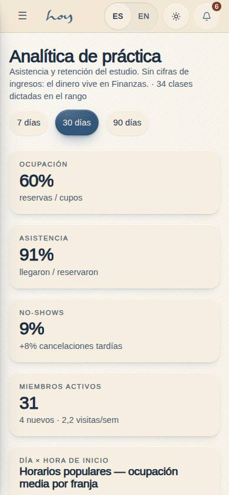
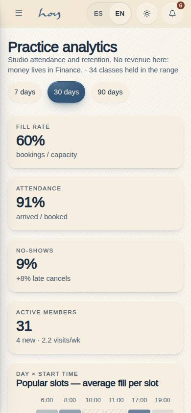
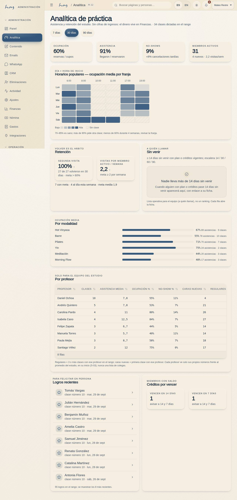
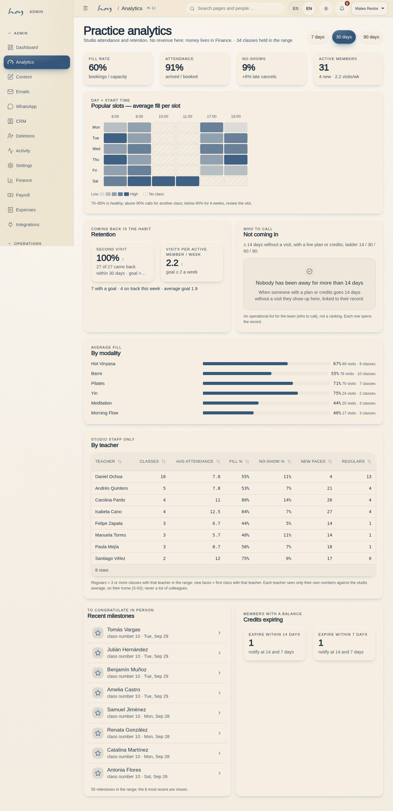

# M-12 — Analítica de práctica

**Route** `/#/admin/analytics` · **Roles** super_admin, admin, coordinator, finance · **Surface** admin · **Spec** `src/modules/admin/specs.ts` (`M12`, see `/#/dev/specs`)

## Purpose
How the studio is doing on attendance and retention: fill, attendance, no-shows, popular slots, second visit, who has not come in for a while, modalities, teachers, milestones to congratulate in person and credits about to expire. **No revenue figures** — ROADMAP §E 32 (does the Coordinator see the revenue KPI?) is open, so the page is attendance / retention only, opens for the same roles as M-01 and money stays in M-09. Every figure comes from `useStudioStats(range)` (`src/data/analytics.ts`); the page formats, it never computes. Members are never ranked. Nav entry "Analítica" (gauge icon) right after the dashboard; M-01's occupancy card links here.

## Screenshots
| ES · mobile | EN · mobile |
| --- | --- |
|  |  |

| ES · desktop | EN · desktop |
| --- | --- |
|  |  |

Captured 2026-09-29 by `npm run screenshots -- --only=/admin/analytics` (light only: M-12 is not a `KEY_PAGES` code, so no dark variant) plus `npm run thumbnails` for the hub cards.

## Sections (layout order — `useLayout(spec)`)
Header: title, "Asistencia y retención del estudio. Sin cifras de ingresos: el dinero vive en Finanzas. · {n} clases dictadas en el rango", range chips **7 · 30 · 90 días** (default 30).

1. `KPIRow ×4` — Ocupación (reservas / cupos; trends up ≥ 70 %) · Asistencia (llegaron / reservaron) · No-shows (+{late}% cancelaciones tardías; above 20 % reads "revisar la política" and trends down) · Miembros activos ({n} nuevos · {v} visitas/sem).
2. `Heatmap` — "Horarios populares — ocupación media por franja", weekday × start hour (`Heatmap` molecule, 5-step brand-blue ramp, hatched = no class; Lun–Sáb, Dom only when a Sunday class ran); guide line "70–85 % es sano; más de 90 % pide otra clase; menos de 60 % durante 4 semanas, revisar la franja."
3. `Retention` — Segunda visita ({back} de {first} volvieron en 30 días · meta > 60 %) · Visitas por miembro activo / semana (meta ≥ 2) · the goals line "{withGoal} con meta · {onTrack} al día esta semana · meta media {avg}".
4. `AtRiskList` — "Sin venir · A quién llamar": rule line, `DataTable` (Miembro with a "con meta" dot, Última visita, Días, Escalón badge 14+ / 30+ / 60+ / 90+), each row opens M-06; note "Lista operativa para el equipo (a quién llamar), no un ranking."
5. `ByModality` — `BarList` of average fill per modality with "{attended} asistencias · {classes} clases".
6. `ByTeacher` — "Solo para el equipo del estudio": `DataTable` Profesor · Clases · Asistencia media · Ocupación % · No-show % (red above 20 %) · Caras nuevas · Regulares; note that teachers see only their own numbers in S-03.
7. `Milestones` — "Logros recientes · Para felicitar en persona": the 8 most recent milestones in range (`ListRow` with star, "clase número {count} · {date}" / "primera clase · {date}") → M-06.
8. `CreditsExpiring` — Vencen en 14 días · Vencen en 7 días ("avisar a 14 y 7 días").

## Responsive layout
**Shell** `DesktopShell`. One column below 1100 px; from 1100 px a two-column grid where `Retention` + `AtRiskList` and `Milestones` + `CreditsExpiring` pair up and the other sections span the full width (`.adm-analytics`, `data-span`). The heatmap scrolls inside its card with the weekday column sticky under 480 px; `ByModality` stacks label over bar on phones. `PageSpec.checkedAt` = `[390, 1280, 3840]`. Follow-ups on the kanban: a `BarList` stacked-label variant instead of the page override, `Heatmap` natural width at 3840, the `SegmentedControl` selected pill in dark mode.

## Actions (WebMCP)
| id | Intent (ES) | Params | Permission |
| --- | --- | --- | --- |
| `analytics.setRange` | Muéstrame la analítica de los últimos {range} días | `range: enum:7,30,90` | `members.read` |
| `analytics.openMember` | Abre la ficha de {userId} | `userId: string — users.id (usr_cust)` | `members.read` |

Declared in the spec (`M12.actions`), mounted in `AnalyticsPage.tsx` with `useActions()`. An invalid range answers "El rango debe ser 7, 30 o 90 días."; a missing `userId` answers "Falta el id del miembro (userId)."

## Data
| Table | Read / write | Notes |
| --- | --- | --- |
| `bookings` | read | seats: `booked` + `checked_in` + `no_show` taken; `late_cancel` for the late-cancel rate |
| `class_sessions` | read | completed classes in range: capacity, weekday × hour, modality, teacher |
| `memberships` | read | who is entitled (active) for the at-risk list |
| `credits` | read | live balances and next expiry (expiring 14 / 7 days; entitlement) |
| `practice_goals` | read | active goals: adoption line and the "con meta" dot on at-risk rows |
| `profiles`, `users` | read | names (full name, email as the fallback) |
| `teachers`, `modalities` | read | names for the two breakdowns |

## Logic and integrations
- Every number is `studioStats()` through `useStudioStats(range)`; the page computes nothing itself. Range 7 / 30 / 90 days, default 30.
- Ocupación (fill) = seats taken (booked + checked_in + no_show) / capacity of completed classes in range. Asistencia = checked_in / seats taken. No-shows = no_show / seats taken. Cancelaciones tardías = late_cancel / (seats taken + late_cancel).
- Miembros activos = distinct users with ≥ 1 check-in in range; nuevos = their first ever check-in falls in range; visitas / semana = check-ins / active members / (range ÷ 7).
- Heatmap cell = mean per-class fill of completed classes at that weekday × start hour. 70–85 % healthy, > 90 % add a class, < 60 % for 4 weeks review the slot.
- Segunda visita = members whose first visit was 30–60 days ago and who attended again within 30 days / those members (goal > 60 %).
- En riesgo = active membership or live credits AND last check-in ≥ 14 days ago; band = the largest of 14 / 30 / 60 / 90 ≤ days since (`AT_RISK_BANDS`); sorted by days since, descending. **The M-06 segment rail still uses its own 21-day rule** (`useMemberStats`) until the two are unified (ROADMAP §E 41).
- Por profesor = completed classes per teacher: classes, mean attendance, fill, no-show rate, new faces (first check-in with that teacher in range), regulars (≥ 3 check-ins with that teacher in range); sorted by classes.
- Logros = `MILESTONES` (1, 5, 10, 25, 50, 100, 250) reached inside the range, newest first, first 8.
- Créditos por vencer = members with a live balance whose next purchase expiry falls within 14 / 7 days.
- Thresholds and sources: `docs/reference/analytics.md` §7. Integrations: none.

## States
- Loading (empty tables) · range with no classes held (heatmap and modality list show "No hubo clases en este rango") · nobody at risk (`EmptyState` "Nadie lleva más de 14 días sin venir") · no milestones in range · no goals set yet ("Nadie ha elegido una meta semanal todavía.") · no teacher taught in range · heatmap scrolls inside its card on phones.

## Real vs mock
- Real: everything is computed from the real rows in the data layer; a check-in at the desk (S-02) or a booking in the app changes the page on the next render. The two actions run.
- Mock / pending: data is the browser-local `MockProvider` seed (the seed's 30-day window holds ~32 completed classes with 8 teachers; at-risk is usually empty because the seed's members all visit); no external integration; no revenue while §E 32 is open. A Supabase materialisation of the same functions is described in `docs/reference/analytics.md` §6 for when the tables outgrow the browser.

## Changelog
- `docs/changelog/0040-practice-analytics.md` — the page is new: practice analytics for members, teachers and the club (v0.16.0, 2026-09-29)

---
**Resumen (ES).** Analítica de práctica. Cómo va el estudio en asistencia y retención: ocupación, asistencia, no-shows, horarios populares, segunda visita, quién lleva días sin venir (escalera 14 / 30 / 60 / 90, con enlace a la ficha), modalidades, profesores, logros para felicitar en persona y créditos por vencer. Sin cifras de ingresos hasta resolver la decisión §E 32; nunca un ranking de miembros.
