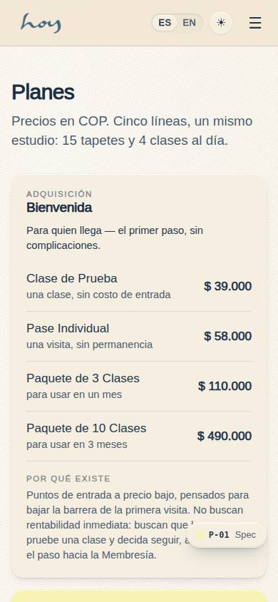
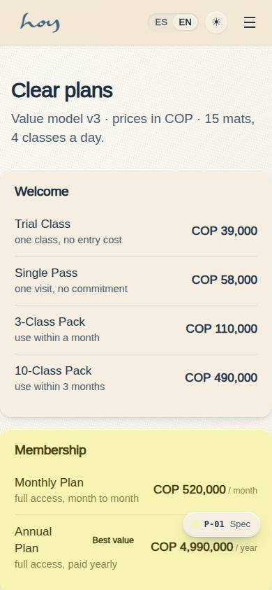
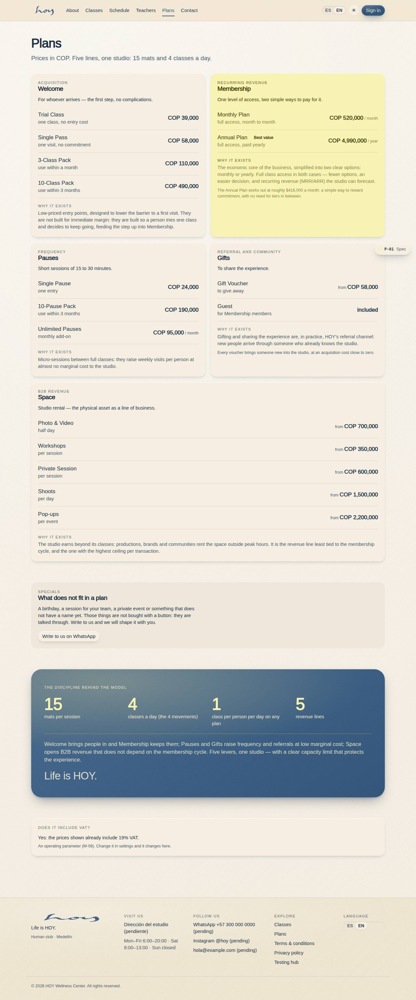

# P-01 — Plans & prices — Modelo de Valor v3

**Route** `/#/site/plans` · **Roles** public, customer, front_desk, finance, coordinator, super_admin · **Surface** public · **Spec** `spec.code === 'P-01'` (see `/#/dev/specs`)

## Purpose
One value model, written once and read by every surface that quotes a price — now with the reasoning in front of the customer. Each family shows its commercial role, its one-line subtitle and its "Por qué existe" paragraph from `FAMILY_RATIONALE`; the Annual Plan carries its monthly-equivalent footnote; a dark band prints the four discipline numbers and the investor paragraph; and an "¿Incluye IVA?" card reads the live M-08 tax policy.

## Screenshots
| ES · mobile | EN · mobile |
| --- | --- |
|  |  |

| ES · desktop | EN · desktop |
| --- | --- |
|  |  |

## Sections (layout order — `useLayout(spec)`)
1. `PageHead`
2. `Families`
3. `Discipline`
4. `TaxNote`

## Data
| Table | Read / write | Notes |
| --- | --- | --- |
| `plans` | read | |
| `plan_prices` | read | |
| `packages` | read | |
| `memberships` | read / write | |
| `gift_cards` | read | |
| `space_rentals` | read | |
| `orders` | read | |

## Logic and integrations
- Prices live in one config; no surface hard-codes a figure. Changing a price here changes it everywhere.
- Membresía has exactly two options — Mensual and Anual. No third tier, no hidden discounts.
- Espacio prices are 'desde' and lead to a conversation, not a checkout.
- One class a day per person on any plan; the studio holds 15 mats and runs 4 classes a day.
- Conscious controls: pause up to 30 days, leave without mazes, a kind cancellation window, notice before every charge.
- Every plan CTA enters the same single-screen checkout (C-04) with lazy registration and local payment methods.
- Integrations: WhatsApp, Wompi, Supabase Realtime

## States
- Default (this page)
- Member: Membresía cards show current plan and 'change'
- Promotion: badge + strike price
- Sold-out space date: CTA becomes an enquiry form

## Real vs mock
- Real: prices, names, family labels, the per-family rationale and the discipline numbers all come from
  `src/tenant/pricing.ts` (whose four numbers read `tenant.studio` and the number of families, so nothing is
  written twice). The IVA note reads the live M-08 tax settings through `usePolicy()`, so changing
  `tax.ivaPct` / `tax.pricesIncludeIva` in admin settings changes this page.
- Mock / pending: checkout is behind sign-in (`/auth/sign-in?next=/app/plans?plan=<id>`); Wompi and WhatsApp
  are simulated. `plans` / `plan_prices` rows are seeded from the same pricing file.

## Changelog
- `docs/changelog/0005-final-integration.md` — screenshots and this page doc (v0.3.0)
- `docs/changelog/0011-website-brand-content.md` — brand copy, MediaSlot/MapSlot, new classes pages (v0.6.0)

---
**Resumen (ES).** Planes y precios — Modelo de Valor v3. Las cinco familias con su rol comercial y su «Por qué existe», la nota del Plan Anual, la banda de disciplina (15 · 4 · 1 · 5) y la nota de IVA leída de M-08.