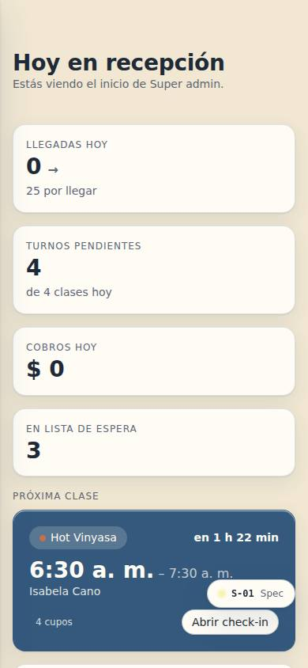
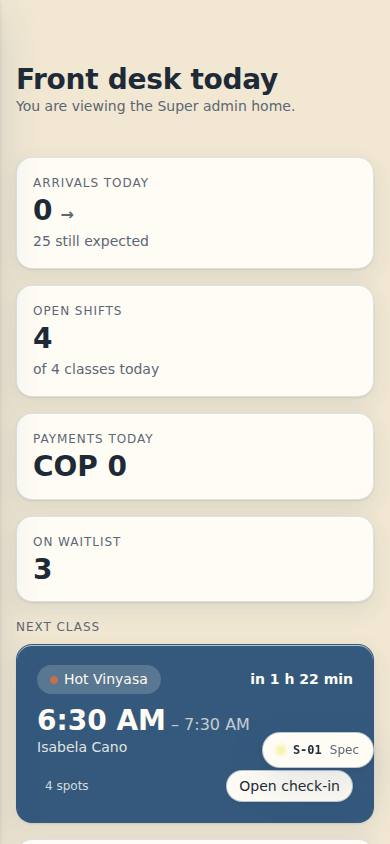
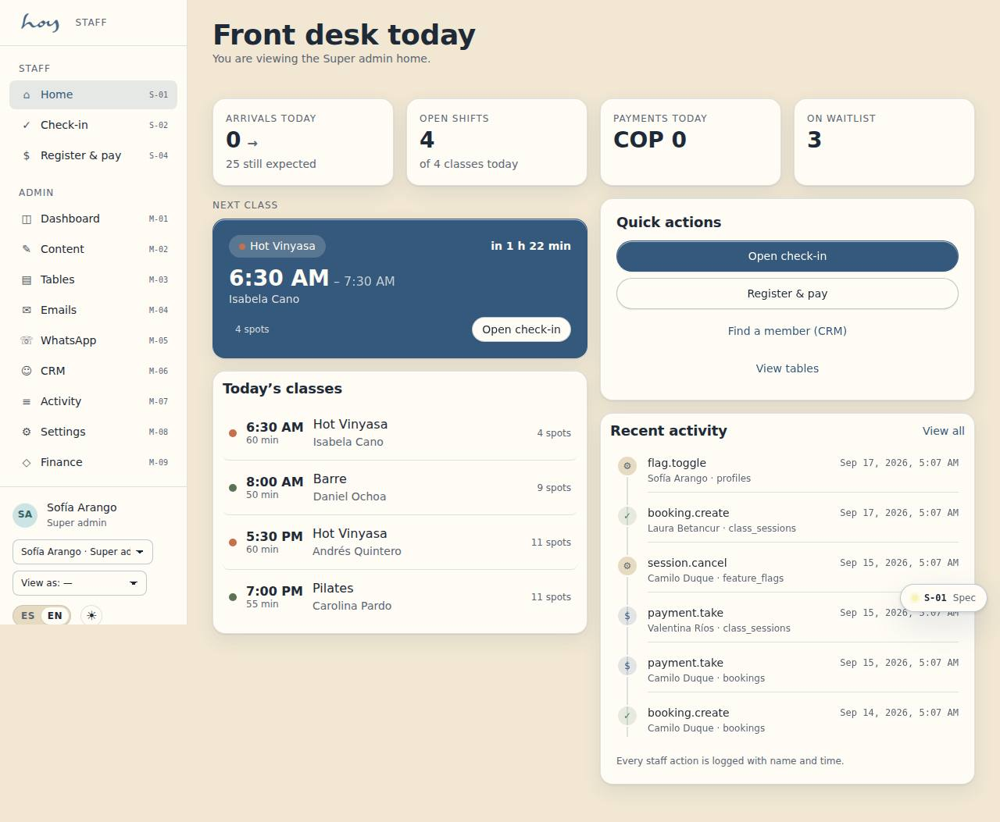

# S-01 — Role home & demo switcher

**Route** `/#/staff` · **Roles** super_admin, coordinator, front_desk, teacher, finance, customer · **Surface** staff · **Spec** `spec.code === 'S-01'` (see `/#/dev/specs`)

## Purpose
One app, six doors. The demo switcher in the toolbar swaps role so the whole system can be reviewed as any user.

## Screenshots
| ES · mobile | EN · mobile |
| --- | --- |
|  |  |

| ES · desktop | EN · desktop |
| --- | --- |
|  |  |

## Sections (layout order — `useLayout(spec)`)
1. `RoleBadge + KPIRow`
2. `NextClassCard`
3. `TodayList`
4. `QuickActions`
5. `AuditNotice (recent activity)`

## Data
| Table | Read / write | Notes |
| --- | --- | --- |
| `class_sessions` | read | |
| `bookings` | read / write | |
| `waitlist` | read / write | |
| `payments` | read / write | |
| `audit_log` | read / write | |
| `teachers` | read | |

## Logic and integrations
- Teachers hold both a teacher and a student context and can switch freely.
- Permissions are additive per role; Super admin implies all.
- Every staff action is written to the audit log with actor, target and timestamp.
- Demo switching exists in the prototype only, never in production.
- Integrations: Supabase Auth

## States
- No role assigned: read-only student view
- Context switch: full re-route

## Real vs mock
- Real: the page renders from the data layer (`useData()` / `useTable`) over the tables above; every write goes through the `DataProvider` so the Supabase provider replaces the mock unchanged.
- Mock / pending: Supabase Auth are simulated or deferred; data is the browser-local `MockProvider` seed.
- Note: Live: subscribes to bookings and class_sessions through useTable.

## Changelog
- `docs/changelog/0005-final-integration.md` — screenshots and this page doc (v0.3.0)

---
**Resumen (ES).** Inicio por rol y selector demo. Inicio por rol con selector de usuario demo para probar cada experiencia.
