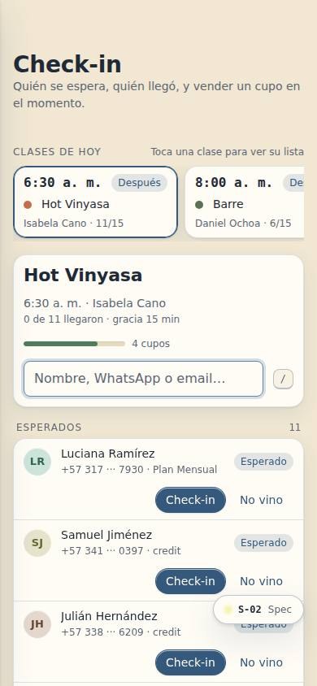
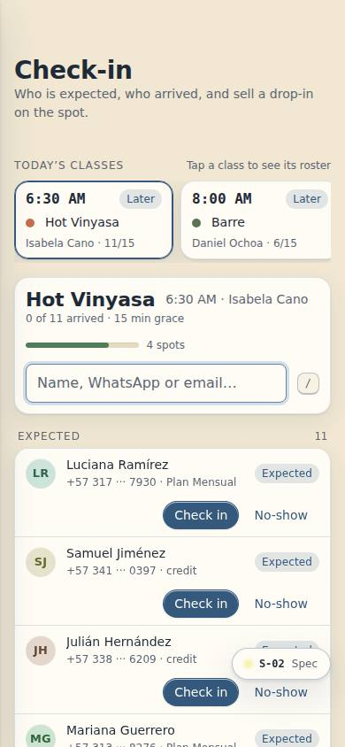
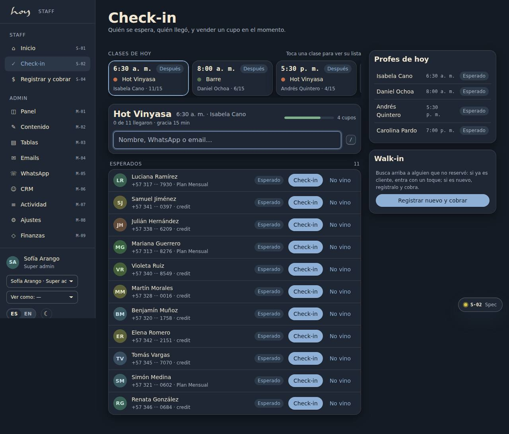
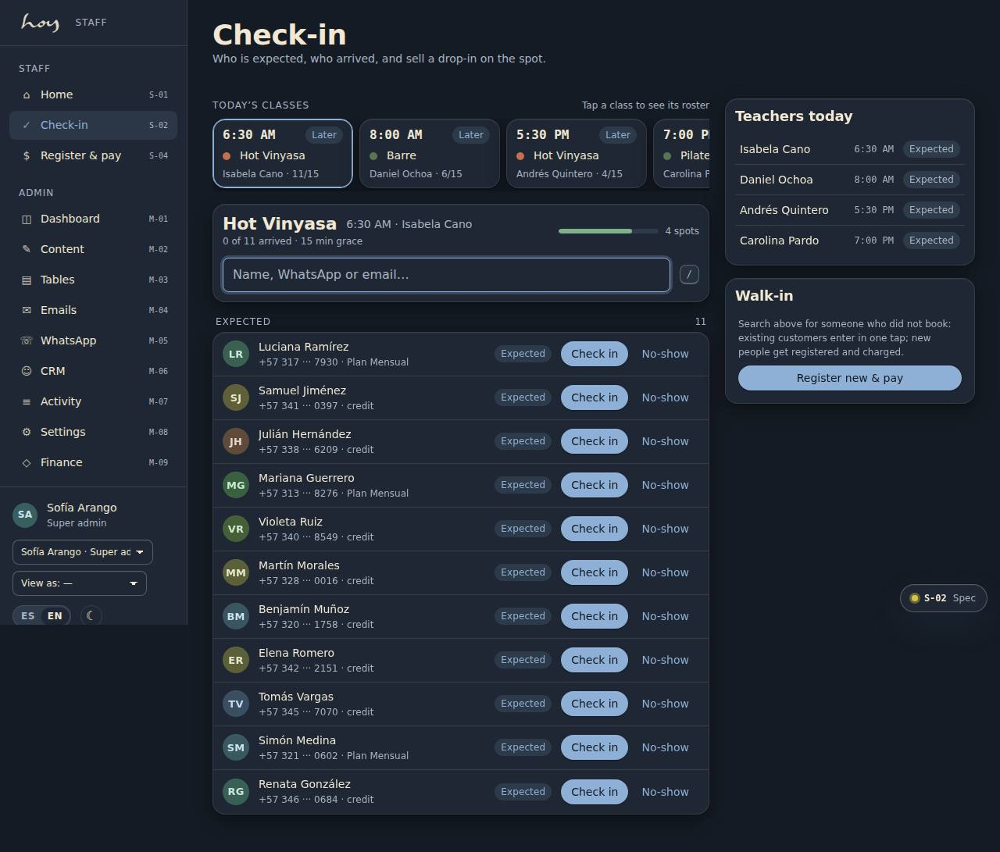

# S-02 — Front desk check-in

**Route** `/#/staff/checkin` · **Roles** front_desk, coordinator, super_admin · **Surface** staff · **Spec** `spec.code === 'S-02'` (see `/#/dev/specs`)

## Purpose
The desk view during the ten minutes before class: who is expected, who has arrived, scan or search, and sell a drop-in on the spot.

## Screenshots
| ES · mobile | EN · mobile |
| --- | --- |
|  |  |

| ES · desktop | EN · desktop |
| --- | --- |
|  |  |

| ES · dark | EN · dark |
| --- | --- |
|  |  |

## Sections (layout order — `useLayout(spec)`)
1. `TodayStrip (now / next / later)`
2. `MemberSearch + CapacityMeter`
3. `RosterList (expected / checked in / waitlist)`
4. `TeachersInToday`
5. `QuickSell (walk-in)`

## Data
| Table | Read / write | Notes |
| --- | --- | --- |
| `class_sessions` | read | |
| `bookings` | read / write | |
| `waitlist` | read / write | |
| `users` | read / write | |
| `profiles` | read / write | |
| `memberships` | read / write | |
| `plans` | read | |
| `teachers` | read | |
| `modalities` | read | |
| `audit_log` | read / write | |
| `tenants` | read / write | |

## Logic and integrations
- There is no scanner: students check in at the desk by name and teachers mark attendance, so the roster has one source of truth.
- Waitlist promotion happens from this screen when a no-show is confirmed at T+5m.
- Cash settles the pending order and prints or sends the receipt.
- Health flags show as a discreet marker for the teacher.
- Integrations: Wompi, Email, Supabase Realtime

## States
- Offline: queue check-ins locally and sync
- No classes today: empty strip
- Loading roster
- No permission: roster read-only

## Real vs mock
- Real: the page renders from the data layer (`useData()` / `useTable`) over the tables above; every write goes through the `DataProvider` so the Supabase provider replaces the mock unchanged.
- Mock / pending: Wompi, Email, Supabase Realtime are simulated or deferred; data is the browser-local `MockProvider` seed.
- Note: Late = checked in after starts_at + policies.lateGraceMin (M-08).
- Note: Keyboard: / focuses search, Enter checks in the first expected match, Esc clears.
- Note: Capacity comes from the session row (seeded from tenant.studio.mats).

## Changelog
- `docs/changelog/0005-final-integration.md` — screenshots and this page doc (v0.3.0)

---
**Resumen (ES).** Check-in en recepción. Check-in en recepción: lista de la clase, llegadas, lista de espera y cobros rápidos.
