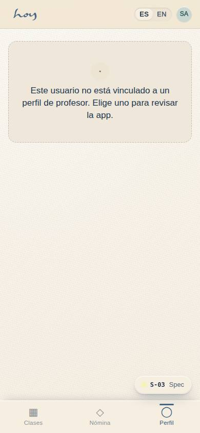
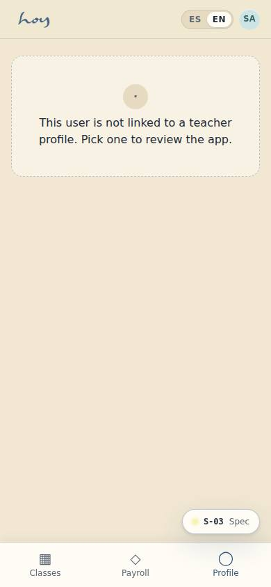
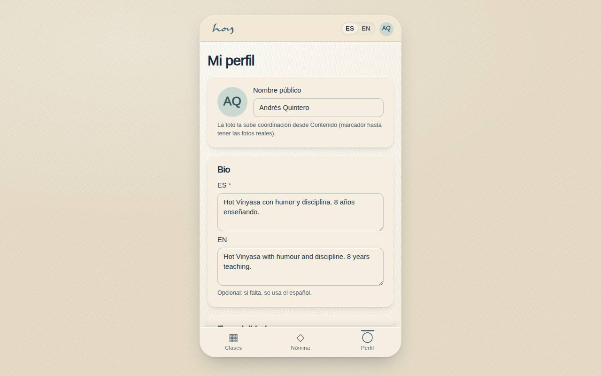
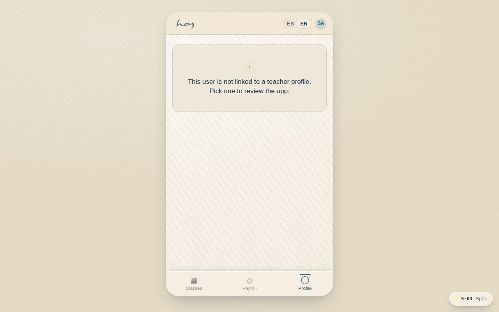
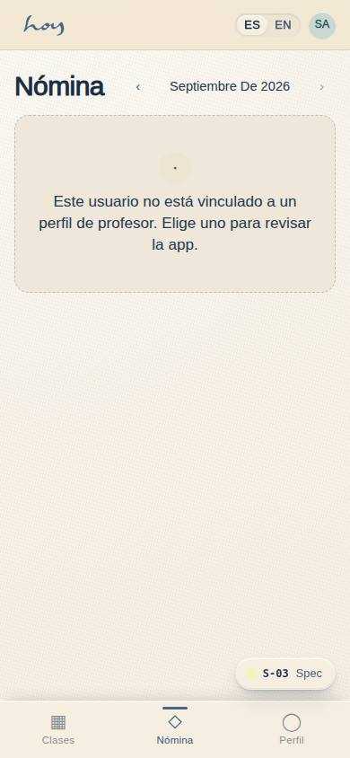
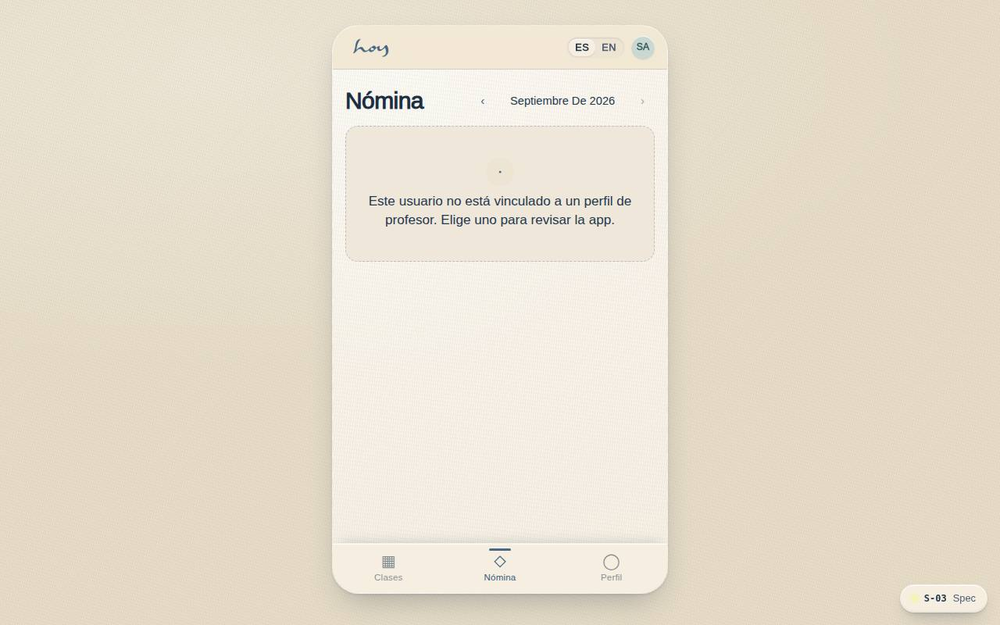

# S-03 — Teacher app

**Route** `/#/teach` · `/#/teach/class/:id` · `/#/teach/payroll` · `/#/teach/profile` · **Roles** teacher, coordinator, finance, super_admin · **Surface** teacher · **Spec** `spec.code === 'S-03'` (see `/#/dev/specs`)

## Purpose
What a teacher needs between classes: schedule, roster and attendance, their own content, reviews, and what they have been paid.

## Screenshots
| ES · mobile | EN · mobile |
| --- | --- |
|  |  |

| ES · desktop | EN · desktop |
| --- | --- |
|  |  |

All four teacher routes share the S-03 code, so the unlabelled captures above are the last one the
pass visits (`/teach/profile`). **Payroll** (`/teach/payroll`) is captured under the `payroll` label
by `npm run screenshots -- --only=/teach/payroll --label=payroll`, which is what the operations
manual embeds in chapters 06 and 16:

| ES · payroll · mobile | ES · payroll · desktop |
| --- | --- |
|  |  |

## Sections (layout order — `useLayout(spec)`)
S-03 is four routes: the home (`/teach`), the class roster (`/teach/class/:id`), **payroll**
(`/teach/payroll`) and the profile editor (`/teach/profile`). The payroll page renders:

1. `MonthPicker`
2. `RunStateCard` — estimate / draft / approved / paid, with what each means
3. `SummaryTiles` — classes taught, rate per class, month total
4. `Breakdown` — one row per class: date, time, attendees, amount, substitution badge
5. `ExtrasLines` — bonuses and adjustments finance added (an adjustment may be negative)
6. `PayoutMethodCard` — the account on file and the method of this run
7. `RunHistory` — earlier runs with a status chip and the teacher's own total
8. `PrintStatement` + `AskFinance` (WhatsApp)

## Data
| Table | Read / write | Notes |
| --- | --- | --- |
| `payroll_runs` | read | the run covering the month, and the teacher's own history |
| `payroll_lines` | read | the teacher's lines once the run exists |
| `teachers` | read / write | `rate_per_class` is read-only here; the profile editor writes the rest |
| `class_sessions`, `bookings` | read | the live estimate before the run exists, and attendance |
| `class_templates` | read | a substitution is a session whose template teacher differs |
| `payment_methods` | read | the payout account on file for the teacher's user |
| `tenants` | read | the finance WhatsApp number from M-08 |
| `audit_log` | write | attendance marks and class notes (from the roster route) |

## Logic and integrations
- Attendance can be marked from T−15m to T+2h; later needs the coordinator.
- **Before** finance generates the run, the month is computed live from completed sessions ×
  `teachers.rate_per_class` through `src/data/payrollCalc.ts`, and labelled an estimate.
- **Once** a `payroll_runs` row covers the period, the page reads `payroll_lines` instead — so what the
  teacher sees is what finance will pay, bonuses and adjustments included.
- A substitution is a badge, not a different rate.
- The payout method on file comes from `payment_methods` for the teacher's user; the run's own method
  is shown next to it, because it is decided when finance closes the run.
- "Ask about this statement" opens WhatsApp to the studio contact with the period and total prefilled.
  The print button produces the statement as a PDF through the browser.
- Read-only by design: only finance writes payroll (M-09a / M-09b).
- Integrations: Wompi (payout dispersion, simulated), WhatsApp (the finance link is a real `wa.me` URL).

## States
- Estimate (no run yet) · draft · approved · paid (with the date)
- No classes taught this month · substitutions present · negative adjustment
- No payout method on file · user not linked to a teacher profile

## Real vs mock
- **Real.** The statement is real `payroll_lines` for the signed-in teacher, the live estimate uses the
  same arithmetic M-09a uses to generate the run, the history and status chips are real run rows, and
  the WhatsApp link and print view work.
- **Mock / pending.** Nothing pays out: `wompiPayout()` simulates the dispersion, and the page says
  "la nómina la corre finanzas del estudio · Wompi simulado" instead of the old placeholder badge.
  Data is the browser-local `MockProvider` seed.
- **Note.** The two months before the seed's ±7-day session window have their class lines reconstructed
  from the weekly timetable (`class_session_id = null`, with a note saying so) rather than from
  invented sessions.

## Changelog
- `docs/changelog/0012-thin-screens-depth.md` — depth pass on the thin screens (v0.6.0)
- `docs/changelog/0005-final-integration.md` — screenshots and this page doc (v0.3.0)

---
**Resumen (ES).** App de profesores. App de profesores: mis clases, asistencia, descripción y vista de nómina.
