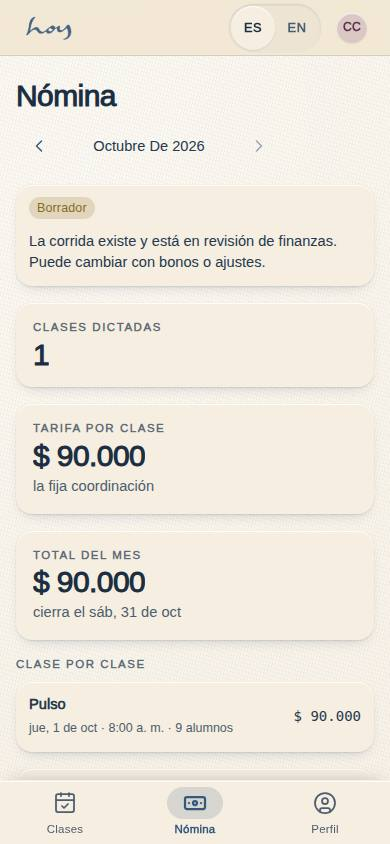

# S-03 — Teacher app

**Route** `/#/teach` · `/#/teach/class/:id` · `/#/teach/payroll` · `/#/teach/profile` · **Roles** teacher, coordinator, finance, super_admin · **Surface** teacher · **Spec** `spec.code === 'S-03'` (see `/#/dev/specs`)

## Purpose
What a teacher needs between classes: schedule, roster and attendance, their own content, reviews, and what they have been paid.

## Screenshots
| ES · mobile | EN · mobile |
| --- | --- |
|  |  |

| ES · desktop | EN · desktop |
| --- | --- |
|  |  |

All four teacher routes share the S-03 code, so the unlabelled captures above are the last one the
pass visits (`/teach/profile`). **Payroll** (`/teach/payroll`) is captured under the `payroll` label
by `npm run screenshots -- --only=/teach/payroll --label=payroll`, which is what the operations
manual embeds in chapters 06 and 16:

| ES · payroll · mobile | ES · payroll · desktop |
| --- | --- |
|  |  |

## Sections (layout order — `useLayout(spec)`)
S-03 is four routes: the home (`/teach`), the class roster (`/teach/class/:id`), **payroll**
(`/teach/payroll`) and the profile editor (`/teach/profile`).

The home (`/teach`) renders `NextClassCard` · `PayrollTile` · **`MyNumbers`** (0040) · `TodayClasses` · `Specials` · `ScheduleList` · `SubstitutionRequest`. **Mis números · 30 días** is seven `StatTile`s from `useTeacherStats(me, 30)` with the studio figure from `useStudioStats(30)` as the hint: Ocupación (estudio {n}%) · Asistencia media ({n} personas por clase · estudio {n}) · No-shows (estudio {n}%) · Caras nuevas (primera clase contigo) · Regulares (3 o más clases contigo) · Primerizos que volvieron ({returned} de {n} en 30 días) · Valoración (hidden under 5 reviews: "Aún pocas reseñas ({n} de 5)"); footer "Solo tú y coordinación ven estos números." Never a list or ranking of colleagues — that table is M-12, staff only.

The payroll page renders:

1. `MonthPicker`
2. `RunStateCard` — estimate / draft / approved / paid, with what each means
3. `SummaryTiles` — classes taught, rate per class, month total
4. `Breakdown` — one row per class: date, time, attendees, amount, substitution badge
5. `ExtrasLines` — bonuses and adjustments finance added (an adjustment may be negative)
6. `PayoutMethodCard` — the account on file and the method of this run
7. `RunHistory` — earlier runs with a status chip and the teacher's own total
8. `PrintStatement` + `AskFinance` (WhatsApp)

## Responsive layout (0025)
**Shell** `AppShell` (D-0006). Below 900 px: brand top bar, a content column of at most 560 px and the sticky bottom dock (Classes · Payroll · Profile), exactly the phone layout. From 900 px (`useMinWidth('shell')`): a full-viewport page, the primary nav moves into the top bar (`NavBar variant="top"`), content sits in a centred `--w-app` container (75rem, growing with the `--ui` band at 1920 / 2560 / 3840) and the document scrolls. No phone bezel at any width; the bezel exists only in the hub's `DeviceFrame` simulator.

- Applies to every teacher route (`/teach`, `/teach/class/:id`, `/teach/payroll`, `/teach/profile`): same shell as the customer app.
- **≥ 900 px**: the top bar carries Classes · Payroll · Profile; content stays one column inside the `--w-app` container (no two-column split yet).
- **< 900 px**: unchanged phone layout with the bottom dock.

Verified 2026-09-28 at 390 · 768 · 1280 · 1920 · 3840 px (ES, light; ES + EN captures at 360 · 390 · 768 · 1280 · 1920 · 3840) during the 0026 build: DOM audit (`scrollWidth === innerWidth` on all four routes) plus the captures above; `PageSpec.checkedAt` = `[390, 768, 1280, 1920, 3840]`.

## Responsive layout (0026) — column width
From 900 px the four teacher routes are capped at `--w-teach` (60rem, D-01; 960 px at 1280, 1080 at 1920, 1680 at 3840) instead of the 75rem `--w-app` container the two-column customer pages use: rosters, statement lines and the profile form are one-column lists and read badly stretched to 1200+ px (the "too wide" of the 0026 prompt). Below 900 px nothing changes. DOM audit at 390 · 768 · 1280 · 1920 · 3840: no horizontal overflow on any route, no fixed px widths (`.teach-month` is now 9.375rem).

## Data
| Table | Read / write | Notes |
| --- | --- | --- |
| `payroll_runs` | read | the run covering the month, and the teacher's own history |
| `payroll_lines` | read | the teacher's lines once the run exists |
| `teachers` | read / write | `rate_per_class` is read-only here; the profile editor writes the rest |
| `class_sessions`, `bookings` | read | the live estimate before the run exists, and attendance |
| `class_templates` | read | a substitution is a session whose template teacher differs |
| `payment_methods` | read | the payout account on file for the teacher's user |
| `tenants` | read | the finance WhatsApp number from M-08 |
| `audit_log` | write | attendance marks and class notes (from the roster route) |
| `reviews` | read | the teacher's own ratings for Mis números (0040) |
| `memberships`, `credits`, `practice_goals` | read | inputs `studioStats()` needs for the studio averages (0040) |

## Logic and integrations
- Attendance can be marked from T−15m to T+2h; later needs the coordinator.
- Mis números (0040): `teacherStats()` over the teacher's completed classes in the last 30 days — fill = seats taken / capacity, mean attendance = check-ins / classes, no-show rate, new faces = first check-in with this teacher in range, regulars = ≥ 3 check-ins with this teacher in range, first-timer return = people whose first ever class was with this teacher who attended anything within 30 days; the rating averages `reviews` in range and stays hidden under 5 (`MIN_REVIEWS`). Rules in `src/data/analytics.ts`, rationale in `docs/reference/analytics.md` §2b.
- **Before** finance generates the run, the month is computed live from completed sessions ×
  `teachers.rate_per_class` through `src/data/payrollCalc.ts`, and labelled an estimate.
- **Once** a `payroll_runs` row covers the period, the page reads `payroll_lines` instead — so what the
  teacher sees is what finance will pay, bonuses and adjustments included.
- A substitution is a badge, not a different rate.
- The payout method on file comes from `payment_methods` for the teacher's user; the run's own method
  is shown next to it, because it is decided when finance closes the run.
- "Ask about this statement" opens WhatsApp to the studio contact with the period and total prefilled.
  The print button produces the statement as a PDF through the browser.
- Read-only by design: only finance writes payroll (M-09a / M-09b).
- Integrations: Wompi (payout dispersion, simulated), WhatsApp (the finance link is a real `wa.me` URL).

## States
- Estimate (no run yet) · draft · approved · paid (with the date)
- No classes taught this month · substitutions present · negative adjustment
- No payout method on file · user not linked to a teacher profile

## Real vs mock
- **Real.** The statement is real `payroll_lines` for the signed-in teacher, the live estimate uses the
  same arithmetic M-09a uses to generate the run, the history and status chips are real run rows, and
  the WhatsApp link and print view work.
- **Mock / pending.** Nothing pays out: `wompiPayout()` simulates the dispersion, and the page says
  "la nómina la corre finanzas del estudio · Wompi simulado" instead of the old placeholder badge.
  Data is the browser-local `MockProvider` seed.
- **Note.** The two months before the seed's ±7-day session window have their class lines reconstructed
  from the weekly timetable (`class_session_id = null`, with a note saying so) rather than from
  invented sessions.

## Changelog
- `docs/changelog/0040-practice-analytics.md` — "Mis números · 30 días" on the teacher home: own fill, attendance, no-shows, new faces, regulars, first-timer return and rating against the studio average (v0.16.0, 2026-09-29)
- `docs/changelog/0026-calendar-teacher-mats.md` — the teacher column is capped at `--w-teach` (60rem) from 900 px (v0.10.1, 2026-09-28)
- `docs/changelog/0019-app-store-readiness.md` — the KPI tiles no longer wrap their value (StatTile fit + phone-frame container query); `es-390-payroll.jpg` / `en-1280-payroll.jpg` are the payroll statement as the teacher (v0.7.0)
- `docs/changelog/0012-thin-screens-depth.md` — depth pass on the thin screens (v0.6.0)
- `docs/changelog/0005-final-integration.md` — screenshots and this page doc (v0.3.0)
- `docs/changelog/0025-responsive-app-shell.md` — responsive `AppShell` / ≥ 900 px layout (v0.10.0, 2026-09-28)
- `docs/changelog/0030-icons.md` — icon system: lucide glyphs behind the `Icon` atom (teacher dock glyphs (classes, payroll, profile); icons on attendance, notes, substitution and statement actions; labelled month arrows) (v0.12.0, 2026-09-29)

---
**Resumen (ES).** App de profesores. App de profesores: mis clases, asistencia, descripción, vista de nómina y, desde 0040, "Mis números · 30 días": mis propios números frente al promedio del estudio, nunca una lista de colegas.
