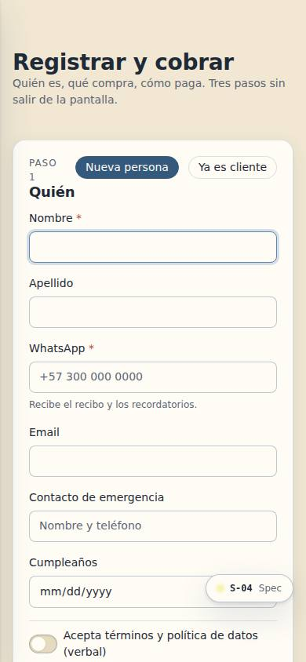
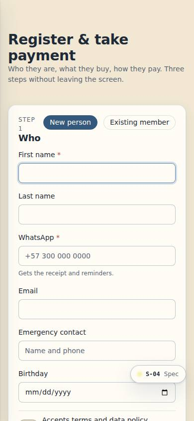
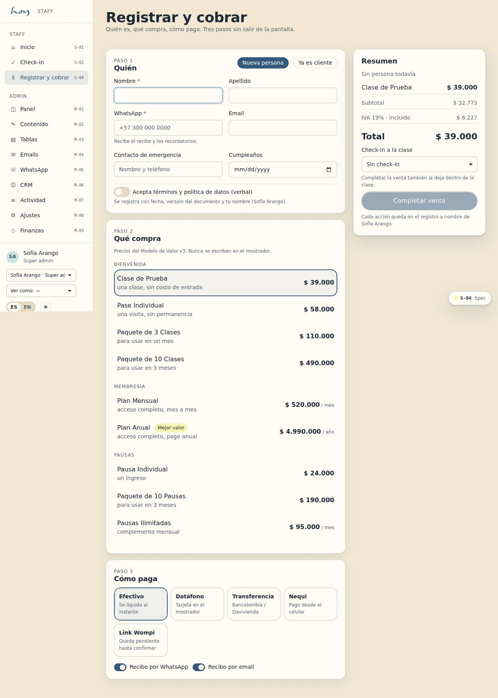

# S-04 — Register & take payment

**Route** `/#/staff/register` · **Roles** front_desk, coordinator, super_admin · **Surface** staff · **Spec** `spec.code === 'S-04'` (see `/#/dev/specs`)

## Purpose
The counter transaction in one screen: who they are, what they are buying, how they are paying. Built for someone standing at a desk with a person in front of them, so it is three short sections rather than a wizard.

## Screenshots
| ES · mobile | EN · mobile |
| --- | --- |
|  |  |

| ES · desktop | EN · desktop |
| --- | --- |
|  |  |

## Sections (layout order — `useLayout(spec)`)
1. `Step1 · Who (new / existing)`
2. `Step2 · What (pricing.ts)`
3. `Step3 · How they pay`
4. `SummaryRail (IVA + total)`
5. `Receipt`

## Data
| Table | Read / write | Notes |
| --- | --- | --- |
| `users` | read / write | |
| `profiles` | read / write | |
| `user_roles` | read | |
| `consents` | read / write | |
| `payments` | read / write | |
| `invoices` | read / write | |
| `memberships` | read / write | |
| `credits` | read / write | |
| `bookings` | read / write | |
| `class_sessions` | read | |
| `message_log` | read / write | |
| `audit_log` | read / write | |
| `tenants` | read / write | |

## Logic and integrations
- Products and prices are read from the value-model config, never typed at the desk.
- Consent is recorded with timestamp, staff actor and policy version — the student agrees verbally, the desk records it.
- Cash settles immediately; card and transfer create a pending order until the gateway confirms.
- Completing the sale also checks the person into the class they bought, which is the whole point of doing it at the counter.
- Every action writes to the activity log with the staff member's name.
- Integrations: WhatsApp, Wompi, Email, Supabase Realtime, DIAN e-invoicing

## States
- New customer (this screen)
- Existing member: identity fields collapse to a found-member card
- Payment declined: inline reason, order stays pending
- Offline: queue and warn
- No permission: form read-only
- Sale complete: receipt view

## Real vs mock
- Real: the page renders from the data layer (`useData()` / `useTable`) over the tables above; every write goes through the `DataProvider` so the Supabase provider replaces the mock unchanged.
- Mock / pending: WhatsApp, Wompi, Email, Supabase Realtime, DIAN e-invoicing are simulated or deferred; data is the browser-local `MockProvider` seed.
- Note: Prices only from src/tenant/pricing.ts; IVA from M-08 tax settings.
- Note: Wompi link is a placeholder: payment stays pending until the gateway confirms.

## Changelog
- `docs/changelog/0005-final-integration.md` — screenshots and this page doc (v0.3.0)

---
**Resumen (ES).** Registrar y cobrar. La transacción de mostrador en una pantalla: quién es, qué compra, cómo paga.
