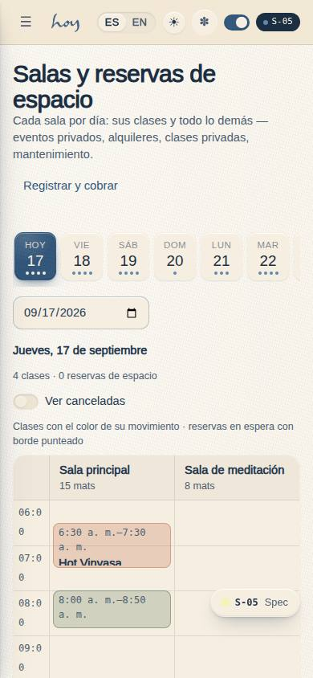
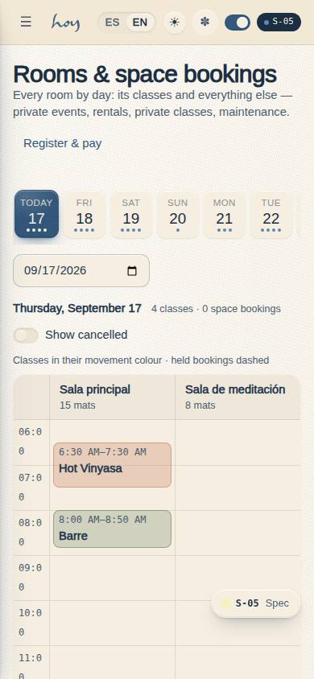

# S-05 — Rooms & space bookings

**Route** `/#/staff/rooms` · **Roles** super_admin, admin, coordinator, front_desk · **Surface** staff · **Spec** `spec.code === 'S-05'` (see `/#/dev/specs`)

## Purpose
See every room by day with its classes and space bookings, book a window for a private event, rental, private class, maintenance or a block, and confirm, cancel or close the booking.

## Screenshots
| ES · mobile | EN · mobile |
| --- | --- |
|  |  |

| ES · desktop | EN · desktop |
| --- | --- |
|  |  |

## Sections (layout order — `useLayout(spec)`)
1. `DateStrip`
2. `DayGrid`
3. `BookingForm`
4. `Selected`
5. `UpcomingList`

## Data
| Table | Read / write | Notes |
| --- | --- | --- |
| `rooms` | read | |
| `class_sessions` | read | |
| `space_bookings` | read / write | |
| `special_charges` | read | |
| `teachers` | read | |
| `modalities` | read | |
| `users` | read / write | |
| `profiles` | read / write | |
| `audit_log` | read / write | |

## Logic and integrations
- A room is taken by a scheduled class or by a space booking that is not cancelled; two windows conflict when they overlap for more than zero minutes (src/modules/staff/rooms.ts findConflicts). The form refuses an overlapping window and lists what is in the way.
- Statuses: held (quoted, no deposit — dashed block) → confirmed → done; cancelled at any point frees the room. Each transition writes an audit_log row (space_booking.<status>).
- Booking and charging are two acts: "Cobrar" opens S-04 with ?booking=<id>, which sells an Especial and links it back (special_charge_id) while confirming the booking. S-04 can also create the booking inside the sale.
- A teacher on a booking is paid through the Especial (special_charges.teacher_payout → payroll_lines kind manual), never here.
- bookings.write_any gates every write; the rest of the page is read-only for other staff.
- Integrations: none

## States
- Loading
- No rooms
- Empty day
- Day with classes only
- Held / confirmed / done / cancelled blocks
- Cancelled hidden by default (toggle)
- Conflict: CTA disabled with the list of what overlaps
- Read-only (no bookings.write_any)
- Selected class → open check-in
- Selected booking → confirm / done / cancel / charge

## Real vs mock
- Real: the page renders from the data layer (`useData()` / `useTable`) over the tables above; every write goes through the `DataProvider` so the Supabase provider replaces the mock unchanged.
- Mock / pending: no external integrations; data is the browser-local `MockProvider` seed.
- Note: Sections: DateStrip (14 days + any date) · DayGrid (rooms × hours: class_sessions + space_bookings) · BookingForm (kind, room, window, title, who, teacher, note, conflict check) · Selected (status actions, Cobrar → S-04) · UpcomingList.
- Note: Rooms come from the rooms table (seed: Sala principal + Sala de meditación); the grid draws as many columns as there are rows.
- Note: The hour range widens to fit the blocks; 06–21 is only the display default, not a studio fact.

## Changelog
- `docs/changelog/0005-final-integration.md` — screenshots and this page doc (v0.3.0)

---
**Resumen (ES).** Salas y reservas de espacio. Ver cada sala por día con sus clases y sus reservas de espacio, reservar una ventana para un evento privado, alquiler, clase privada, mantenimiento o bloqueo, y confirmar, cancelar o cerrar la reserva.
