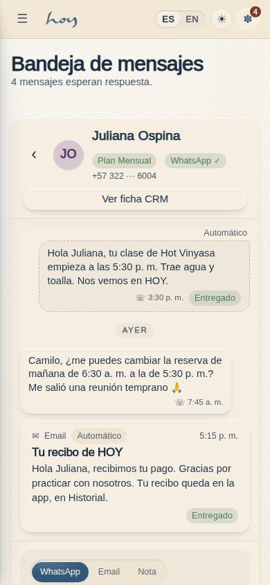
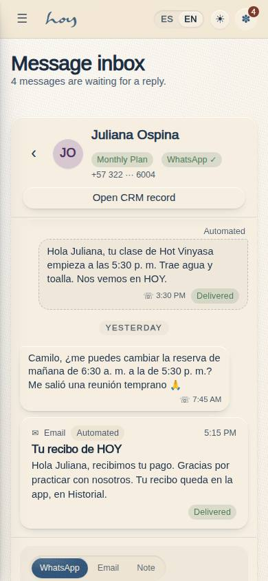
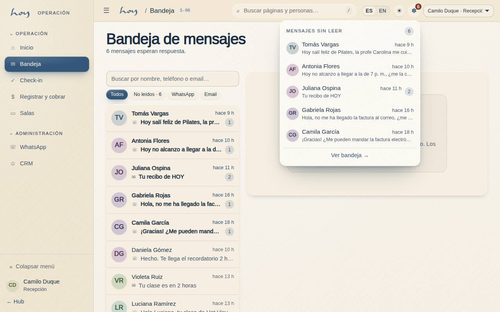

# S-06 — Message inbox

**Route** `/#/staff/inbox` · `/#/staff/inbox/:id` · **Roles** super_admin, admin, coordinator, front_desk · **Surface** staff · **Spec** `src/modules/staff/specs.ts` `S06` (see `/#/dev/specs`) · **Since** v0.8.0 (`docs/changelog/0021-crm-conversacion-y-bandeja.md`)

## Purpose
The front desk's inbox: see who wrote to the studio, reply by WhatsApp or email from the same screen, leave internal notes and jump to the person's CRM record. One conversation per person — inbound, outbound, automated sends, newsletters and the team's notes in a single WhatsApp-style thread — so several people can be answered one after another without leaving the page. It reads and writes the same `message_log` rows as the M-06 Conversación tab; the URL is the selection, so the top-bar bell, S-01 and M-06 deep-link into a thread.

## Screenshots
| ES · mobile | EN · mobile |
| --- | --- |
|  |  |

| ES · desktop | EN · desktop |
| --- | --- |
|  |  |

| The bell popover (top bar, any staff / admin page) |
| --- |
|  |

The standard captures are taken as Camilo (front desk) with Juliana's thread selected through `/staff/inbox/:id`; selecting it marked her two inbound messages read, which is why the subtitle says four are waiting while S-01 says six.
## Sections (layout order — `useLayout(spec)`)
1. `PageHead` — title and the live subtitle ("N mensajes esperan respuesta" / "Todo respondido").
2. `ConversationList` (left pane, organism) — search by name, phone or email; filters **Todos · No leídos · WhatsApp · Email**; one row per person (avatar, name, last message snippet, `formatRelative()` time, channel glyph, unread counter); unread threads first; the selected row carries `aria-current` and the blue bar. Rows are links to `/staff/inbox/:id`.
3. `ThreadHeader` (right pane) — back link (narrow), avatar, name, plan badge (`toneForStatus`), WhatsApp ✓ / · badge, masked phone, email, **Ver ficha CRM** → `/admin/crm/:id` (if `members.read`). Empty state "Elige una conversación" until a row is picked; "Conversación no encontrada" for an old link.
4. `MessageThread` (`scroll` mode, organism) — oldest first, day separators Hoy · Ayer · date, `ChatBubble` per row (member left, studio right in yellow with "Name · Role", automations dashed grey, emails as cards with subject + source badge, internal notes as the dashed yellow card, unread ring), auto-scrolls when a row arrives.
5. `MessageComposer` (molecule) — WhatsApp · Email · Nota; subject field for email; Ctrl+Enter; read-only without `members.write`; WhatsApp blocked with the reason when the number is unverified; quiet-hours hint with the hour the queue releases.

## Data
| Table | Read / write | Notes |
| --- | --- | --- |
| `message_log` | read / write | `useConversations()` groups rows per `user_id` (test sends excluded); `useMessaging('front_desk')` inserts outbound / internal rows and updates `read_at` / `read_by` |
| `users`, `profiles` | read | names, initials, phone, email, WhatsApp verified (`usePeople()`) |
| `memberships`, `plans` | read | the plan badge in the header |
| `tenants` | read | `settings.quietHours` (M-08d) for the queue rule |
| `audit_log` | write | `member.message` (channel, user_id, source, status) and `member.note` (user_id) — never the text |

## Logic and integrations
- A conversation is every message_log row with the same user_id, ordered by sent_at (or created_at); test sends from M-04/M-05 (payload.test) are excluded (src/data/comms.ts useConversations).
- Unread = inbound rows with read_at null. Opening a thread writes read_at / read_by on all of them (markConversationRead) — that is the team’s read receipt, and what empties the bell, S-01 and the list badge.
- Sending goes through useMessaging(): WhatsApp and email insert an outbound row (source manual, sent_by = the signed-in user) and an audit_log member.message; a note inserts an internal row (channel note) plus member.note without its content.
- WhatsApp status is queued during quiet hours (M-08 quietHours) and sent otherwise; the composer says so. Email ignores quiet hours. A member whose number is not verified cannot receive WhatsApp: the tab stays, the box is disabled with the reason.
- members.write gates the composer; other desk roles read the thread. members.read gates the “Ver ficha CRM” button.
- Rows with user_id null (a teacher’s substitution request) belong to the team, not to a customer, and are not listed here.
- Integrations: WhatsApp Cloud API (simulated: inbound rows arrive by webhook into message_log), Email provider (simulated: same table, channel email)

## States
- Loading
- No conversations
- None selected (“Elige una conversación”)
- All read
- Thread with unread inbound (blue ring)
- Filtered / searched list, no match
- Read-only composer (no members.write)
- WhatsApp blocked (unverified number)
- Quiet hours (queued hint)
- Thread not found (old link)
- Narrow: list, then thread (≤ 900 px)

## Real vs mock
- Real: every send, note and read receipt is a `message_log` row written through the `DataProvider` (with its audit entry); the list, the counters, the bell and S-01 update live from the same rows; the Supabase provider replaces the mock unchanged.
- Mock / pending: nothing leaves the browser — a WhatsApp is `sent` (or `queued`) as a row, not delivered; the inbound messages are the fixed seed (`src/data/seed/messages.ts`: 69 rows, 17 conversations, six unread within 48 h). The WhatsApp Cloud API webhook and the email inbound will insert `direction = inbound` rows and update `status` / `external_id` (ROADMAP §F 4–5, 36); the page needs no change.
- Note: Route /staff/inbox lists; /staff/inbox/:id selects. The URL is the selection so the bell, S-01 and M-06 can deep-link.
- Note: The same three components (MessageThread, ChatBubble, MessageComposer) render the Conversación tab of M-06.
- Note: Every capture reseeds, so the six unread demo messages are always there at first load.

## Changelog
- `docs/changelog/0021-crm-conversacion-y-bandeja.md` — first version: the two-pane inbox, the bell popover, the S-01 entry points (v0.8.0); the implementer's pre-pass captures are kept as `*-after.jpg`

---
**Resumen (ES).** Bandeja de mensajes de recepción (`/staff/inbox`): a la izquierda, una fila por persona con lo último que escribió, hace cuánto y cuántos mensajes están sin leer (primero los pendientes; buscador y filtros Todos · No leídos · WhatsApp · Email); a la derecha, la cabecera de la persona con "Ver ficha CRM", el hilo completo (WhatsApp en ambos sentidos, correos, automatizaciones, notas internas) y la caja para responder por WhatsApp o email o dejar una nota. Abrir un hilo lo marca como leído para todo el equipo y apaga la campana. Hoy todo se guarda en `message_log` en el navegador; el webhook real de WhatsApp y el correo entrante escribirán en la misma tabla.
