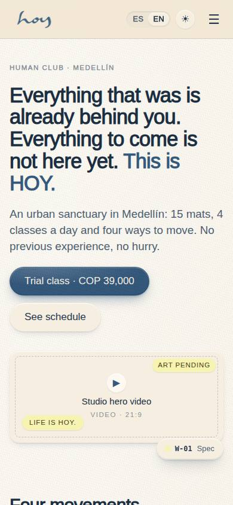
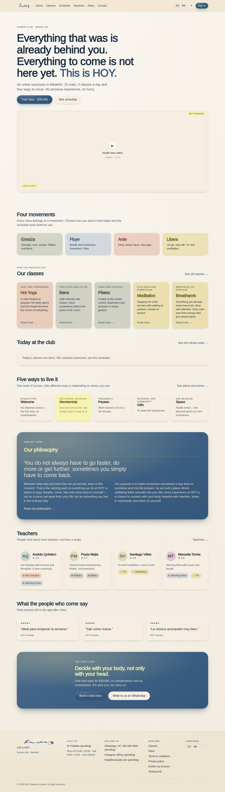
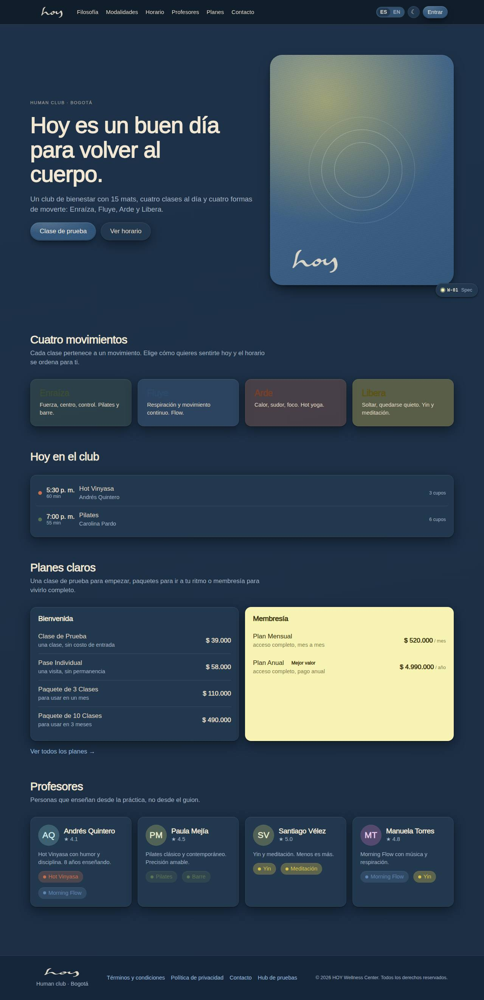
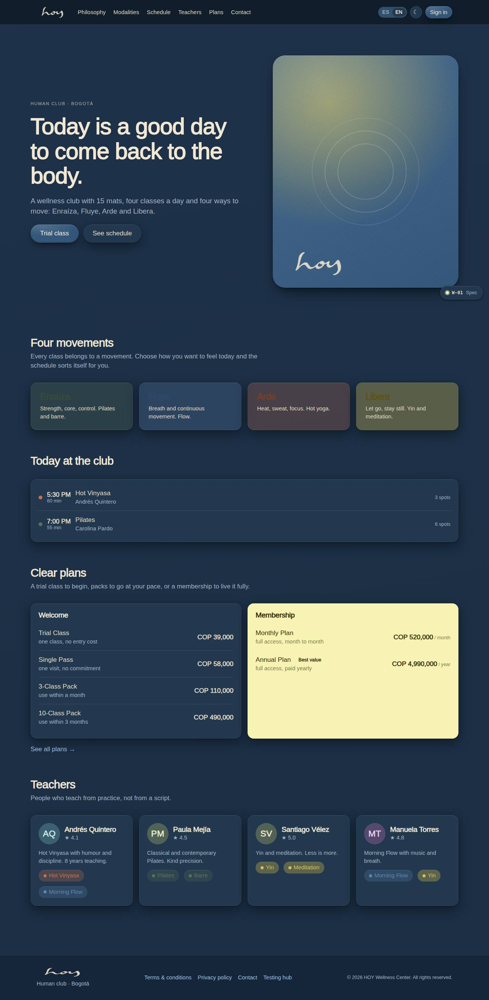

# W-01 — Site · Home

**Route** `/#/site` · **Roles** super_admin, admin, coordinator, front_desk, finance, teacher, maintenance, customer, public · **Surface** public · **Spec** `spec.code === 'W-01'` (see `/#/dev/specs`)

## Purpose
The public front page, rebuilt around the brand manifesto: the cover line over a 21:9 video slot, the four movements, the five classes, today's classes, the five-family value model, a dark philosophy panel, the teachers, real reviews from the `reviews` table and the "first step" trial-class band. Sections are reorderable at `/#/dev/layout/W-01`.

## Screenshots
| ES · mobile | EN · mobile |
| --- | --- |
|  |  |

| ES · desktop | EN · desktop |
| --- | --- |
|  |  |

| ES · dark | EN · dark |
| --- | --- |
|  |  |

## Sections (layout order — `useLayout(spec)`)
1. `Hero`
2. `Movements`
3. `Classes`
4. `TodayClasses`
5. `ValueModel`
6. `Philosophy`
7. `Teachers`
8. `Testimonials`
9. `FirstStep`

## Data
| Table | Read / write | Notes |
| --- | --- | --- |
| `class_sessions` | read | |
| `modalities` | read | |
| `teachers` | read | |
| `reviews` | read | Published comments feed the testimonials section. |
| `plans` | read | |

## Logic and integrations
- Sections render in the order stored by the layout editor (useLayout).
- Today list shows only scheduled sessions for the current date.
- All prices come from src/tenant/pricing.ts.
- Integrations: Supabase Realtime

## States
- default
- no classes today

## Real vs mock
- Real: every paragraph, class essay, tagline and value-model rationale is the owner's own copy, typed
  once in `src/tenant/brand.ts` and `src/tenant/pricing.ts` and read through `useT()` / `bi()`. Studio
  facts (city, capacity, hours, contact, location) come from `src/tenant/tenant.ts`. Schedule, teacher
  and review rows come from the data layer (`useTable`), so the Supabase provider replaces the mock unchanged.
- Mock / pending: **all photography and video is pending** — every image is a `MediaSlot` that reserves the
  ratio and prints the art brief (`docs/website-vision.md` carries the shot list). Contact details
  (WhatsApp, email, address, Instagram) are placeholders flagged `tenant.contact.pending`; the exact
  address and `tenant.location` coordinates are approximate. Data is the browser-local `MockProvider` seed.

## Changelog
- `docs/changelog/0005-final-integration.md` — screenshots and this page doc (v0.3.0)
- `docs/changelog/0011-website-brand-content.md` — brand copy, MediaSlot/MapSlot, new classes pages (v0.6.0)

---
**Resumen (ES).** Sitio · Inicio. La portada pública construida sobre el manifiesto de marca: portada con video 21:9, cuatro movimientos, cinco clases, clases de hoy, el modelo de valor, la filosofía en panel oscuro, profesores, reseñas reales y el primer paso (clase de prueba).