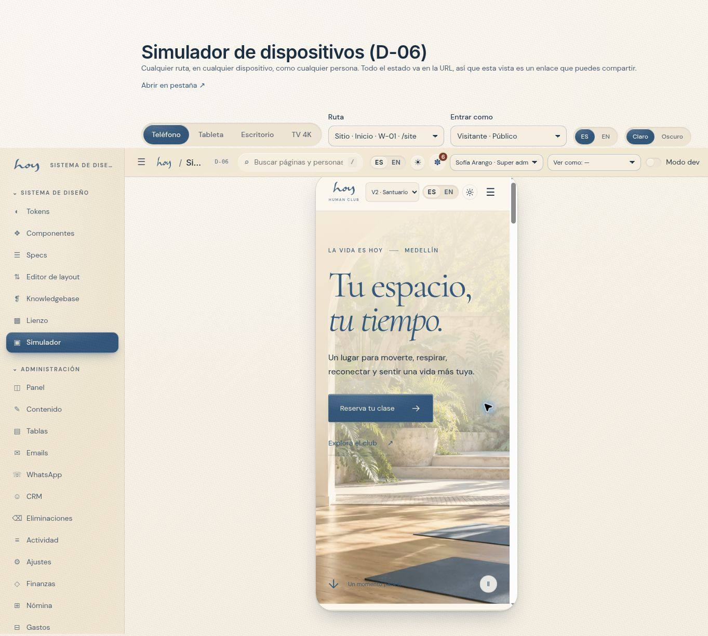
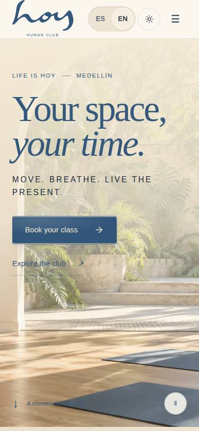
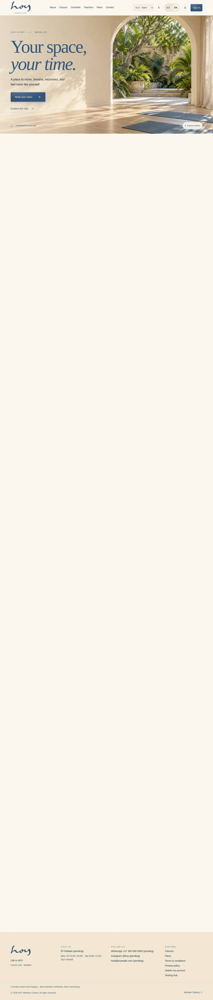
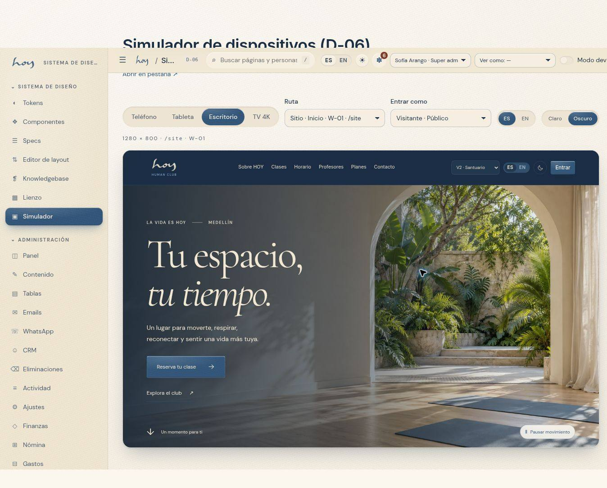
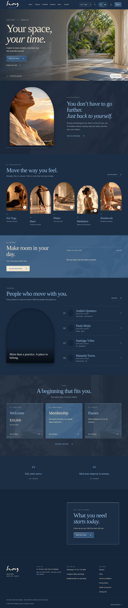
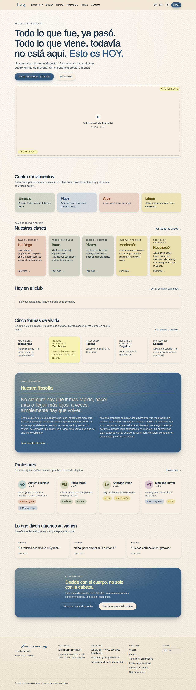
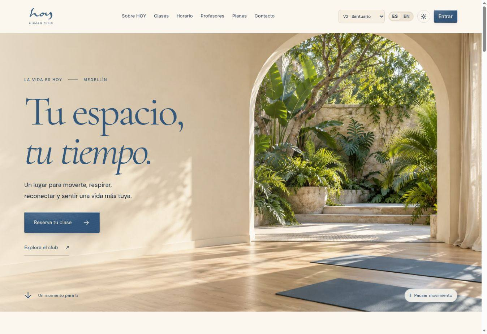
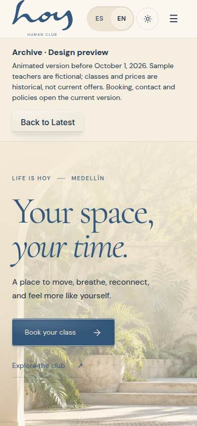
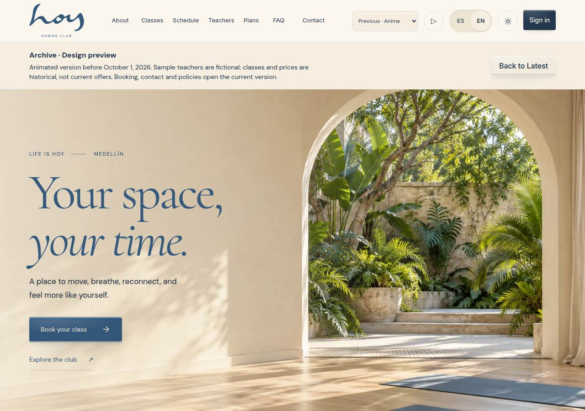

# W-01 — Site · Home

**Route** `/#/site` · **Roles** super_admin, admin, coordinator, front_desk, finance, teacher, maintenance, customer, public · **Surface** public · **Spec** `spec.code === 'W-01'` (see `/#/dev/specs`)

## Purpose
The public front page, rebuilt around the brand manifesto: the cover line over a 21:9 video slot, the five classes, today's classes, the five-family value model, a dark philosophy panel, the teachers, real reviews from the `reviews` table and the "first step" trial-class band. Sections are reorderable at `/#/dev/layout/W-01`.

## Screenshots
| ES · mobile | EN · mobile |
| --- | --- |
|  |  |

| ES · desktop | EN · desktop |
| --- | --- |
|  |  |

| ES · dark | EN · dark |
| --- | --- |
|  |  |

## Sections (layout order — `useLayout(spec)`)
V2 (Sanctuary, default) follows `siteSpecs.home.layout`; V1 (classic) keeps its own order (Classes, TodayClasses, ValueModel, Philosophy, Teachers…).
1. `Hero`
2. `Philosophy`
3. `Classes` (eyebrow `01 / TU PRÁCTICA`)
4. `TodayClasses` (eyebrow `02 / NOS ENCONTRAMOS`)
5. `Teachers`
6. `ValueModel`
7. `Testimonials`
8. `FirstStep`

Retired (0034): `Movements` — the "¿Cómo quieres sentirte hoy? / How do you want to feel today?" picker (V2: four stones linking to `/site/schedule?movement=`; V1: "Cuatro movimientos" cards whose body said "Elige cómo quieres sentirte hoy"). A stored `page_layouts` row that still lists it drops the id (`useLayout` keeps only names the spec has). The four movements themselves were retired everywhere in 0039: the class gallery eyebrow is just its number (“01”), W-04 filters by modality (`?modality=`), W-03 groups modalities by the five classes, and the hero says “varias formas de moverte”.

## Data
| Table | Read / write | Notes |
| --- | --- | --- |
| `class_sessions` | read | |
| `modalities` | read | |
| `teachers` | read | |
| `reviews` | read | Published comments feed the testimonials section. |
| `plans` | read | |

## Logic and integrations
- **No mood picker (0034)**: the home no longer asks "how do you want to feel today"; the website half of the ask that retired A-05 in the app (0030). Before / after: the page is ~675 px shorter at 1280 (6636 → 5961).
- **Wordmark (0033)**: the V2 header brand link and the footer brand link render the vector wordmark (`Wordmark vector`, 120 px wide minimum, blue on light / cream on dark, hover mid blue / yellow). The hero eyebrow "LA VIDA ES HOY" and the closing line "empieza hoy." (the adverb "today") stay text. Before / after: `docs/screenshots/_brand/wordmark-in-headings-2026-09-29.jpg`; dark captures `es-1280-dark.jpg`, `es-390-dark.jpg`.
- Sections render in the order stored by the layout editor (useLayout).
- Today list shows only scheduled sessions for the current date.
- All prices come from src/tenant/pricing.ts.
- Integrations: Supabase Realtime

## States
- default
- no classes today

## Real vs mock
- Real: every paragraph, class essay, tagline and value-model rationale is the owner's own copy, typed
  once in `src/tenant/brand.ts` and `src/tenant/pricing.ts` and read through `useT()` / `bi()`. Studio
  facts (city, capacity, hours, contact, location) come from `src/tenant/tenant.ts`. Schedule, teacher
  and review rows come from the data layer (`useTable`), so the Supabase provider replaces the mock unchanged.
- Mock / pending: **all photography and video is pending** — every image is a `MediaSlot` that reserves the
  ratio and prints the art brief (`docs/website-vision.md` carries the shot list). Contact details
  (WhatsApp, email, address, Instagram) are placeholders flagged `tenant.contact.pending`; the exact
  address and `tenant.location` coordinates are approximate. Data is the browser-local `MockProvider` seed.

## 0051 — the studio's verified content (2026-10-01)
The studio's verified copy (WEBSITE MODIF). Hero line **"Muévete. Respira. Vive el presente."**; the philosophy panel
reads **"Movimiento para todos"**; the classes band is the statement **"No venimos a entrenar cuerpos. Venimos a
despertar presencia."** with the seven-methodologies sub-head and seven `ClassArch` arches (number, name, tagline,
keywords; a snap-scrolling strip under 1200 px); "Hazle espacio a tu día" became **"¿Cómo te quieres mover hoy?"**;
the teachers block lists the seven real teachers with a monogram in the tone of their class; the plans trio is the
trial class, the 12-class package and the private class.
| Before (0.21.3) | After (0.22.0) |
| --- | --- |
|  |  |

## Changelog
- `docs/changelog/0051-website-verified-content.md` — hero line, "Movimiento para todos", the classes band with seven ClassArch arches, "¿Cómo te quieres mover hoy?", the seven real teachers, the launch prices (v0.22.0, 2026-10-01)
- `docs/changelog/0034-site-no-feel-today.md` — the `Movements` section ("¿Cómo quieres sentirte hoy?") removed from V2 and V1; chapter eyebrows renumbered (v0.12.2)
- `docs/changelog/0019-app-store-readiness.md` — footer gains *Eliminar mi cuenta* → W-09 (every site page) (v0.7.0)
- `docs/changelog/0005-final-integration.md` — screenshots and this page doc (v0.3.0)
- `docs/changelog/0011-website-brand-content.md` — brand copy, MediaSlot/MapSlot, new classes pages (v0.6.0)
- `docs/changelog/0039-retire-movements.md` — class gallery eyebrow is just “01”; hero copy “varias formas de moverte” (v0.15.0, 2026-09-29)

---
**Resumen (ES).** Sitio · Inicio. La portada pública construida sobre el manifiesto de marca: portada con video 21:9, cinco clases, clases de hoy, el modelo de valor, la filosofía en panel oscuro, profesores, reseñas reales y el primer paso (clase de prueba).

## Website edition 2.0 — 2026-09-25

The Sanctuary edition applies Aleja's cream/blue editorial direction, real image textures and restrained motion. The navigation version selector preserves the original edition for comparison. Existing provider/CMS behavior is retained; the runtime still uses demo data. See [release history](../website-versions.md) and [motion handoff](../website-motion-production.md). No actual teacher identities are assigned generated portraits.

[Live validation and screenshot notes](../website-validation.md). Responsive captures use actual 390 and 1280 CSS-pixel simulator viewports; browser chrome and simulator scaling can be visible in the saved images. Video clips and external production-database behavior have not been validated.

## Animated archive (0056)

The version selector offers Latest (default) and Previous · Animated. The historical preview uses isolated read-only content and a visible design-archive notice. Booking, contact and policies switch to Latest. [Version links and boundaries](../website-versions.md).

