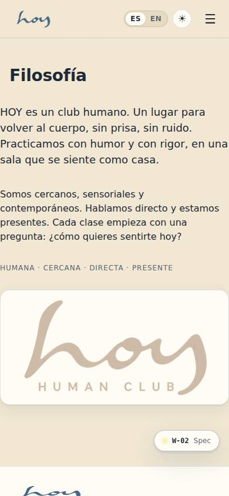
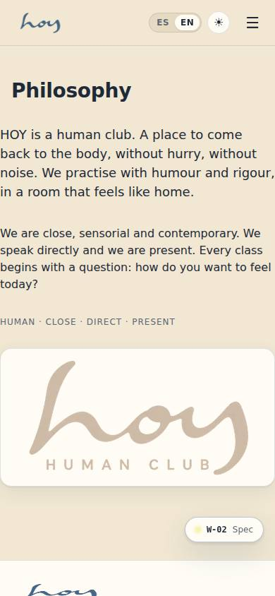
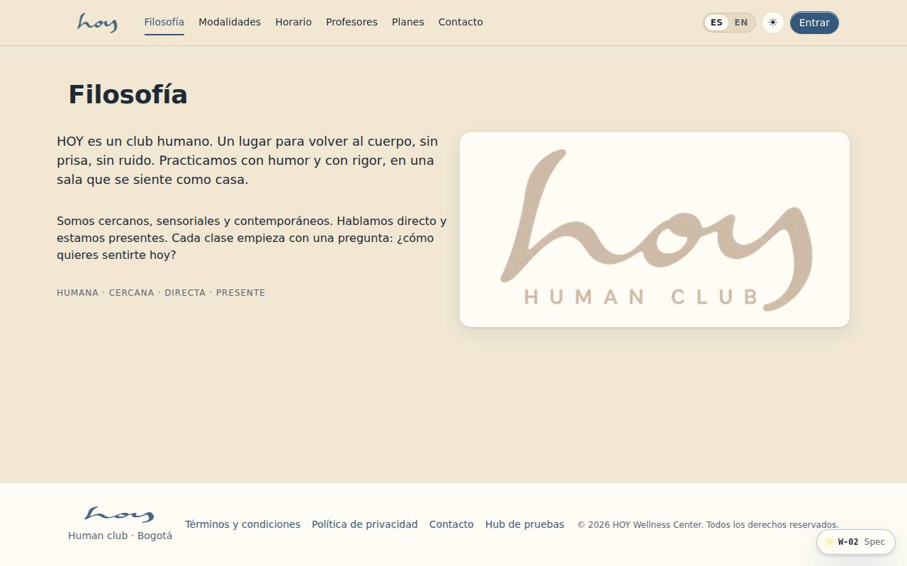

# W-02 — Site · Philosophy

**Route** `/#/site/about` · **Roles** super_admin, admin, coordinator, front_desk, finance, teacher, maintenance, customer, public · **Surface** public · **Spec** `spec.code === 'W-02'` (see `/#/dev/specs`)

## Purpose
Who we are and how we speak: human, close, direct, present.

## Screenshots
| ES · mobile | EN · mobile |
| --- | --- |
|  |  |

| ES · desktop | EN · desktop |
| --- | --- |
|  |  |

## Sections (layout order — `useLayout(spec)`)
1. `PageHead`
2. `Manifesto`
3. `ValuesRow`
4. `BrandBoard`

## Data
| Table | Read / write | Notes |
| --- | --- | --- |
| — | | |

## Logic and integrations
- Copy comes from the brand manual (reference/brand).
- Integrations: none

## States
- default

## Real vs mock
- Real: the page renders from the data layer (`useData()` / `useTable`) over the tables above; every write goes through the `DataProvider` so the Supabase provider replaces the mock unchanged.
- Mock / pending: no external integrations; data is the browser-local `MockProvider` seed.

## Changelog
- `docs/changelog/0005-final-integration.md` — screenshots and this page doc (v0.3.0)

---
**Resumen (ES).** Sitio · Filosofía. Quiénes somos y cómo hablamos: humana, cercana, directa, presente.
