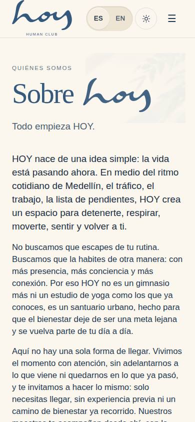
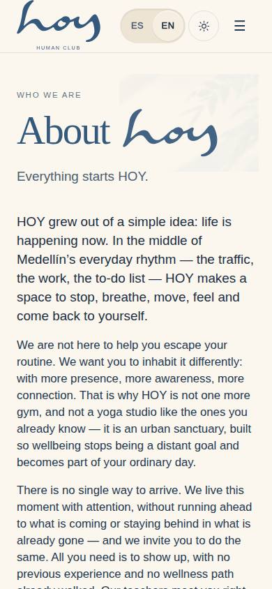
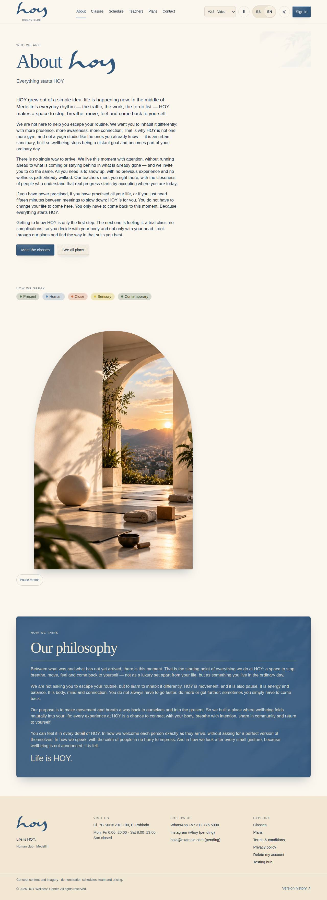
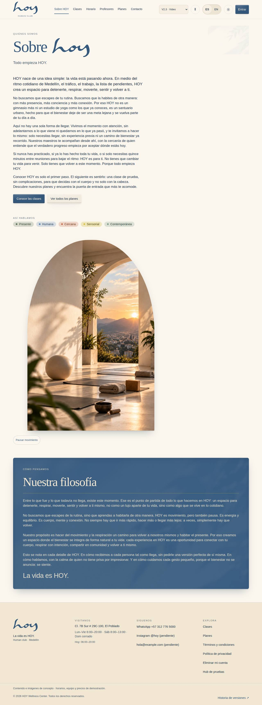

# W-02 — Site · Philosophy

**Route** `/#/site/about` · **Roles** super_admin, admin, coordinator, front_desk, finance, teacher, maintenance, customer, public · **Surface** public · **Spec** `spec.code === 'W-02'` (see `/#/dev/specs`)

## Purpose
The full "Sobre HOY" text (five paragraphs, eyebrow "Quiénes somos"), the four values as chips, a 4:3 photo slot for the founders / studio interior, "Nuestra filosofía" on the brand's slate-blue panel with pale-yellow headings, and the brand board.

## Screenshots
| ES · mobile | EN · mobile |
| --- | --- |
|  |  |

| ES · desktop | EN · desktop |
| --- | --- |
|  |  |

## Sections (layout order — `useLayout(spec)`)
1. `Head`
2. `About`
3. `Media`
4. `Philosophy`
5. `BrandBoard`

## Data
| Table | Read / write | Notes |
| --- | --- | --- |
| — | | |

## Logic and integrations
- **Wordmark (0033)**: the page title h1 "Sobre HOY" / "About HOY" sets HOY as the inline wordmark (`brandHeading` in `PageHead`, V2 only). The lead "Todo empieza HOY.", the pull-quote "La vida es HOY." (20–30 px, under the 120 px minimum) and the essay stay text. Captures: `es-1280.jpg`, `es-1280-dark.jpg`, `es-390.jpg` (+ EN); before / after in `docs/screenshots/_brand/wordmark-in-headings-2026-09-29.jpg`.
- Copy comes from the brand manual (reference/brand).
- Integrations: none

## States
- default

## Real vs mock
- Real: every paragraph, class essay, tagline and value-model rationale is the owner's own copy, typed
  once in `src/tenant/brand.ts` and `src/tenant/pricing.ts` and read through `useT()` / `bi()`. Studio
  facts (city, capacity, hours, contact, location) come from `src/tenant/tenant.ts`. Schedule, teacher
  and review rows come from the data layer (`useTable`), so the Supabase provider replaces the mock unchanged.
- Mock / pending: **all photography and video is pending** — every image is a `MediaSlot` that reserves the
  ratio and prints the art brief (`docs/website-vision.md` carries the shot list). Contact details
  (WhatsApp, email, address, Instagram) are placeholders flagged `tenant.contact.pending`; the exact
  address and `tenant.location` coordinates are approximate. Data is the browser-local `MockProvider` seed.

## 0051 — the studio's verified content (2026-10-01)
The dark panel is **"La filosofía de HOY"**: *Nuestra filosofía* and *Nuestro propósito* (verified copy), the closing
question "¿cómo vuelvo a mí?" and the pull-quote "No venimos a entrenar cuerpos. Venimos a despertar presencia."
(`philosophy` in `src/tenant/brand.ts`).
| Before (0.21.3) | After (0.22.0) |
| --- | --- |
|  |  |

## Changelog
- `docs/changelog/0051-website-verified-content.md` — "La filosofía de HOY" panel: Nuestra filosofía · Nuestro propósito (v0.22.0, 2026-10-01)
- `docs/changelog/0005-final-integration.md` — screenshots and this page doc (v0.3.0)
- `docs/changelog/0011-website-brand-content.md` — brand copy, MediaSlot/MapSlot, new classes pages (v0.6.0)
- `docs/changelog/0039-retire-movements.md` — the four values are plain chips (no movement colours) (v0.15.0, 2026-09-29)

---
**Resumen (ES).** Sitio · Sobre HOY. El texto completo de «Sobre HOY», los cuatro valores, el hueco de foto 4:3, la filosofía en panel oscuro y el tablero de marca.

## Website edition 2.0 — 2026-09-25

The Sanctuary edition applies Aleja's cream/blue editorial direction, real image textures and restrained motion. The navigation version selector preserves the original edition for comparison. Existing provider/CMS behavior is retained; the runtime still uses demo data. See [release history](../website-versions.md) and [motion handoff](../website-motion-production.md). No actual teacher identities are assigned generated portraits.

## 0054 — brand chips removed
Removed the “Así hablamos” heading and the Presente, Humana, Cercana, Sensorial and Contemporánea chips from both website editions and languages.
