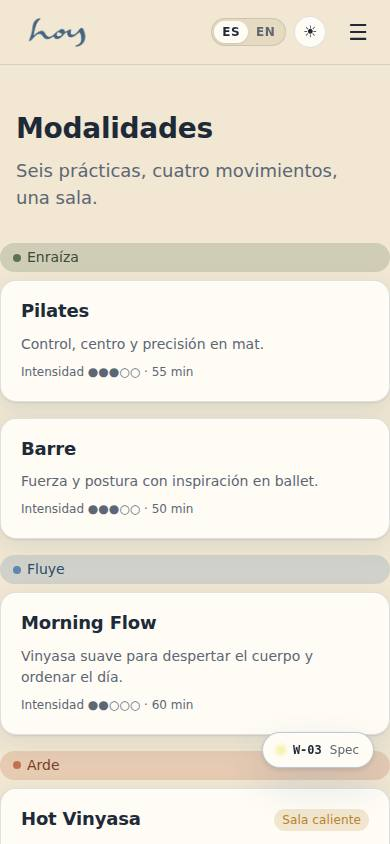
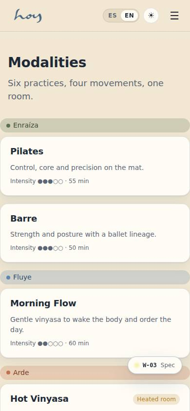
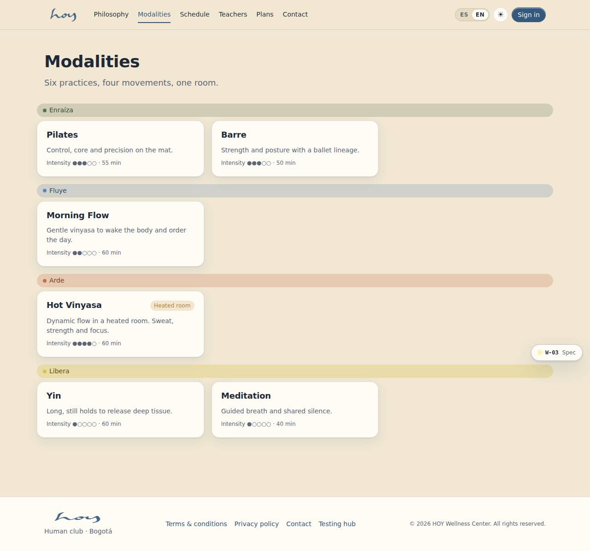

# W-03 — Site · Modalities

**Route** `/#/site/modalities` · **Roles** super_admin, admin, coordinator, front_desk, finance, teacher, maintenance, customer, public · **Surface** public · **Spec** `spec.code === 'W-03'` (see `/#/dev/specs`)

## Purpose
The six practices grouped by movement, with intensity, duration and heated room.

## Screenshots
| ES · mobile | EN · mobile |
| --- | --- |
|  |  |

| ES · desktop | EN · desktop |
| --- | --- |
|  |  |

## Sections (layout order — `useLayout(spec)`)
1. `PageHead`
2. `ModalityGrid`

## Data
| Table | Read / write | Notes |
| --- | --- | --- |
| `modalities` | read | |

## Logic and integrations
- Groups by movement in the order Enraíza, Fluye, Arde, Libera.
- Integrations: none

## States
- default

## Real vs mock
- Real: the page renders from the data layer (`useData()` / `useTable`) over the tables above; every write goes through the `DataProvider` so the Supabase provider replaces the mock unchanged.
- Mock / pending: no external integrations; data is the browser-local `MockProvider` seed.

## Changelog
- `docs/changelog/0005-final-integration.md` — screenshots and this page doc (v0.3.0)

---
**Resumen (ES).** Sitio · Modalidades. Las seis prácticas del club agrupadas por movimiento, con intensidad, duración y si es sala caliente.
