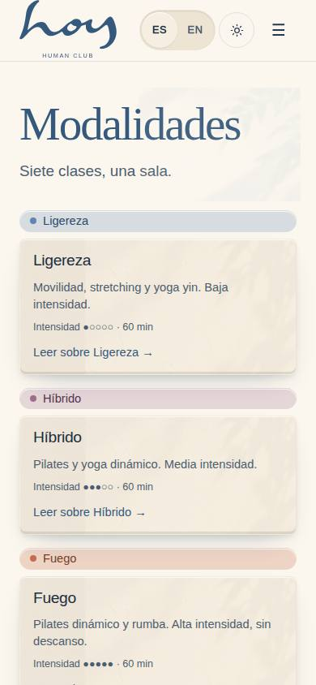
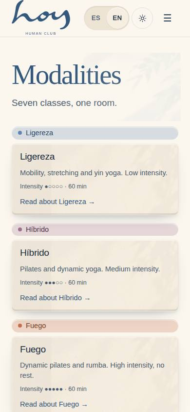
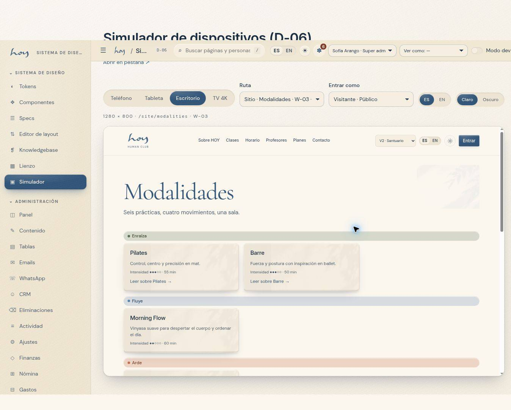
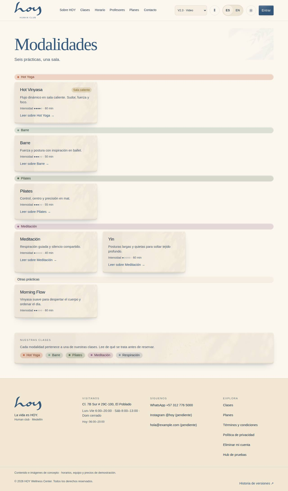
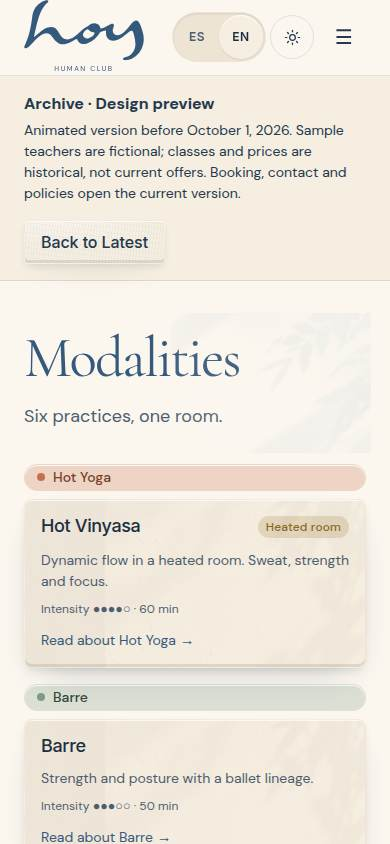
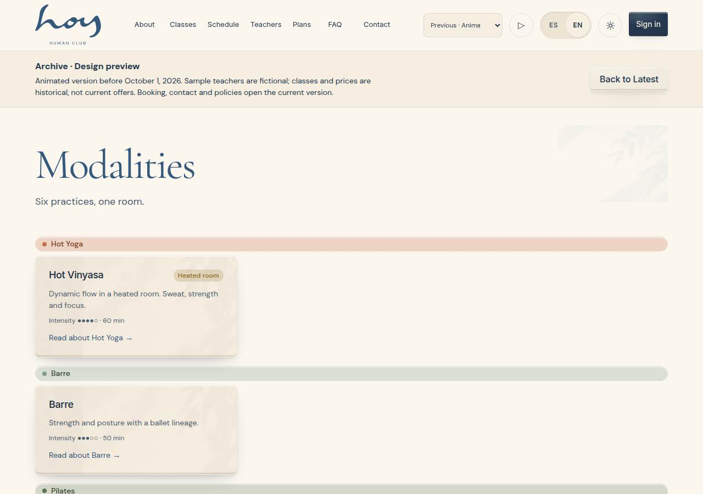

# W-03 — Site · Modalities

**Route** `/#/site/modalities` · **Roles** super_admin, admin, coordinator, front_desk, finance, teacher, maintenance, customer, public · **Surface** public · **Spec** `spec.code === 'W-03'` (see `/#/dev/specs`)

## Purpose
The scheduled practices grouped by the five brand classes (hot yoga, barre, pilates, meditación, respiración) with intensity, duration and heated room — and each modality cross-linked to the class essay it belongs to, through `brand.classes[*].modalitySlugs`.

## Screenshots
| ES · mobile | EN · mobile |
| --- | --- |
|  |  |

| ES · desktop | EN · desktop |
| --- | --- |
|  |  |

## Sections (layout order — `useLayout(spec)`)
1. `PageHead`
2. `ModalityGrid`
3. `ClassLinks`

## Data
| Table | Read / write | Notes |
| --- | --- | --- |
| `modalities` | read | |

## Logic and integrations
- Groups the modalities by the five brand classes in `brand.classOrder` (via `brand.classes[*].modalitySlugs`); the concept of movements no longer exists (0039).
- Integrations: none

## States
- default

## Real vs mock
- Real: every paragraph, class essay, tagline and value-model rationale is the owner's own copy, typed
  once in `src/tenant/brand.ts` and `src/tenant/pricing.ts` and read through `useT()` / `bi()`. Studio
  facts (city, capacity, hours, contact, location) come from `src/tenant/tenant.ts`. Schedule, teacher
  and review rows come from the data layer (`useTable`), so the Supabase provider replaces the mock unchanged.
- Mock / pending: **all photography and video is pending** — every image is a `MediaSlot` that reserves the
  ratio and prints the art brief (`docs/website-vision.md` carries the shot list). Contact details
  (WhatsApp, email, address, Instagram) are placeholders flagged `tenant.contact.pending`; the exact
  address and `tenant.location` coordinates are approximate. Data is the browser-local `MockProvider` seed.

## 0051 — the studio's verified content (2026-10-01)
Grouped by the seven classes (Ligereza, Híbrido, Fuego, Sólido, Centro, Alineación, Pulso), each in its tone. The
M-08f "Respiración es una clase propia" switch is gone: breathing lives inside Centro.
| Before (0.21.3) | After (0.22.0) |
| --- | --- |
|  |  |

## Changelog
- `docs/changelog/0051-website-verified-content.md` — the seven classes replace the five disciplines; no breathwork toggle (v0.22.0, 2026-10-01)
- `docs/changelog/0005-final-integration.md` — screenshots and this page doc (v0.3.0)
- `docs/changelog/0011-website-brand-content.md` — brand copy, MediaSlot/MapSlot, new classes pages (v0.6.0)
- `docs/changelog/0039-retire-movements.md` — modalities grouped by the five brand classes (v0.15.0, 2026-09-29)

---
**Resumen (ES).** Sitio · Modalidades. Las prácticas agrupadas por las cinco clases, con intensidad, duración y sala caliente, cada una enlazada al ensayo de su clase.

## Website edition 2.0 — 2026-09-25

The Sanctuary edition applies Aleja's cream/blue editorial direction, real image textures and restrained motion. The navigation version selector preserves the original edition for comparison. Existing provider/CMS behavior is retained; the runtime still uses demo data. See [release history](../website-versions.md) and [motion handoff](../website-motion-production.md). No actual teacher identities are assigned generated portraits.

## Animated archive (0056)

The version selector offers Latest (default) and Previous · Animated. The historical preview uses isolated read-only content and a visible design-archive notice. Booking, contact and policies switch to Latest. [Version links and boundaries](../website-versions.md).

