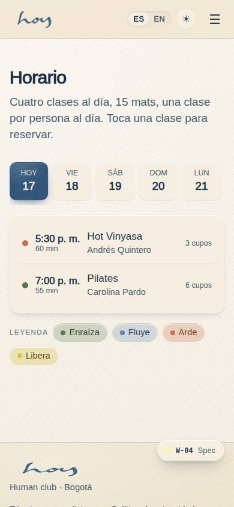
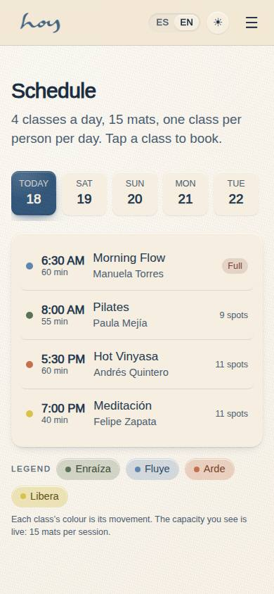
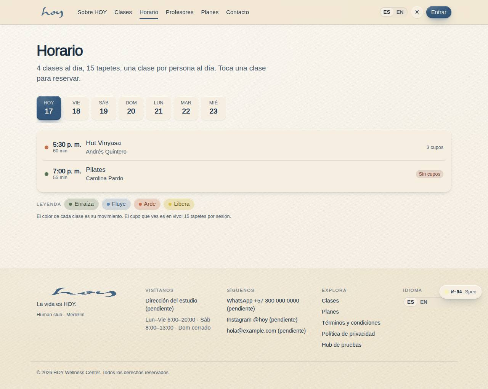
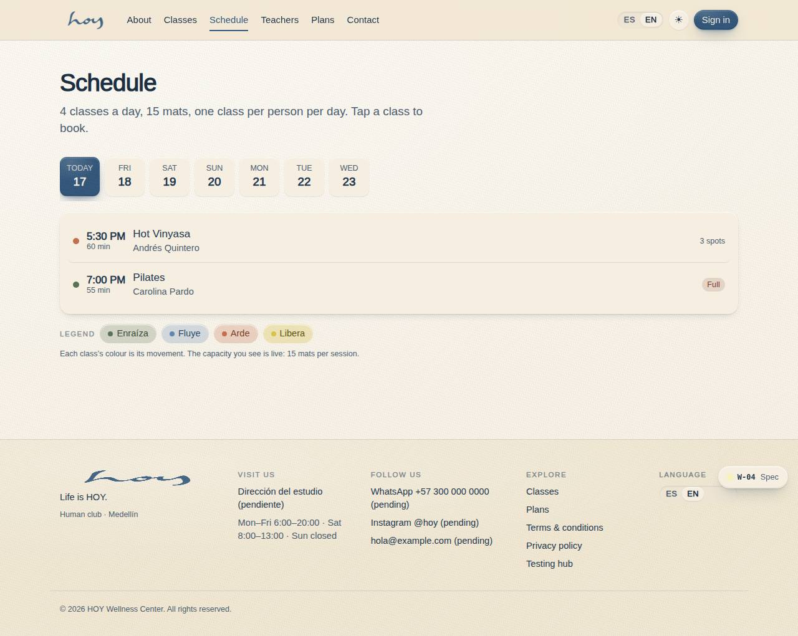

# W-04 — Site · Schedule

**Route** `/#/site/schedule` · **Roles** super_admin, admin, coordinator, front_desk, finance, teacher, maintenance, customer, public · **Surface** public · **Spec** `spec.code === 'W-04'` (see `/#/dev/specs`)

## Purpose
Public weekly schedule with live capacity. Seven day tabs, the movement legend doubles as a filter (`?movement=`), and tapping a class opens the sign-in prompt that carries the session into the customer app.

## Screenshots
| ES · mobile | EN · mobile |
| --- | --- |
|  |  |

| ES · desktop | EN · desktop |
| --- | --- |
|  |  |

## Sections (layout order — `useLayout(spec)`)
1. `PageHead`
2. `DayTabs`
3. `ClassList`
4. `Legend`

## Data
| Table | Read / write | Notes |
| --- | --- | --- |
| `class_sessions` | read | |
| `modalities` | read | |
| `teachers` | read | |
| `rooms` | read | |

## Logic and integrations
- Shows 7 days starting today; Sundays show the empty state.
- Capacity = capacity − booked_count from class_sessions.
- Deep click → login prompt → /app (demo: switches to the customer demo user).
- Integrations: Supabase Realtime, Supabase Auth

## States
- default
- day without classes
- login prompt open

## Real vs mock
- Real: every paragraph, class essay, tagline and value-model rationale is the owner's own copy, typed
  once in `src/tenant/brand.ts` and `src/tenant/pricing.ts` and read through `useT()` / `bi()`. Studio
  facts (city, capacity, hours, contact, location) come from `src/tenant/tenant.ts`. Schedule, teacher
  and review rows come from the data layer (`useTable`), so the Supabase provider replaces the mock unchanged.
- Mock / pending: **all photography and video is pending** — every image is a `MediaSlot` that reserves the
  ratio and prints the art brief (`docs/website-vision.md` carries the shot list). Contact details
  (WhatsApp, email, address, Instagram) are placeholders flagged `tenant.contact.pending`; the exact
  address and `tenant.location` coordinates are approximate. Data is the browser-local `MockProvider` seed.

## Changelog
- `docs/changelog/0005-final-integration.md` — screenshots and this page doc (v0.3.0)
- `docs/changelog/0011-website-brand-content.md` — brand copy, MediaSlot/MapSlot, new classes pages (v0.6.0)

---
**Resumen (ES).** Sitio · Horario. Horario semanal público con cupos en vivo; la leyenda de movimientos filtra la lista y tocar una clase pide iniciar sesión.