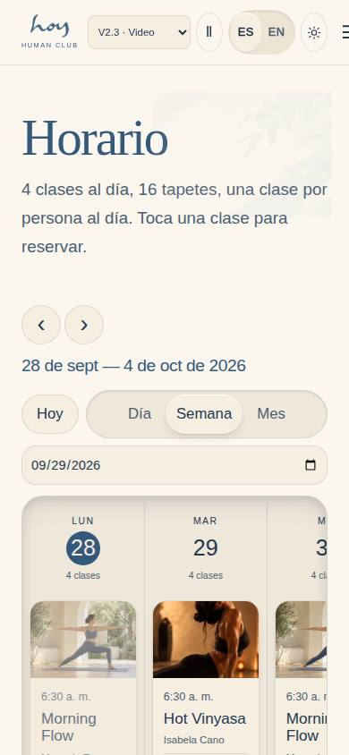
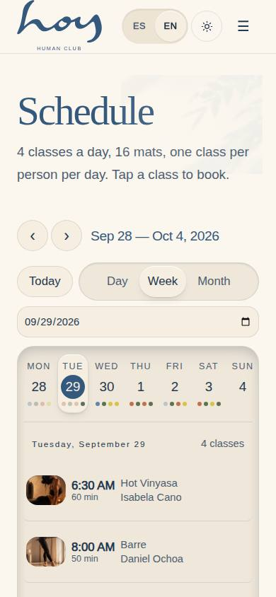
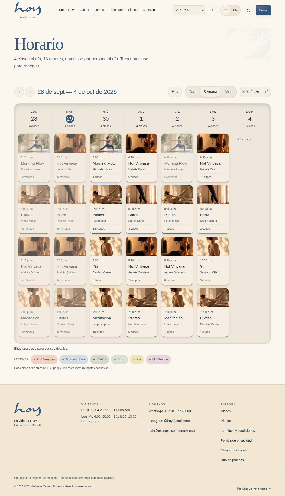
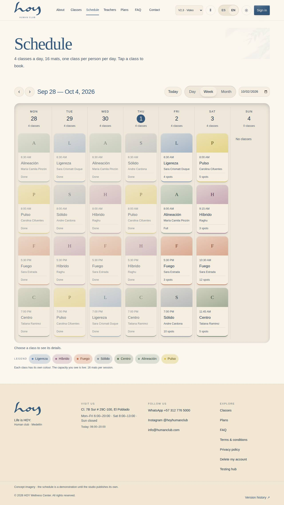
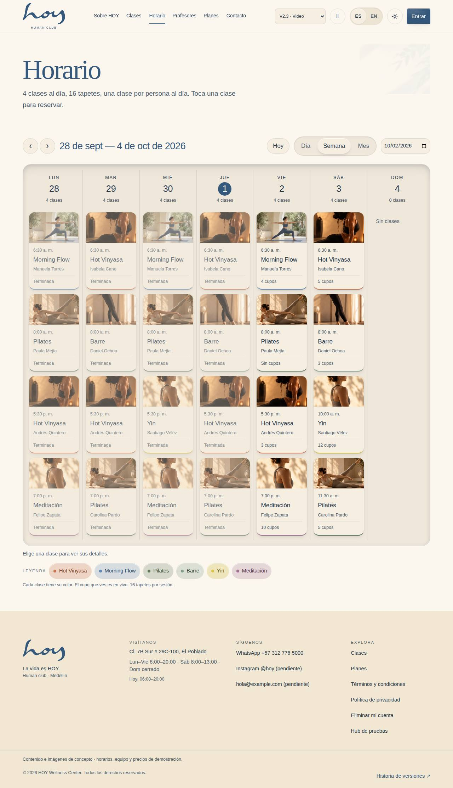

# W-04 — Site · Schedule

**Route** `/#/site/schedule` · **Roles** super_admin, admin, coordinator, front_desk, finance, teacher, maintenance, customer, public · **Surface** public · **Spec** `spec.code === 'W-04'` (see `/#/dev/specs`)

## Purpose
Public weekly schedule with live capacity. Seven day tabs, the modality legend doubles as a filter (`?modality=<slug>`), and tapping a class opens the sign-in prompt that carries the session into the customer app.

## Screenshots
| ES · mobile | EN · mobile |
| --- | --- |
|  |  |

| ES · desktop | EN · desktop |
| --- | --- |
|  |  |

## Sections (layout order — `useLayout(spec)`)
1. `PageHead`
2. `DayTabs`
3. `ClassList`
4. `Legend` (the modalities; chips filter with `?modality=<slug>`)

## Responsive layout (0025)
**Shell** `SiteShell` (unchanged: full-width website, header nav, 1120 px container, 1520 px in the Sanctuary edition ≥ 1920). What changed in 0025 is the hand-off.

- **≥ 900 px**: picking a class opens the reserve `Drawer side="bottom"` as a **centred dialog** instead of a full-width bottom sheet; its CTA goes to A-02 (`AuthShell`, same top bar family) and on to C-04 full-viewport — no step narrows to a phone.
- **< 900 px**: the reserve drawer is a bottom sheet, as before.
- Known gaps (kanban, 0025 follow-ups): the site's own controls are still under 44 px (`.site .btn` 36, header links 34, version select 38) and `.site-actions` overflows 13 px at 390 px (pre-existing).
- The Sanctuary fonts load through a `<link>` in `index.html`; the former CSS `@import` blanked the whole website when Google Fonts was unreachable.

Verified 2026-09-28 at 360 · 390 · 768 · 1280 · 1920 · 3840 px (ES and EN, light) during the 0026 build: DOM audit (`scrollWidth === innerWidth`, calendar window without horizontal overflow, no control under 44 px) plus the captures above regenerated at all six widths; `PageSpec.checkedAt` = `[360, 390, 768, 1280, 1920, 3840]`.

## Responsive layout (0026) — calendar on phones
`SessionCalendar` picks its layout from the viewport (`useMinWidth('shell')`, 900 px):

- **< 900 px · Week**: a snap-scrolling strip of the seven days (44 px chips: weekday, date, one class-tone dot per class, `aria-pressed` on the selected day) above the selected day's classes as `ClassRow`s. Tapping a chip selects the day; the toolbar arrows move a week.
- **< 900 px · Month**: a compact 7-column grid of 44 px day cells with the same dots (outside-month days dimmed, today ringed, selected day filled) above the selected day's list. Tapping a cell selects the day; arrows move a month.
- **< 900 px · Day**: unchanged (the list).
- **≥ 900 px**: the seven-column card grids of 0025, unchanged.
- No horizontal scroll region at any width; sizes are rem / tokens so the 4K band scales them. The footnote no longer asks to swipe.

**Mat grid in the reserve sheet.** `MatPicker` derives its columns from the room's measured width and the tenant row length (`tenant.studio.mats / matRows` = 8): `matColumns()` picks 8, 4 or 2 mats per line, whichever is the largest divisor that keeps every mat at least `--mat-size` (3.5rem) wide. Each physical row is its own `role="group"` grid ("Fila 1", "Fila 2"); when a row wraps, a "Fila n · mats a–b" label keeps the front (teacher) / entrance reading. Mats are 60–72 px tall (rem). Inside the reserve drawer / dialog the rows wrap the same way from the drawer's width.

## Data
| Table | Read / write | Notes |
| --- | --- | --- |
| `class_sessions` | read | |
| `modalities` | read | |
| `teachers` | read | |
| `rooms` | read | |

## Logic and integrations
- Shows 7 days starting today; Sundays show the empty state.
- Capacity = capacity − booked_count from class_sessions.
- Deep click → login prompt → /app (demo: switches to the customer demo user).
- Integrations: Supabase Realtime, Supabase Auth

## States
- default
- day without classes
- login prompt open

## Real vs mock
- Real: every paragraph, class essay, tagline and value-model rationale is the owner's own copy, typed
  once in `src/tenant/brand.ts` and `src/tenant/pricing.ts` and read through `useT()` / `bi()`. Studio
  facts (city, capacity, hours, contact, location) come from `src/tenant/tenant.ts`. Schedule, teacher
  and review rows come from the data layer (`useTable`), so the Supabase provider replaces the mock unchanged.
- Mock / pending: **all photography and video is pending** — every image is a `MediaSlot` that reserves the
  ratio and prints the art brief (`docs/website-vision.md` carries the shot list). Contact details
  (WhatsApp, email, address, Instagram) are placeholders flagged `tenant.contact.pending`; the exact
  address and `tenant.location` coordinates are approximate. Data is the browser-local `MockProvider` seed.

## 0051 — the studio's verified content (2026-10-01)
The week is the seven classes (Mon–Fri 06:30 / 08:00 / 17:30 / 19:00, Sat 08:00 / 09:15 / 10:30 / 11:45), each 60
minutes, each with the teacher who guides it. The footer still labels the timetable a demo until the studio publishes
its own.
| Before (0.21.3) | After (0.22.0) |
| --- | --- |
|  |  |

## Changelog
- `docs/changelog/0051-website-verified-content.md` — the schedule runs on the seven classes and their teachers (v0.22.0, 2026-10-01)
- `docs/changelog/0026-calendar-teacher-mats.md` — phone Week strip and Month grid in `SessionCalendar`, room-width `MatPicker` rows in the reserve sheet (v0.10.1, 2026-09-28)
- `docs/changelog/0005-final-integration.md` — screenshots and this page doc (v0.3.0)
- `docs/changelog/0011-website-brand-content.md` — brand copy, MediaSlot/MapSlot, new classes pages (v0.6.0)
- `docs/changelog/0025-responsive-app-shell.md` — responsive `AppShell` / ≥ 900 px layout (v0.10.0, 2026-09-28)
- `docs/changelog/0039-retire-movements.md` — legend and `?movement=` filter replaced by modalities and `?modality=` (v0.15.0, 2026-09-29)

---
**Resumen (ES).** Sitio · Horario. Horario semanal público con cupos en vivo; la leyenda de modalidades filtra la lista y tocar una clase pide iniciar sesión.

## Website edition 2.0 — 2026-09-25

The Sanctuary edition applies Aleja's cream/blue editorial direction, real image textures and restrained motion. The navigation version selector preserves the original edition for comparison. Existing provider/CMS behavior is retained; the runtime still uses demo data. See [release history](../website-versions.md) and [motion handoff](../website-motion-production.md). No actual teacher identities are assigned generated portraits.
