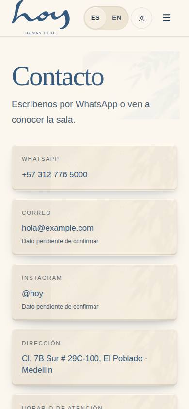
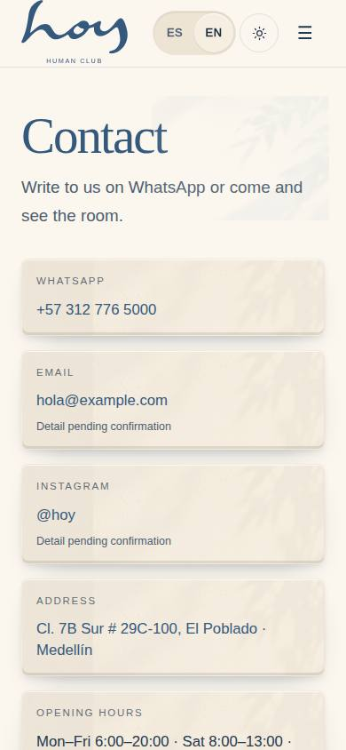

# W-06 — Site · Contact

**Route** `/#/site/contact` · **Roles** super_admin, admin, coordinator, front_desk, finance, teacher, maintenance, customer, public · **Surface** public · **Spec** `spec.code === 'W-06'` (see `/#/dev/specs`)

## Purpose
WhatsApp, email, address, Instagram and opening hours from the tenant config — every placeholder labelled as pending — the studio location through `MapSlot` (offline-safe placeholder plus a Google Maps deep link), a WhatsApp CTA, and an "escríbenos" form that opens WhatsApp with the message prefilled. No backend.

## Screenshots
| ES · mobile | EN · mobile |
| --- | --- |
|  |  |

| ES · desktop | EN · desktop |
| --- | --- |
|  |  |

## Sections (layout order — `useLayout(spec)`)
1. `PageHead`
2. `ContactCards`
3. `Map`
4. `Form`

## Data
| Table | Read / write | Notes |
| --- | --- | --- |
| `tenants` | read | contact (`useContact()`) and, since 0041, the weekly hours (`useOpeningHours()`) |
| `hours_overrides` | read | 0041: today's line and the exceptions of the next 30 days under the hours card |

## Logic and integrations
- No hardcoded contact data: reads src/tenant/tenant.ts.
- Integrations: WhatsApp

## States
- default

## Real vs mock
- Real: every paragraph, class essay, tagline and value-model rationale is the owner's own copy, typed
  once in `src/tenant/brand.ts` and `src/tenant/pricing.ts` and read through `useT()` / `bi()`. Studio
  facts (city, capacity, hours, contact, location) come from `src/tenant/tenant.ts`. Schedule, teacher
  and review rows come from the data layer (`useTable`), so the Supabase provider replaces the mock unchanged.
- Mock / pending: **all photography and video is pending** — every image is a `MediaSlot` that reserves the
  ratio and prints the art brief (`docs/website-vision.md` carries the shot list). Contact details:
  **WhatsApp (+57 312 776 5000) and the address (Cl. 7B Sur # 29C-100, El Poblado — the Santa María Tenis Club
  premises) are real and confirmed since 0036**; email and Instagram are still placeholders and keep the
  "Dato pendiente de confirmar" line (per-field `confirmed` in `tenant.contact` / M-08a). Data is the browser-local `MockProvider` seed.

## 0041 — live hours
The hours card quotes the M-08a weekly hours (not the tenant.ts constant), today's line (“Hoy: 06:00–20:00”,
“Hoy cerrado · Festivo (Día de la Raza) · abre mañana 06:00”) and up to three upcoming exceptions from M-08g. Every
website page (shared shell) also carries the studio as schema.org `LocalBusiness` JSON-LD with the same hours, and the
footer shows the sentence plus today's line.

## 0047 — WhatsApp by topic
The WhatsApp card, the "Abrir WhatsApp" CTA and the "Escríbenos" form are **`frontDesk`** handoffs; the Especiales card is a
**`specials`** handoff — all through `useWhatsappLink()` (M-08a → Contactos de WhatsApp por tema, D-0022), so a
coordination number typed there takes the Especiales conversation without touching this page. When a contact is off duty and
the studio is closed, a small line under the button says "Respondemos el próximo día hábil (…)", computed from the hours, the
M-08g exceptions and Colombia's holidays. The CTA message moved from an inline literal to the `site.contact.wa` key.

## 0051 — the studio's verified content (2026-10-01)
Contact reads **WhatsApp Business +57 312 776 5000**, **info@humanclub.com**, **@hoyhumanclub** and the landmark
"Contiguo al Colegio Santa María del Rosario" — all four marked confirmed in `src/tenant/tenant.ts`, so no "pendiente"
label. A "Preguntas frecuentes" button opens W-10.
| Before (0.21.3) | After (0.22.0) |
| --- | --- |
|  |  |

## Changelog
- `docs/changelog/0051-website-verified-content.md` — WhatsApp Business, info@humanclub.com, @hoyhumanclub and the landmark, all confirmed; FAQ button (v0.22.0, 2026-10-01)
- `docs/changelog/0047-whatsapp-contact-routing.md` — CTA, card and form as `frontDesk`, Especiales as `specials`, the off-duty note, `site.contact.wa` (v0.21.0, 2026-09-30)
- `docs/changelog/0041-hours-google-keys.md` — live hours, today line, upcoming exceptions, LocalBusiness JSON-LD (v0.17.0, 2026-09-29)
- `docs/changelog/0005-final-integration.md` — screenshots and this page doc (v0.3.0)
- `docs/changelog/0011-website-brand-content.md` — brand copy, MediaSlot/MapSlot, new classes pages (v0.6.0)
- `docs/changelog/0036-real-contact.md` — real WhatsApp and address, per-field pending labels, map link, dark captures (v0.13.1)

---
**Resumen (ES).** Sitio · Contacto. WhatsApp y dirección reales (0036), correo e Instagram aún marcados como pendientes, el mapa del estudio (MapSlot), un CTA de WhatsApp y un formulario que abre WhatsApp con el mensaje listo.

## Website edition 2.0 — 2026-09-25

The Sanctuary edition applies Aleja's cream/blue editorial direction, real image textures and restrained motion. The navigation version selector preserves the original edition for comparison. Existing provider/CMS behavior is retained; the runtime still uses demo data. See [release history](../website-versions.md) and [motion handoff](../website-motion-production.md). No actual teacher identities are assigned generated portraits.
