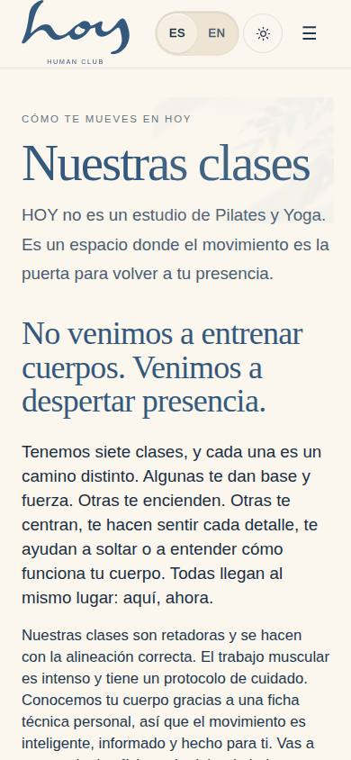
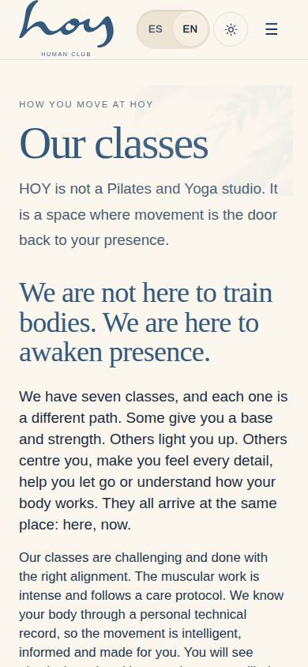
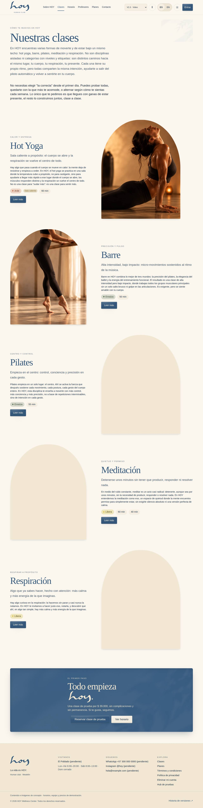
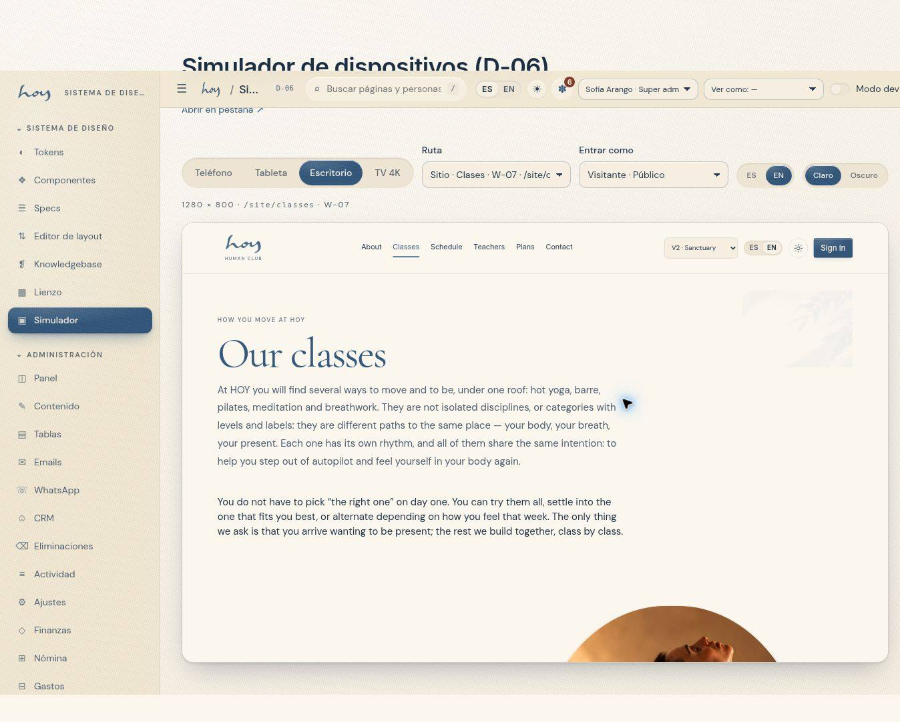
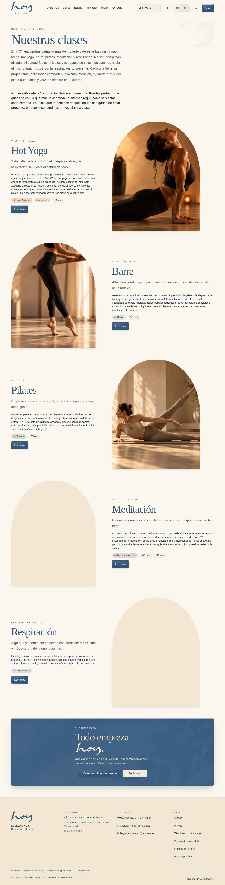

# W-07 — Site · Classes

**Route** `/#/site/classes` · **Roles** super_admin, admin, coordinator, front_desk, finance, teacher, maintenance, customer, public · **Surface** public · **Spec** `spec.code === 'W-07'` (see `/#/dev/specs`)

## Purpose
The "Nuestras clases" introduction and one rich block per class — hot yoga, barre, pilates, meditación, respiración — each with its eyebrow, summary, opening paragraph, modality-name chip, duration from the matching modality and a 16:9 photo slot. The blocks alternate left/right on desktop and stack on mobile.

## Screenshots
| ES · mobile | EN · mobile |
| --- | --- |
|  |  |

| ES · desktop | EN · desktop |
| --- | --- |
|  |  |

_Captured in the 0.6.0 full pass._

## Sections (layout order — `useLayout(spec)`)
1. `PageHead`
2. `Intro`
3. `ClassList`
4. `CTA`

## Data
| Table | Read / write | Notes |
| --- | --- | --- |
| `modalities` | read | Duration and heated flag per class, joined on `slug`. |

## Logic and integrations
- **Wordmark (0033)**: the closing panel h2 "Todo empieza HOY." / "Everything starts HOY." sets HOY as the inline wordmark in the heading colour (tone `current`: cream on the deep-blue panel in both themes). The PageHead eyebrow "Cómo te mueves en HOY" and the intro paragraphs stay text. Captures: `es-1280.jpg`, `es-1280-dark.jpg`, `es-390.jpg` (+ EN).
- Cards are generated from `brand.classOrder`; adding a class means adding one entry to `src/tenant/brand.ts`.
- Each block links to `/site/classes/:slug` and carries its modality's class tone from D-01 `classTones`.
- The trial price in the closing band is read from `src/tenant/pricing.ts` (`trial`).
- Integrations: none

## States
- default

## Real vs mock
- Real: the intro and every class essay are the owner's copy from `src/tenant/brand.ts`; the facts
  (duration, intensity, heated) are joined live from the `modalities` table through
  `brand.classes[slug].modalitySlugs`; the trial price comes from `src/tenant/pricing.ts`.
- Mock / pending: the photography is pending — each class books a 16:9 `MediaSlot` with its art brief
  (see the shot list in `docs/website-vision.md`). Data is the browser-local `MockProvider` seed.

## 0051 — the studio's verified content (2026-10-01)
The verified **"Nuestras clases"** text (lead, statement, three paragraphs, question, close) and one row per class:
a large `ClassArch` beside concept, intention, keys, method, intensity and who guides it, "Leer más" (W-08) and the
schedule link.
| Before (0.21.3) | After (0.22.0) |
| --- | --- |
|  |  |

## Changelog
- `docs/changelog/0051-website-verified-content.md` — "Nuestras clases" intro and the seven classes as large arches (v0.22.0, 2026-10-01)
- `docs/changelog/0011-website-brand-content.md` — new page (v0.6.0)
- `docs/changelog/0039-retire-movements.md` — chip shows the modality names; class tone replaces the movement colour (v0.15.0, 2026-09-29)

---
**Resumen (ES).** Sitio · Clases. La introducción «Nuestras clases» y un bloque por clase con cejilla, resumen, primer párrafo, chip con el nombre de la modalidad, duración y hueco de foto 16:9.

## Website edition 2.0 — 2026-09-25

The Sanctuary edition applies Aleja's cream/blue editorial direction, real image textures and restrained motion. The navigation version selector preserves the original edition for comparison. Existing provider/CMS behavior is retained; the runtime still uses demo data. See [release history](../website-versions.md) and [motion handoff](../website-motion-production.md). No actual teacher identities are assigned generated portraits.
