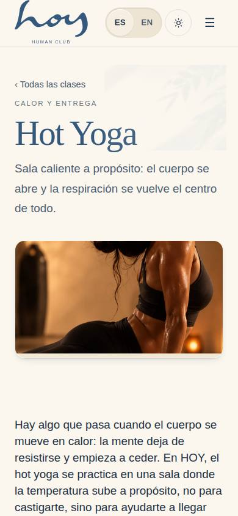
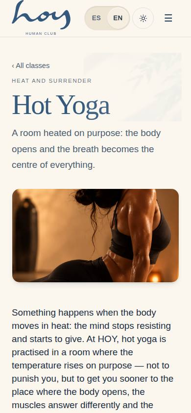
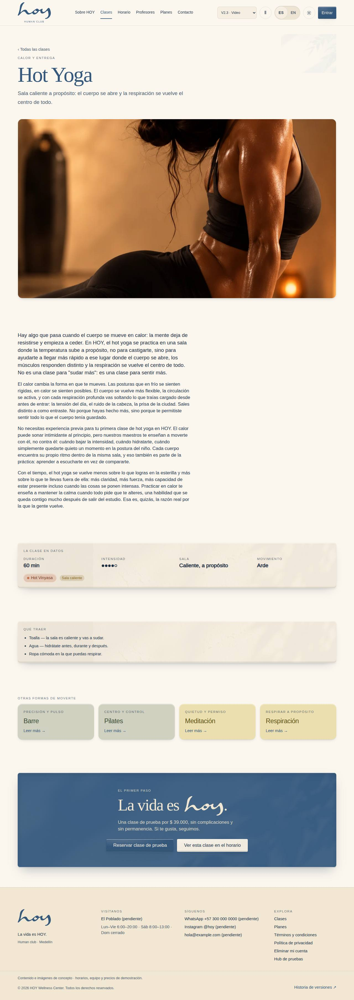
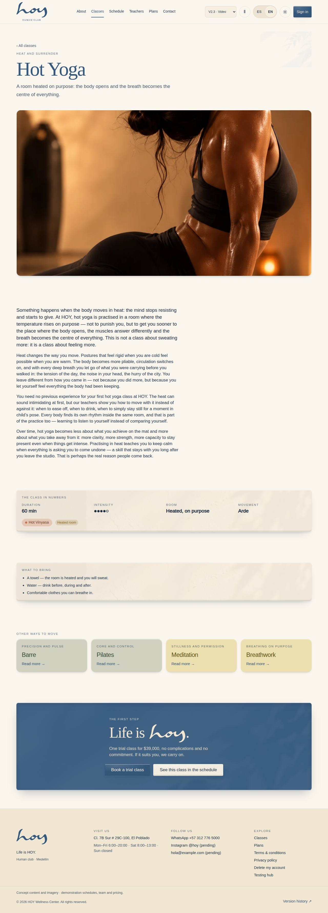
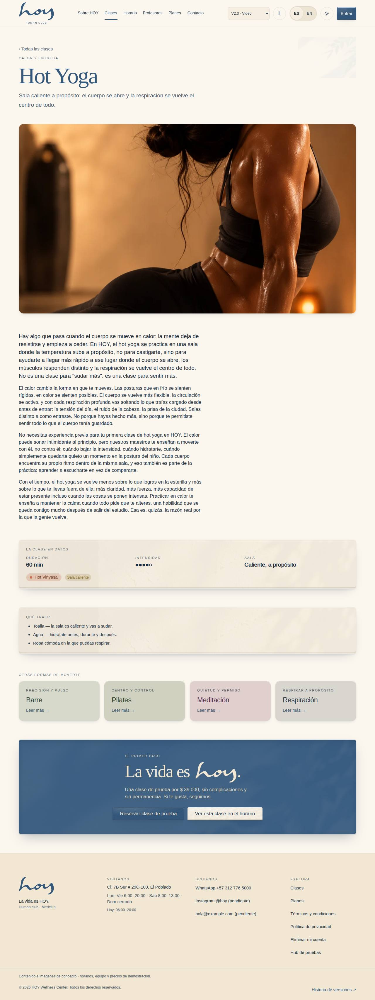

# W-08 — Site · Class

**Route** `/#/site/classes/:slug` · **Roles** super_admin, admin, coordinator, front_desk, finance, teacher, maintenance, customer, public · **Surface** public · **Spec** `spec.code === 'W-08'` (see `/#/dev/specs`)

## Purpose
One class in full: the essay from the brand manual, the facts of its matching modality (duration, intensity, heated room), a "what to bring" list derived from the class (heat always adds towel and water), links to the other classes, and a closing band with the trial-class CTA and a filtered link into the schedule.

## Screenshots
| ES · mobile | EN · mobile |
| --- | --- |
|  |  |

| ES · desktop | EN · desktop |
| --- | --- |
|  |  |

_Captured in the 0.6.0 full pass. The `:slug` param is captured as `hot-yoga`._

## Sections (layout order — `useLayout(spec)`)
1. `Hero`
2. `Essay`
3. `Facts`
4. `Bring`
5. `Other`
6. `CTA`

## Data
| Table | Read / write | Notes |
| --- | --- | --- |
| `modalities` | read | Facts join through `brand.classes[slug].modalitySlugs`; no match renders the "lives inside the guided classes" note. |

## Logic and integrations
- **Wordmark (0033)**: the closing panel h2 "La vida es HOY." / "Life is HOY." sets HOY as the inline wordmark (tone `current`, cream on the deep-blue panel). The essay paragraphs ("En HOY, …") stay text. Captures: `es-1280.jpg`, `es-1280-dark.jpg`, `es-390.jpg` (+ EN).
- The slug is validated against `brand.classOrder`; an unknown slug renders the not-found state with a chip per class.
- "What to bring" is built from the class's `bring` keys, de-duplicated, with towel and water forced when `heated`.
- The schedule CTA passes `?modality=<slug>` so W-04 opens pre-filtered.
- Integrations: none

## States
- default
- no matching modality (respiración)
- unknown slug

## Real vs mock
- Real: the intro and every class essay are the owner's copy from `src/tenant/brand.ts`; the facts
  (duration, intensity, heated) are joined live from the `modalities` table through
  `brand.classes[slug].modalitySlugs`; the trial price comes from `src/tenant/pricing.ts`.
- Mock / pending: the photography is pending — each class books a 16:9 `MediaSlot` with its art brief
  (see the shot list in `docs/website-vision.md`). Data is the browser-local `MockProvider` seed.

## 0051 — the studio's verified content (2026-10-01)
Rebuilt for the seven classes (`/site/classes/<slug>`): hero arch; concept and intention; keys, messages and method
cards; the class in data (60 min, intensity dots, room temperature); what to bring (the FAQ: the studio provides the
mat and all props, a small towel and a bottle are optional, hydration zone after class); the other six arches; the
trial-class band.
| Before (0.21.3) | After (0.22.0) |
| --- | --- |
|  |  |

## Changelog
- `docs/changelog/0051-website-verified-content.md` — one page per class: concept, intention, keys, messages, method, what to bring, who guides it (v0.22.0, 2026-10-01)
- `docs/changelog/0011-website-brand-content.md` — new page (v0.6.0)
- `docs/changelog/0039-retire-movements.md` — the “Movimiento” fact is gone; the schedule CTA passes `?modality=` (v0.15.0, 2026-09-29)

---
**Resumen (ES).** Sitio · Clase. El ensayo completo de una clase, los datos de su modalidad, qué traer, enlaces a las otras clases y el CTA a la clase de prueba.

## Website edition 2.0 — 2026-09-25

The Sanctuary edition applies Aleja's cream/blue editorial direction, real image textures and restrained motion. The navigation version selector preserves the original edition for comparison. Existing provider/CMS behavior is retained; the runtime still uses demo data. See [release history](../website-versions.md) and [motion handoff](../website-motion-production.md). No actual teacher identities are assigned generated portraits.
