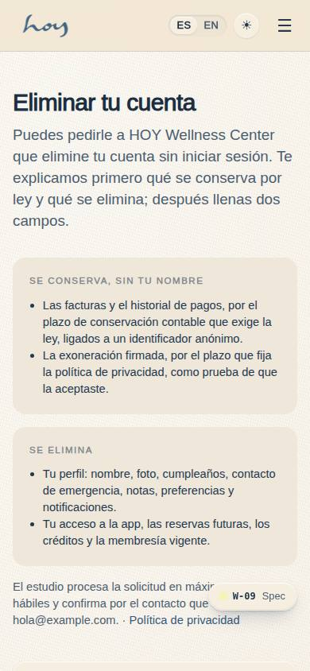
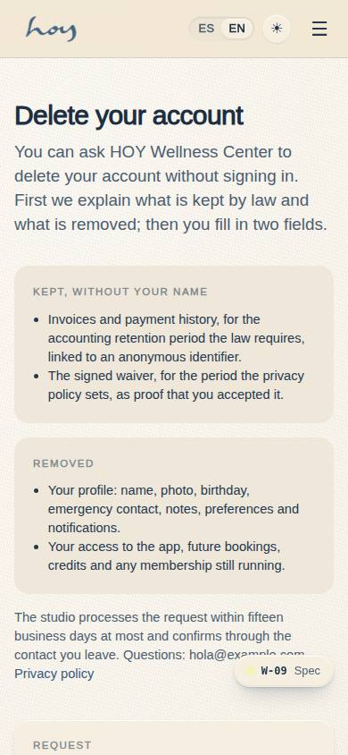
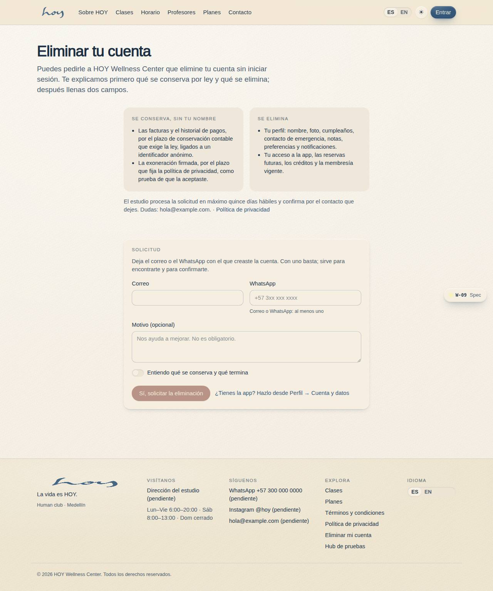
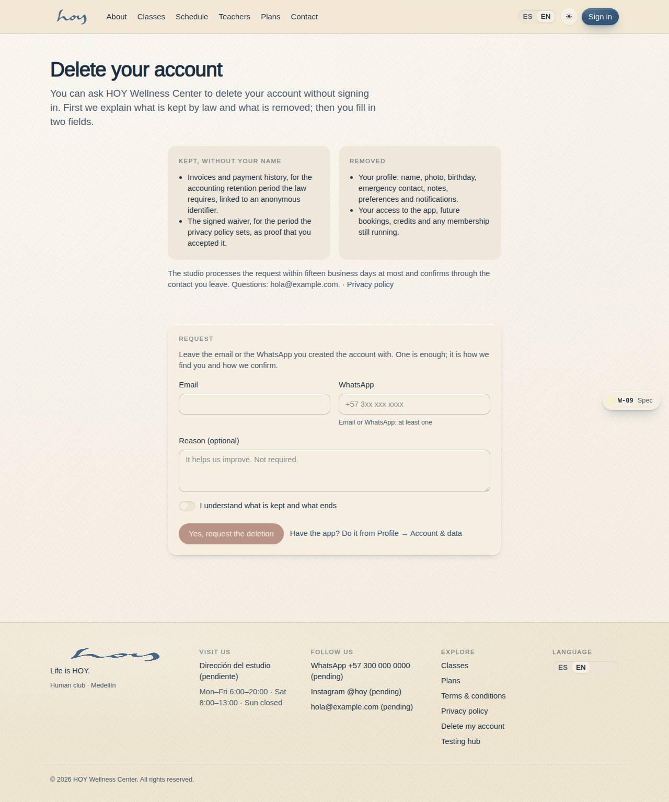

# W-09 — Site · Delete account

**Route** `/#/site/delete-account` · **Roles** everyone (no sign-in) · **Surface** public · **Spec** `src/modules/website/specs.ts` `deleteAccount` (see `/#/dev/specs`)

## Purpose
Request an account deletion with no sign-in: email or WhatsApp, an optional reason, and a plain-words explanation of what is kept by law and what is removed. It is the public URL Google Play's account-deletion policy requires; the app offers the same under Profile → Account & data (C-26).

## Screenshots
| ES · mobile | EN · mobile |
| --- | --- |
|  |  |

| ES · desktop | EN · desktop |
| --- | --- |
|  |  |

## Sections (layout order — `useLayout(spec)`)
1. `PageHead` — title and lead with the controller's display name.
2. `WhatHappens` — two cards: kept without your name (invoices and payment history, the signed waiver) · removed (profile, access, future bookings, credits, membership); the fifteen-business-day line with the studio email and the privacy-policy link.
3. `Form` — email, WhatsApp (at least one), optional reason, "I understand" switch, the destructive button; on success a notice with a six-character reference.

## Data
| Table | Read / write | Notes |
| --- | --- | --- |
| `deletion_requests` | write | `user_id` null, `channel` website, `status` requested |
| `audit_log` | write | `account.deletion_request` with `actor_id` null and `role: public` |
| `tenants` | read | display name and email through `useSettings()` |

## Logic and integrations
- Validation: a valid email or a 10-digit phone is required; the switch gates the button.
- Nothing is deleted here: admin matches the contact to a member in M-11 and the anonymisation runs server-side.
- Linked from the site footer (*Eliminar mi cuenta*) and from §7 of the privacy policy (A-06).
- Integrations: none on the page; in Supabase the insert goes through an edge function that rate-limits and never reads back (see the table's RLS notes in `docs/data-model.md`).

## States
- default
- validation: no contact
- validation: bad email / phone
- switch off → button disabled
- sent (reference shown)

## Real vs mock
- Real: the row and the audit entry are written through `useData()`.
- Mock / pending: the public insert path (edge function) and the confirmation message.

## Changelog
- `docs/changelog/0019-app-store-readiness.md` — first version (v0.7.0)

---
**Resumen (ES).** La página pública para pedir la eliminación de una cuenta sin iniciar sesión, que Google Play exige: correo o WhatsApp, motivo opcional, y qué se conserva por ley y qué se elimina. Crea la solicitud; admin la atiende en M-11.
