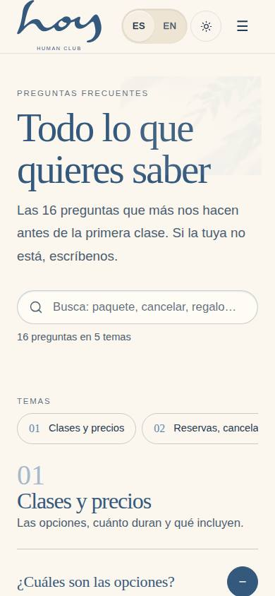
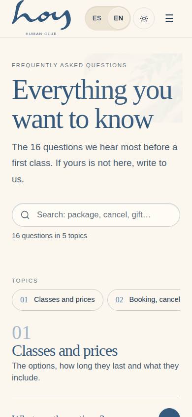
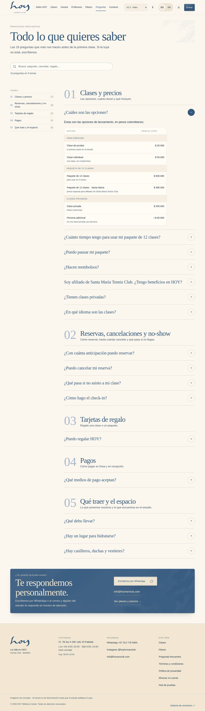
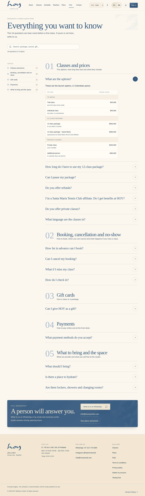

# W-10 — Site · FAQ

**Route** `/#/site/faq` · **Roles** super_admin, admin, coordinator, front_desk, finance, teacher, maintenance, marketing, developer, customer, public · **Surface** public · **Spec** `spec.code === 'W-10'` (see `/#/dev/specs`)

## Purpose
The studio’s frequently asked questions in five topics (classes and prices; booking, cancellation and no-show; gift cards; payments; what to bring and the space), with search, a topic index and live price tables.

## Screenshots
| ES · mobile | EN · mobile |
| --- | --- |
|  |  |

| ES · desktop | EN · desktop |
| --- | --- |
|  |  |

## Sections (layout order — `useLayout(spec)`)
1. `PageHead`
2. `Search`
3. `Groups`
4. `Contact`

## Data
| Table | Read / write | Notes |
| --- | --- | --- |
| `faq_entries` | read | |

## Logic and integrations
- Reads published faq_entries in sort order and groups them by group_key — the rows C-14 / C-15 read and M-02c edits, so the site and the app never disagree.
- A `{{pricing:<families>}}` line in an answer renders a live PriceTable from src/tenant/pricing.ts (FaqAnswer); numbers in sentences were filled from pricing.ts and the M-08 defaults at seed time.
- Search folds accents and case over the question and the answer (prices written out); matches open their answers; zero matches offer a WhatsApp handoff (support intent) with the search prefilled.
- The page publishes schema.org FAQPage JSON-LD in the reader’s language.
- Integrations: WhatsApp

## States
- default
- search: matches (answers open)
- search: no matches
- loading

## Real vs mock
- Real: the page renders from the data layer (`useData()` / `useTable`) over the tables above; every write goes through the `DataProvider` so the Supabase provider replaces the mock unchanged.
- Mock / pending: WhatsApp are simulated or deferred; data is the browser-local `MockProvider` seed.

## Design (0051)
The brief was "make sure the FAQ section is beautiful". In the sanctuary edition:

1. **Head**: eyebrow, the serif title "Todo lo que quieres saber", a one-line lead with the live question count, and a
   pill search field (accent-insensitive: "cancelacion" finds "cancelación").
2. **Topic index**: a sticky numbered list beside the questions from 1024 px (01 … 05 with the count per topic);
   below that a row of chips that scrolls sideways inside the column (no page overflow at 390).
3. **Sections**: a large light numeral (01 … 05), the topic title and its lead; the questions in the new **editorial
   `Accordion`** — hairline separators, serif questions, a round ± control (44 px). The first question opens by default
   so the live **PriceTable** (trial, individual, the two package prices, private class + per person) shows at once.
4. **Answers** go through **FaqAnswer**: paragraphs, and a `{{pricing:<families>}}` line becomes a PriceTable, so a
   price change in `src/tenant/pricing.ts` reaches the FAQ with no edit.
5. **Close**: a deep-blue contact card ("¿Te quedó alguna duda? Te respondemos personalmente.") with WhatsApp, the
   confirmed email and a link to the plans.

Content: the studio's FAQ document (`reference/uploads/HOY_FAQ_Corrections_Remove.docx`), 16 questions in 5 topics,
seeded in `faq_entries` (groups `s1`–`s5`), so C-14 / C-15 in the app read the same answers.

## Changelog
- `docs/changelog/0051-website-verified-content.md` — new page: the studio's FAQ with search, topic index, editorial accordion and live prices (v0.22.0, 2026-10-01)

---
**Resumen (ES).** Sitio · Preguntas frecuentes. Las preguntas frecuentes del estudio en cinco temas (clases y precios; reservas, cancelaciones y no-show; tarjetas de regalo; pagos; qué traer y el espacio), con búsqueda, índice de temas y tablas de precios en vivo.
