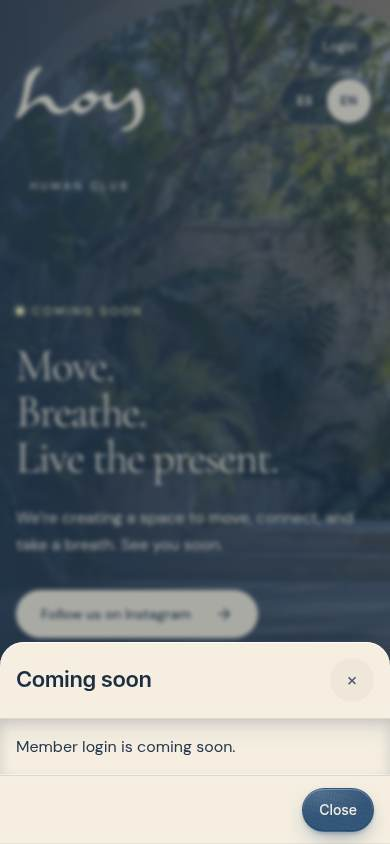
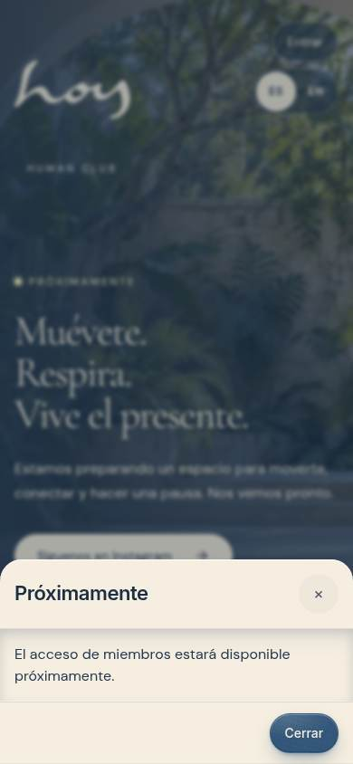
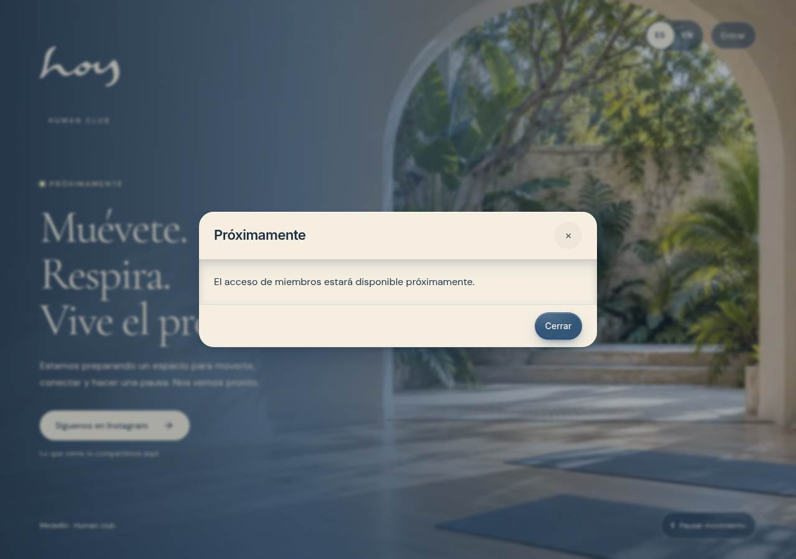

# W-11 · Próximamente / Coming soon

Routes: `/` and `/#/coming-soon` · Surface: public · Roles: everyone

The public root pre-launch surface, also accessible from its own hub card at /hub. It is separate from the complete `/site` experience and its version selector. The existing brand wordmark and sanctuary concept artwork are reused, with the same local ambient loop and no new generated assets.

## Content and behavior

- Spanish by default; ES/EN uses the shared language control
- “Muévete. Respira. Vive el presente.” comes from the approved brand content
- The opening status is simply “Próximamente / Coming soon”; no date or countdown is claimed
- The main CTA opens the already-confirmed studio Instagram profile in a new tab, not a popup
- Top-right Login / Entrar opens the accessible Coming Soon dialog; Close, Escape, overlay and browser Back dismiss it and return focus
- No credentials are requested and no Clerk/auth service is configured
- No contact form, email collection, mock signup or payment action
- Pause and resume controls affect only this page; website edition selection is untouched
- AmbientScene uses the poster when video fails, motion is reduced, or data saving is enabled

## Captures

The integration release includes W-11 captures and hub thumbnails from the actual running page, in Spanish and English on phone and desktop. See `docs/screenshots/W-11/`.

## Hosting entry (0059)

`/hub` is a same-deployment static entry into `/#/hub`. Both the current project subpath and a future verified root domain keep assets and preview URLs at their deployment root. DNS/CNAME/custom-domain settings are not changed by this UI release.

## Login placeholder captures

Actual settled production renders, verified in [Website preview QA](https://github.com/imagine-os/hoy/actions/runs/37363797838):

