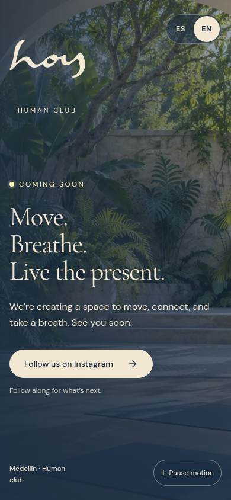
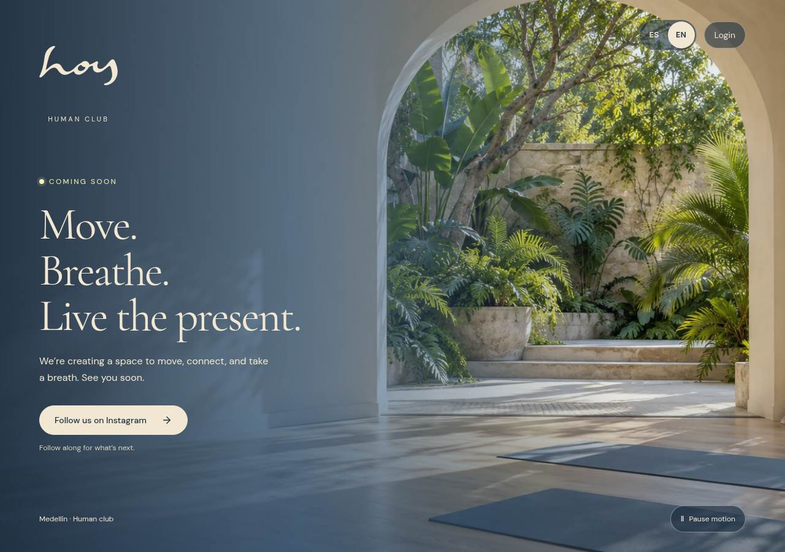

# W-11 · Próximamente / Coming soon

Route: `/#/coming-soon` · Surface: public · Roles: everyone

A standalone pre-launch surface accessible from its own hub card. It is separate from the complete `/site` experience and its version selector. The existing brand wordmark and sanctuary concept artwork are reused, with the same local ambient loop and no new generated assets.

## Content and behavior

- Spanish by default; ES/EN uses the shared language control
- “Muévete. Respira. Vive el presente.” comes from the approved brand content
- The opening status is simply “Próximamente / Coming soon”; no date or countdown is claimed
- The main CTA opens the already-confirmed studio Instagram profile in a new tab, not a popup
- Top-right Login / Entrar opens the existing demo sign-in entry at /auth/sign-in; no production auth service is claimed
- No contact form, email collection, mock signup or payment action
- Pause and resume controls affect only this page; website edition selection is untouched
- AmbientScene uses the poster when video fails, motion is reduced, or data saving is enabled

## Captures

The integration release includes W-11 captures and hub thumbnails from the actual running page, in Spanish and English on phone and desktop. See `docs/screenshots/W-11/`.

