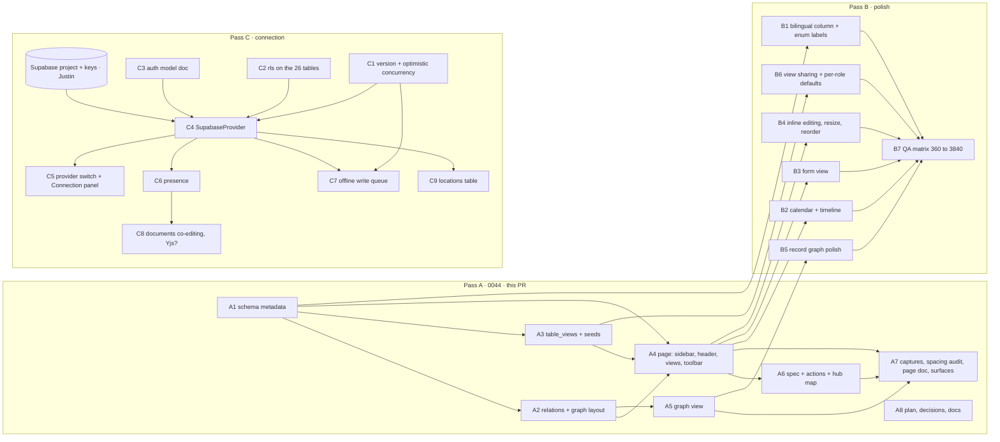

# Tables system — development plan

_Pass 0044 · v0.19.0 · 2026-09-29 · written by Fable 5.1 (plan, judgement) · prompt `docs/prompts/0044-tables-views.md`
· decisions [D-0020](../decisions.md), [D-0021](../decisions.md) · page M-03 `/admin/tables`._

This is the first deliverable of the pass, per project convention: order of operations, tasks bound by dependencies
(not calendar days), a model per task, and room for repeated passes and polish. Written for Justin; a Spanish summary
closes the document.

## What it is today

- **56 tables** declared in one file, `src/data/schema.ts`: name, bilingual label, description, group (core, people,
  schedule, analytics, commerce, comms, manual, system, design), columns with types and `references`, an optional
  `titleColumn`, and `rls` on 34 of them. `npm run sql` generates `supabase/schema.sql` and `docs/data-model.md` from it.
- **One data seam**, `DataProvider` (`src/data/types.ts`): list / get / insert / update / remove / subscribe. Every page
  reads through it; nothing touches the seed directly.
- **`MockProvider`** is the only implementation: an in-browser DB seeded deterministically, persisted to
  `localStorage['hoyos.db.v1']`, reseeded when `SEED_VERSION` moves, "realtime" across tabs through `storage` events.
  **`SupabaseProvider`** is a stub that throws, with the intended PostgREST + `postgres_changes` mapping in TODOs.
- **M-03** (`src/modules/admin/TablesPage.tsx`, 163 lines) shows raw identifiers in the mono font everywhere a person
  looks: sidebar entries, page title, column headers, field labels, foreign keys as ids. One grid, text search, one
  sort, 50-row pages. No views, no filters, no grouping, no hidden columns, no saved anything. The sidebar is a fixed
  15 rem column; on phones it becomes a 40 vh block above the table.
- The schema already carries the human words (`label`, `titleColumn`, group labels) — the page just never uses them.

## Where it goes

A **tables system**, not a developer table browser: the Airtable / Notion baseline — grid, list, gallery, kanban,
calendar, timeline and form views; filters, multi-sort, grouping, hidden columns; **saved views shared as rows** of a
`table_views` table — plus a **graph view** in two modes: the schema graph (57 tables, 83 foreign keys, grouped and
coloured by group) and the record neighbourhood (one row and everything that points at it or that it points to).

Everything reads and writes through the same provider seam, so the views and the data sync the moment Supabase
connects: a saved view is a row like any other, a filter is a `Query`, a live count is a `subscribe`. People see
labels, icons and relations in the design-system fonts; technical names (`class_sessions`, `tenant_id`) stay one dev
toggle away.

## Passes as a dependency graph

### Pass A — 0044, this PR

| Task | Depends on | Model | Done when |
| --- | --- | --- | --- |
| **A1** Schema metadata: `kind`, `icon`, `titleColumn` on every table, column `label?` (Bi) and `sensitive?`, humanize dictionary `src/data/labels.ts` | — | Opus | Every one of the 57 tables has kind, icon and titleColumn; `tableLabel()` / `columnLabel()` return human ES/EN for any name; `npm run sql` still generates; SEED_VERSION bumped |
| **A2** Relations derivation + graph layout `src/data/relations.ts` | A1 | Opus | `relationsOf(table)` gives forward and reverse FKs with labels; a deterministic layout (group clusters) for 57 nodes / 83 edges; pure functions, unit-checkable |
| **A3** `table_views` table + seeds + SEED_VERSION + `npm run sql` | A1 | Opus | A view row = table, name (Bi), type, filters, sorts, group_by, hidden columns, shared flag, owner; one seeded default view per table group; appears in `schema.sql` and `data-model.md` |
| **A4** Page: toggleable sidebar (expanded / rail / sheet; pinned, recent, search, collapsible groups), header, view switcher, filter / sort / group / columns toolbar, grid / list / gallery / kanban | A1, A2, A3 | Opus | M-03 at 360 → 3840 with 44 px targets and keyboard on every control; labels from the design-system fonts; technical names behind the dev toggle; FK cells show row titles; saved views persist as rows; `api_keys.key_hash` hidden for read-only roles |
| **A5** Graph view (schema graph + record neighbourhood) | A2 | Opus | SVG graph, zoom / pan by keyboard and pointer, click a node → that table or row, legend by group, readable at 390 and 3840 |
| **A6** `M03` spec in `src/modules/admin/specs.ts` + actions registry + hub map | A4 | Opus | Real `data`, `layout`, `states`, `checkedAt`; `tables.*` actions declared with ES/EN intents and permissions; `hubMap.data.ts` tool purpose updated; `npm run hub-map` deterministic |
| **A7** Before / after captures, spacing audit, page doc M-03, surfaces delta | A4, A5, A6 | Sonnet | `docs/screenshots/M-03/*-before.jpg` and after at 390 / 1280 / 3840, `_tables/` sheets; `audit:spacing` clean on `/admin/tables`; `docs/pages/M-03.md` rewritten; `surfaces.md` 0044 delta + actions table |
| **A8** Plan, decisions D-0020 / D-0021, prompt / changelog / kanban / README | — (parallel) | Fable | This file, both decisions, the numbered docs — same turn as the work |

### Pass B — polish (next)

| Task | Depends on | Model | Done when |
| --- | --- | --- | --- |
| **B1** Bilingual `label` for every column of the 57 tables and enum value labels | A1 | Sonnet | No column header or enum Badge falls back to the humanized identifier; ES and EN both filled |
| **B2** Calendar + timeline views (tables with date columns) | A4 | Opus | `class_sessions`, `events`, `hours_overrides`, `payroll_runs`… open in a month / week calendar and a timeline; the placeholders from A4 become real |
| **B3** Form view (public / staff data entry from a view) | A4 | Opus | A view of type `form` renders one Field per visible column, validates by type, inserts through the provider |
| **B4** Inline cell editing + column resize / reorder by keyboard | A4 | Opus | Enter edits a cell, Escape cancels, Tab moves; widths and order saved on the view row; no drag-only path |
| **B5** Record-level graph polish (expand neighbours, path between two rows) | A5 | Opus | Double-click / Enter expands a node one hop; "path from A to B" highlights the FK chain |
| **B6** View sharing UI + per-role default views | A3 | Opus | Share toggle on a view, a default view per role per table, honoured on open |
| **B7** QA matrix 360 → 3840, all inputs (keyboard, mouse, trackpad, touch, pen) | B1–B6 | Sonnet | Matrix in `docs/qa/`, every cell green or a filed follow-up card |

### Pass C — connection

| Task | Depends on | Model | Done when |
| --- | --- | --- | --- |
| **C1** `version` column in `BASE_COLUMNS` + optimistic concurrency in `DataProvider.update` (reject stale writes, surface a "someone changed this" Notice) | — | Opus | `update(table, id, patch, { expectVersion })` rejects when the row moved; MockProvider implements it; the editors show the Notice with reload / overwrite |
| **C2** `TableDef.rls` for the 26 tables missing it, reviewed | — | Sonnet + Fable review | All 57 tables carry `rls`; `npm run sql` emits policies; ROADMAP §F 25 closes |
| **C3** Auth model doc: Supabase Auth ↔ `users` / `user_roles`, `tenant_id` JWT claim, the role switcher becomes real sign-in with view-as kept for super_admin in dev mode | — | Fable | `docs/reference/auth.md` accepted; A-01 / A-02 / A-03 / C-21 mapped to Supabase Auth flows; `VITE_DEMO_AUTH` flag documented |
| **C4** `SupabaseProvider` (PostgREST list / get / insert / update / remove, `postgres_changes` → `subscribe`, `peek` from a local cache) | C1, C2, C3, Supabase project from Justin | Opus | Passes the same manual test script as MockProvider (ROADMAP §C P2); M-03 works unchanged against it |
| **C5** Provider switch by env + a Connection panel in dev tools (provider, tenant, realtime status) | C4 | Opus | `VITE_DATA_PROVIDER=mock|supabase`; the panel shows live status and the last event |
| **C6** Presence on M-03 and the editors via Supabase Realtime presence (who is viewing / editing which row) | C4 | Opus | Two sessions see each other's avatars on the table and on the open row (ROADMAP §C P7) |
| **C7** Offline write queue (IndexedDB) replayed with the version check, conflict Notice | C1, C4 | Opus | Writes made offline replay on reconnect; a stale replay raises the C1 Notice instead of overwriting |
| **C8** Documents co-editing (manual pages, studio policies, page layouts) with Yjs **only if** the team edits text together; store Yjs updates in Supabase (or Liveblocks Yjs if presence UX wins later) — decide then | C6 | Fable | A decision block (D-00xx) with the measured need; if yes, one editor (the manual) co-edits as the pilot |
| **C9** `locations` table once `multipleLocations` is on | C4 | Opus | `rooms.location_id`, hours per location (0041 follow-up), tenant map |

**External blockers.** A Supabase project and its keys (Justin). Whether hoy shares Between Gigs' Supabase Auth project:
Between Gigs uses Supabase auth with D1 / drizzle for data; the recommendation is that **hoy owns its own Supabase
project and Postgres data**, with identity federation later through the hub map (`hoy.hub-map/1` already carries roles
and experiences), so neither repo blocks the other.

## Ontology: recommendation

The question was "is ontology built into all this, or necessary, or does it just add complexity?"

**The schema already is a light ontology.** Fifty-six typed tables, 83 foreign-key relations, nine groups, bilingual table
labels, a `titleColumn` per table. What it lacks is **metadata, not a new layer**: a `kind` and an `icon` per table, a
human `label` per column, and reverse relations derived from the foreign keys (a `users` row *has* bookings because
`bookings.user_id` points at it). Pass A adds exactly that.

Recommendation (**D-0020**): **no separate ontology module or vocabulary.** The graph view reads foreign keys and
`titleColumn`; nothing else is needed to draw the schema or a record's neighbourhood. Cross-project shared vocabulary
(aluzina, Between Gigs) stays at the hub-map level, where it already lives; a `hoy.entities/1` publication of the
entity list (name, label, kind, icon, relations) can follow the hub-map pattern **only when a consumer asks for it**.

Complexity for humans stays low: people see labels, icons and relations, never "classes", "predicates" or inference.
Airtable and Notion expose none of that either, and they are the baseline.

## Database connection, Supabase, Yjs / Liveblocks: assessment

**What exists.** The provider seam (`DataProvider`), `id` / `tenant_id` / `created_at` / `updated_at` on every row,
`subscribe()` designed as the mapping for `postgres_changes`, a generated `supabase/schema.sql` with `current_tenant_id()`
/ `has_role()` / `touch_updated_at()` helpers and RLS comments, `rls` on 34 tables, a `SupabaseProvider` stub that
throws with the intended mapping, cross-tab sync via storage events. Pages never bypass the seam, so the cut-over is one
line in `DataContext.tsx`.

**What is missing.** Auth (the role switcher is demo sign-in), RLS on 26 tables, a `version` field for conflicts, a real
adapter, offline handling, presence, and any CRDT. No Supabase, Yjs or Liveblocks package is installed; adding one needs
a changelog entry with the alternative rejected.

**The order** is Pass C above: C1–C3 need nothing and can start today; C4 needs them plus the project; C5–C9 follow C4.

**Yjs vs Liveblocks, plainly.** Yjs is a CRDT library for co-editing *documents* — text, rich text, free-form layouts —
where two people type in the same paragraph and both edits must survive. Liveblocks is a hosted vendor for presence,
storage and comments that can also host Yjs documents. **For row-based data (bookings, payments, memberships) a CRDT is
the wrong tool**: a booking is one row with a capacity rule, and the right answer to two people editing it is Postgres
plus realtime plus an optimistic `version` check with a visible Notice — not a merge. Yjs earns its place only for long
text edited together (manual pages, studio policies, maybe page layouts), and only if the team actually edits text
together; C8 measures that before adopting it. Liveblocks is rejected as a new vendor unless presence UX later needs
it, consistent with ROADMAP P7 ("Supabase Realtime presence preferred, no new vendor"). Recorded as **D-0021**.

## Repeated passes and polish

A → B → C are **not strictly serial**. C1–C3 (version column, RLS, auth doc) can start any time, even before Pass A
merges. The Spanish label fill (B1) and the QA matrices (B7) are Sonnet passes that never block a feature task. Each
pass ends with captures at 390 / 1280 / 3840, a spacing audit and a page-doc update; the "before" of the next pass is
the "after" of this one. Expect a further polish pass after real data lands (C4), because a 20,000-row `bookings`
table behaves differently from 200 seeded rows (virtualised grid, server-side filters through `Query`).

## Model routing

Model routing: Fable 5.1 (this plan, D-0020 / D-0021, architecture, shared code review) · Opus (schema metadata,
relations, `table_views`, the page, the graph view, spec + actions, the Supabase adapter) · Sonnet (captures, spacing
audit, page doc, surfaces delta, bilingual label fill, QA matrices). Every reply states which model did the work.

---
**Resumen (ES).** El gestor de tablas (M-03) pasa de "navegador para desarrolladores" a un sistema de tablas con vistas
al estilo Airtable / Notion (cuadrícula, lista, galería, kanban, calendario, línea de tiempo, formulario), filtros, orden,
agrupación, columnas ocultas y vistas guardadas como filas, más una vista de grafo (esquema y vecindario de un registro).
El esquema ya es una ontología ligera: solo le faltan metadatos (tipo, icono, etiquetas por columna); no se añade una capa
de ontología aparte (D-0020). La conexión a Supabase sigue el orden C1 → C9: versión para conflictos, RLS completo, modelo
de auth, adaptador, presencia, cola offline; Yjs solo para textos largos coeditados y Liveblocks descartado como proveedor
nuevo (D-0021). Los pases A → B → C no son estrictamente seriales; el relleno en español y las matrices de QA nunca bloquean.
